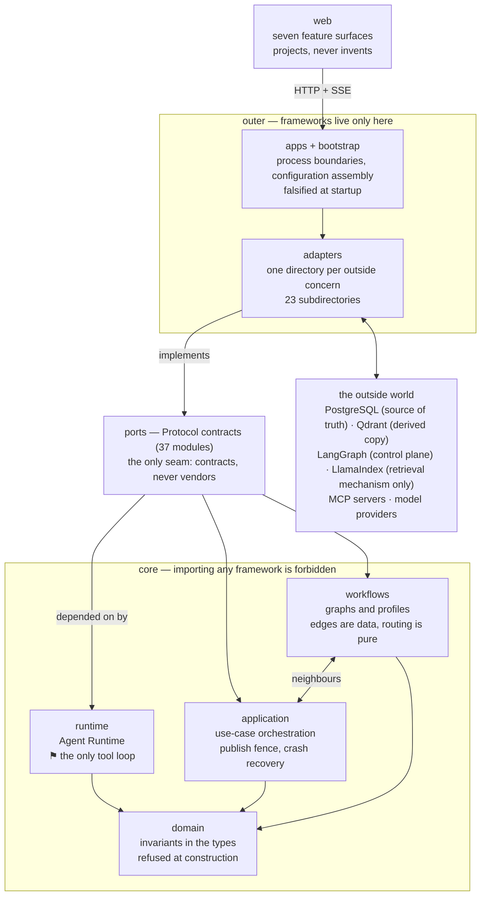
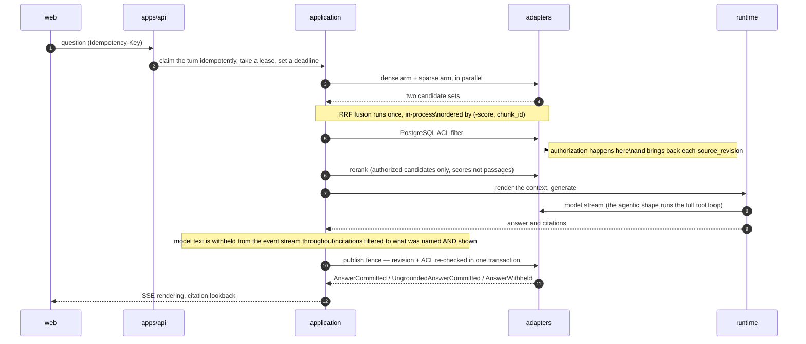
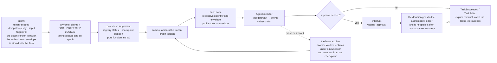
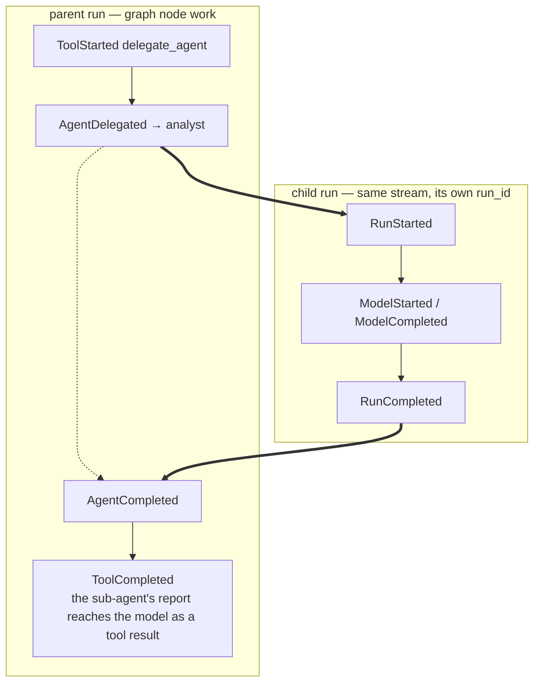

# Agent Workbench

[中文](README.md) | English

A clean-room general Agent platform offering two product shapes: **Chat**
(knowledge-base Q&A with permission checks) and **Task** (recoverable,
approvable automation workflows).

Architecturally there is one claim: **the custom Agent Runtime owns the only Tool
Loop.** LangGraph, LlamaIndex and MCP all enter through Ports/Adapters, each
doing its own segment, and none takes over the core loop.

| If you are | Start here |
|---|---|
| Judging the substance | [**The ten-minute version**](docs/HIGHLIGHTS.md) (Chinese) — a real event stream, gate numbers, four engineering judgements |
| Trying to run it | [Quick start](#3-quick-start) — one command, no network, no database |
| Asking what is **missing** | [**Known gaps**](docs/known-gaps.md) — five categories, each with a location and a criterion for "done" |
| Reading the rationale | [Documentation map](docs/README.md), [architecture baseline](docs/architecture-baseline.md), [ADR index](docs/adr/) |

---

## 1. Features

### 1.1 Chat: knowledge-base Q&A with permission checks

- **Multi-turn conversation**, with sessions and messages persisted in
  PostgreSQL; `chat_turns` is the idempotent source of truth.
- **Retrieval-grounded answers**: fixed two-step retrieval
  (`chat.retrieval_shape` also accepts `agentic`, but the **default is `fixed`** —
  only the fixed shape makes evaluation reproducible). Every citation carries
  `chunk_id`, `document_id` and `document_version`.
- **Permissions run the whole length**: candidates are ACL-filtered, and the
  source revision plus authorization are **re-checked before publication**;
  revocation and answer publication are linearized by a document row lock. The
  reranker runs after authorization, so it cannot introduce a passage the asker
  may not read.
- **If it cannot answer, it says so** rather than producing something that merely
  looks like an answer. This is scored as its own item in evaluation.
- **Web fallback**: when the corpus cannot answer, an external search may be
  called (off by default). An answer that used the web **does not count as
  grounded**, and the console distinguishes the two.
- **Every turn lists the tools authorized for it**, highlighting those actually
  called; a tool call shows the tool name plus what it was called with (e.g.
  `web_search · 北京今天天气`), and failures show the error message rather than a
  code.
- **Streaming over SSE**, resumable by cursor after a disconnect.

### 1.2 Task: recoverable, approvable workflows

Submit an objective; the Agent decomposes it, retrieves, does the work and
produces files, pausing for human approval where required.

**Two graphs, chosen at submission and then frozen:**

| Graph | Node path | Purpose |
|---|---|---|
| Fixed research graph | `understand → plan → route →`{`research_internal`\|`research_external`}`→ synthesize → critic → quality_gate → approval → export` | Retrieval, synthesis, self-critiquing research reports |
| `v2_general` | `understand → work → review →`(`approval`)`→ export` | General work: read tools, write workspace, render a document |

- **Triage at submission**: `POST /v1/tasks/triage` lets the model decide which
  graph applies, asks a human when it cannot, and falls back to a default on
  failure.
- **Human in the loop**: external side effects such as `export` require
  approval. The graph stops at a LangGraph interrupt, the decision is written to
  an authoritative ledger, and it is re-applied after cross-process recovery.
- **Task workspace**: mutable names over immutable bytes, scoped to one Task.
  Writing a name produces a new manifest, and the manifest is itself an artifact —
  so "which version of the workspace" is an id a checkpoint can hold, and a
  replayed node sees the version at its own entry.
- **Ephemeral sandbox** (off by default): one container per call, files in and
  files out, no network, read-only root, non-root, capabilities dropped, with
  memory/CPU/process/wall-clock ceilings.
- **Read-only outward access** (off by default): `fetch_page` and
  `download_document` are both GETs and pass a **post-resolution** address gate —
  only globally routable addresses are allowed, and redirects are gated hop by hop.
- **Artifact export**: `.docx` and similar land in the ArtifactStore and can be
  read (text preview) and downloaded from the console.
- **Sub-agent delegation** (off by default): a run may start another run from
  inside its own loop and hand a focused sub-problem over. The child runs
  through the **same** Runtime — what recurses is call depth, not the number of
  loops. Three gates live in the types: a child's tools are the **intersection**
  of the parent's; at the depth ceiling the delegation tool **disappears from
  the tool table** (a grandchild never saw it, rather than a counter having been
  incremented correctly); and a child envelope may only **lower** a risk ceiling,
  with no argument that raises one.
- **Everything leaves a trace**: each tool call records
  `ToolProposed → PermissionResolved → ToolStarted → ToolCompleted`, and **a
  refused call is recorded too** rather than vanishing.

### 1.3 Knowledge bases and ingestion

Create a knowledge base → upload files → asynchronous ingestion (parse, chunk,
embed, write to Qdrant) → retrievable. PDF, Word, Markdown and plain text.

- Documents are versioned by **revision**; revisions and revocation take effect
  through the revision fence.
- The ingestion Worker claims work with PostgreSQL `SKIP LOCKED`, with
  lease/heartbeat/fencing.
- **Ingestion failure is stated out loud**: `documents` records
  `failed_revision` + `failure_code` per revision and has a `failed` state,
  instead of showing "indexing" forever.
- A knowledge base **declares up front whether it is read-only**, and hides the
  upload area entirely when it is.

### 1.4 Web console

React + TypeScript, eight pages: **Chat**, **Tasks** (timeline and lifecycle),
**Code** (coding sessions and file previews), **Knowledge**, **Usage** (what the
three modes spent, in tokens and money), **Evaluation**, **Computer** (the
screen-control boundary, and a live session panel served over a read-only
reverse proxy — ADR-095) and **System**.

What a run did is folded into stages that expand to the raw events and their
payloads — **folding renames, it never drops**. On a Task that delegated, a
"participating agents" panel appears above the timeline: every run as a row,
nested under whoever started it, with its own status and spend. Selecting a row
narrows the step stream below to that one run.

### 1.5 Interfaces and tools

**HTTP API** (FastAPI): `/v1/chat` (sessions, messages, SSE), `/v1/tasks`
(submit, query, timeline, run tree, cancel, triage), `/v1/knowledge-bases`,
`/v1/uploads`, `/v1/search`, `/v1/approvals`, `/v1/artifacts` (including
`/preview`), `/v1/projects`, `/v1/code`, `/v1/usage`, `/v1/computer` (the
read-only reverse proxy of ADR-095), `/v1/evaluation`, `/health/live|ready`.

**CLI**: `agent-cli`, `agent-api`, `agent-task-worker`,
`agent-ingestion-worker`, `agent-config-check`, `agent-evidence`, plus four
project-owned MCP servers: `agent-word-mcp`, `agent-web-mcp`,
`agent-sandbox-mcp`, `agent-computer-mcp` (all loopback-bound).

**Tools available to Agents** (17 in-process): `knowledge_search`,
`web_search`, `external_search`, `workspace_list/read/write/edit/grep`,
`project_list/read/write/edit/grep` (the project directory a coding session
works in — ADR-072/074), `project_run` (runs a command on the host;
**destructive, shown before it is run** — ADR-077), `sandbox_run`,
`export_artifact`, `delegate_agent` (spawns a sub-agent, **off by default**);
and over MCP `mcp_web_fetch_page`, `mcp_web_download_document`,
`mcp_word_render_document`.

Which server's tools reach which Agent is declared by config `audience`
(`research` / `synthesis` / `sandbox` / `delegation`), so adding a reader is a
config change rather than a code change. That indirection is **required**, not
tidiness: an agent that named a tool in its own static list would ask the tool
gateway for it on deployments that never assembled it, and the gateway raises
for a name it does not hold — turning a switch that is off into a node that
fails every Task.

**Observability**: OpenTelemetry traces and metrics (Port + OTLP Adapter; the
core never imports the SDK).

---

## 2. Architecture

### 2.1 One sentence, and the whole picture

**Two product shapes share one self-built Agent Runtime, and that Runtime owns
the only `model → tool → result → model` loop in the repository.** LangGraph,
LlamaIndex and MCP all enter through Ports/Adapters; none of them takes a turn
of that loop.

Dependency arrows point **inward, always**. Core does not know any framework —
that is not a convention, it is a test that turns CI red.



> **Two things stated plainly.** `workflows` and `application` are mutually
> referencing **neighbours**, not strict layers (each imports the other in three
> or four places); drawing a one-way arrow between them would be drawing it
> wrong. And `evaluation/` is a self-contained core package that imports only
> itself, so it is not on the main chain and is not in the diagram.

### 2.2 What each layer is

| Layer | What it is | May depend on | Forbidden (guard in brackets) |
|---|---|---|---|
| **domain**<br/>`domain/` | Encodes "which states must not exist" into the types, so invariants hold by **construction failure** rather than by every caller remembering to check | stdlib, Pydantic, domain itself, **plus `regex`** (`domain/workspace.py` needs a matching engine with a timeout to back `GREP_TIMEOUT_SECONDS`; the stdlib `re` has none) | Any framework or SDK; any I/O; mutability or unknown fields (`DomainModel` is globally `frozen=True, extra="forbid"`); `TaskState` may not grow message logs or framework objects — it has to fit in a graph checkpoint |
| **ports**<br/>`ports/` (37) | Uses `typing.Protocol` to separate "what capability is needed" from "who provides it" | domain, stdlib, Pydantic only | Any implementation (no SQL, no HTTP, no vector-store calls here); importing `ports/model.py` is gated by the `MODEL_STREAM_OWNERS` allowlist |
| **runtime**<br/>`runtime/` | The one tool loop: drives a run to a **terminal** outcome with budget, deadline, context, cancellation and repeat-call gates on it | domain + ports only | Importing any framework; **no module — adapters included — may write a second loop consuming a model stream**; treating "allow, pending approval" as allow |
| **workflows**<br/>`workflows/` | Control flow written as a **declaration** that can be read and tested on its own: edges are data, routing is pure functions, and what each agent may see and reach is a fixed table | domain, ports, application | Importing langgraph (compilation lives in `adapters/langgraph/`); widening a profile (`permitted_tools` only intersects, and no argument reverses that); asking the registry for the current epoch mid-run |
| **application**<br/>`application/` | Where one Q&A, one Task and one coding session have their steps, authorization fences and failure handling — depending on nothing but domain and ports | domain, ports, workflows | Importing frameworks; reading `os.environ`; **growing its own tool loop** — running an agent goes through `ports/agent_executor` |
| **adapters**<br/>`adapters/` (22 directories plus two loose modules) | One directory per outside concern, translating each vendor's dialect into the ports' contracts at its own edge | ports, domain, third-party frameworks | Importing langgraph or `workflows` outside `adapters/langgraph`; **LlamaIndex's agent / query_engine / response_synthesizer are banned across the whole source tree**, method calls like `as_query_engine()` included |
| **apps + bootstrap**<br/>`apps/` `bootstrap/` `workers/` | Turns one TOML file into several processes, each handed only its own slice and each able to be falsified at startup | all four core layers + adapters + frameworks | `os.environ` **only inside the bootstrap package**; the `Settings` type may not travel past `projections.py`; connection strings are forbidden in TOML; invariants written as single-valued `Literal`s cannot be changed — that takes an ADR first |
| **web**<br/>`web/src/` | Translates the backend's facts into something a person can check, rather than inventing a second execution model | `web/src/api/` (the only place that goes out), backend HTTP + SSE | Talking to the database or vector store directly (`fetch` appears in exactly two files); dropping events while folding them — the raw payload must stay reachable |

That boundary is a test that **turns CI red**
([`tests/architecture/test_dependency_boundaries.py`](tests/architecture/test_dependency_boundaries.py)).
It forbids **method calls** as well as imports — though that half is two
hard-coded attribute names (`as_query_engine` / `as_chat_engine`), because those
hang off the `VectorStoreIndex` this project does build and so need no new
import; every other guard is import-shaped. The reasoning is in
[the ten-minute version §3.1](docs/HIGHLIGHTS.md).

> **Third-party imports into core are an allowlist** (`CORE_THIRD_PARTY_ALLOWLIST`,
> [ADR-099](docs/adr/0099-a-denylist-cannot-say-no-to-what-nobody-listed.md)):
> the standard library, `agent_workbench` itself, and exactly two others —
> `pydantic` (anywhere in core) and `regex` (**only `domain/workspace.py`**, for a
> matching engine with a timeout). **Everything else fails, whether or not anybody
> thought to ban it.**
>
> It became an allowlist on 2026-08-31. Before that `FORBIDDEN_CORE_IMPORTS` was a
> *denylist*, which is how the `regex` above arrived with a green build — it has a
> good reason, and "has a good reason" and "is guarded" are different statements.
> The denylist stays beside it, naming the integrations this project rejected so
> that importing one fails with "move it behind an adapter" rather than the general
> message; a test asserts the two never overlap.

### 2.3 Which layer holds which capability

| Capability | Main home | Also involved |
|---|---|---|
| Re-check permission **before the answer ships**; withhold it if access was revoked | application `chat.py::_release` | adapters/persistence (revision + ACL re-checked in the same transaction) |
| Never pass off a guess as grounded, and never leak the sentence that would have to be retracted | application `answer_release.py` | domain (`live_text` is a closed pair) |
| Citations may only point at passages the model **was actually shown** | domain `context.py` + application `citations.py` | — |
| The vector store decides what is found; **PostgreSQL decides who may see it** | application `retrieval.py` | adapters/vector, adapters/persistence, adapters/reranking |
| Dense + sparse arms, fused **exactly once** | adapters `vector/fusion.py` (pure) | application (decides when to call it) |
| A tool call has **exactly one place** it can be stopped | runtime `tool_gateway.py` | ports/policy, ports/hooks |
| Stop by itself when a run takes too long, costs too much, or goes in circles | runtime `budgets.py` | domain (a request may narrow a budget, never widen it) |
| Compact a long conversation, **and say that it was compacted** | runtime `compaction.py` (ADR-081) | ports/model (that summary call is priced and observed like any other) |
| Reads run in parallel; writes and external effects take an exclusive turn | runtime `tool_scheduler.py` (pure) | domain/tools (risk/concurrency agreement checked at construction) |
| **Sub-agent delegation** — a delegation is a run, not a new loop (ADR-082, off by default) | runtime (the same AgentExecutor, one level down) | domain/agents (a child envelope is an intersection), adapters/tools/`delegate.py` |
| Re-sending one request does not perform a real side effect twice | application (idempotency key + input fingerprint) | ports/tool_executions (intent/result ledger) |
| A crashed Task carries on | application `task_recovery.py` (pure, no I/O) | adapters/langgraph (Postgres checkpoint), adapters/persistence (`SKIP LOCKED`, lease, epoch) |
| One Task is never run by two processes at once | ports/task_registry + ports/execution_guard | workflows `execution_scope.py` (the lease comes from claim time and is never re-asked) |
| A human approves the irreversible step, and "who approved" cannot be forged | workflows `approval.py` (one interrupt point) | ports/approvals (the ledger is the only source of truth) |
| Each agent is shown only what it is entitled to | workflows `agent_profiles.py`, the `admits` closed set | domain (authorization envelope) |
| Coding sessions (no turn ledger, not resumable, the product is files) | application `code_session.py` | adapters/filesystem, apps/api |
| Uploaded material becomes searchable | workers/ingestion + adapters/ingestion | adapters/embedding, adapters/vector |
| Outbound reads **judge the resolved address first**, deny by default | adapters `research/` (resolve-then-judge) | — |
| See what a run did, and expand to the raw events | domain/events (durability is a property of the type) | ports/event_log, web `stepGroups.ts` |
| See **who delegated whom, and how far the sub-agent got** | application `run_tree.py` (rebuilt from events, never stored twice) | web `RunPanel.tsx` (ADR-083) |
| A wrong config, or a capability claim the code does not back, **stops the process from starting** | bootstrap `settings.py` cross-domain validation + single-valued `Literal`s | every layer (`agent-config-check` runs three profiles offline) |

### 2.4 How one Chat answer flows



**The point of this path is the second-to-last step**: when a revocation lands
after generation and before publication, the answer is **withheld**
(`AnswerWithheld`) rather than shipped. The answer, the assistant history and
the turn's terminal state commit in one transaction.

### 2.5 How one Task run flows



**Two graphs, chosen and frozen at submission:**

| Graph | Nodes |
|---|---|
| `v1` research | `understand → plan → route →`{`research_internal` ∥ `research_external`}`→ synthesize → critic → quality_gate → approval → export` |
| `v2` general | `understand → work → review →`(`approval`)`→ export`, with `review` able to loop back to `work` |

The conditional nodes are `route` / `quality_gate` / `approval`; the two research
branches fan in at `synthesize` as a **sorted union**, so the merge is
commutative and safe to re-enter.

**Reliability**: execution lease + heartbeat + epoch fencing, transactional
outbox, a self-built PostgreSQL checkpointer (fenced), retry / dead-letter, an
advisory execution guard, and per-stream gap-free event sequences with an
idempotent `event_key`.

A node writes under the immutable `ExecutionLease` it received **at claim
time** — never by re-asking the registry for the current epoch, or a Worker that
lost its lease would pass the ledger fence using its replacement's epoch.

### 2.6 Multi-agent: a delegation is a run, not a new loop

Since ADR-082 a run may spawn another run mid-loop. **Off by default**
(`multi_agent.delegation_enabled = false`).



The point is that this is **not a second executor**: the delegation tool's
handler calls the **same** `AgentExecutor`, so the one-tool-loop claim is
untouched — what recurses is the call depth, not the number of loops.

All three gates are written into the types rather than left to callers:

| Gate | How |
|---|---|
| A child cannot reach a tool its parent could not | `permitted_child_tools` is an **intersection**, and no argument reverses that |
| Recursion stops | At the depth ceiling the delegation tool is **removed from the child's tool list** — a grandchild is never shown the tool, rather than a counter having been incremented correctly |
| A delegation cannot escape the envelope | `child_envelope` can only **lower** the risk ceiling; nothing raises it |

A child writes into its **parent's own event stream** under its own `run_id`, so
"who delegated whom" is rebuildable from the events (ADR-083):

- `GET /v1/tasks/{id}/runs` — the run tree, for navigation
- `GET /v1/tasks/{id}/timeline?run_id=…` — one run on its own, an index lookup
- The console's **"参与的 Agent" panel** draws that tree; selecting a row narrows
  the step stream below it to that one run

### 2.7 Technology choices

| Layer | Choice | Boundary |
|---|---|---|
| Agent Runtime | **self-built** | Tool loop, policy, budgets, cancellation — **not outsourced** |
| Workflow control plane | LangGraph | Compiles the control-flow declaration; `TaskState` fields are the graph channels |
| Retrieval | self-built + LlamaIndex adapter | LlamaIndex serves the retrieval contract only, **off by default** |
| Vector store | Qdrant | dense / sparse storage; fusion happens in-process |
| Embedding | BGE-M3 | dense + lexical; **refuses to construct** without weights |
| Reranking | BGE reranker | Runs after authorization, returns positionally aligned scores |
| Model | DeepSeek (OpenAI-compatible) | Streaming; server-side `web_search` introduces no second key |
| Persistence | PostgreSQL 16 + Alembic | Sessions, tasks, events, checkpoints, outbox |
| Tool protocol | MCP SDK v2 | Streamable HTTP, frozen into local bindings at startup |
| Frontend | React + TypeScript + Vite | Chat / Tasks / Code / Knowledge / Evaluation / Computer / System / Usage |
| Observability | OpenTelemetry | Port + OTLP adapter; core imports no SDK |

Configuration is a **single schema (currently `1.19`)** validated across domains
at startup: a capability the config claims but the code does not have **fails at
config load**, rather than sitting there unread.

---

## 3. Quick start

Prerequisites: Python 3.12 and `uv`.

**Zero-dependency demo** — no database, no network, no API key, byte-for-byte
reproducible output:

```bash
uv run agent-cli demo
```

To watch a policy denial keep the handler from being called at all:

```bash
uv run agent-cli demo --deny
```

**Local gates** — first `uv sync --frozen --group dev --no-editable`, copy
`.env.example` to `.env` and replace the placeholders, then:

```bash
uv run agent-config-check --profile development && uv run ruff format --check . && uv run ruff check . && uv run pyright && uv run pytest
```

**The full local topology** (PostgreSQL, Qdrant, API, workers, console) is in
[Running locally](docs/running-locally.md) (Chinese); the containerized demo is in
[Compose deployment](docs/deployment.md) — the API is mapped only to
`127.0.0.1:8000`.

---

## 4. Boundaries

> [!WARNING]
> **The current Identity Adapter trusts request headers**, so `agent-api` is only
> usable for controlled local development and must not be exposed to a LAN or the
> public internet. The listen address and Compose ports are restricted to
> loopback, but that is a mechanism against accidental exposure, **not
> authentication** ([ADR-044](docs/adr/0044-no-remote-no-production-identity.md)).

Capability status is promoted only along `Planned → Implemented → Tested →
Demonstrated`, and **no promotion happens without linkable test or demo
evidence**. Explicitly incomplete: production authentication and remote
deployment, the RAGAS runner, Langfuse, the CrewAI comparison benchmark, the
dynamic multi-Agent supervisor and inter-agent messaging (mailbox), and physical
cleanup of superseded Qdrant points. **Agent spawn is implemented**
([ADR-082](docs/adr/0082-a-delegation-is-a-run-not-a-new-loop.md)); the
orchestration skeleton is still a graph frozen at submission. LlamaIndex
retrieval, MCP, the sandbox, outward reads, web search and sub-agent delegation
are **all off by default**, each for a stated reason.

The current Compose topology is for local demonstration only and is not evidence
of a production deployment or of production-grade multi-Worker operation.

**Per-item categories, repository locations and "done" criteria are in
[Known gaps](docs/known-gaps.md)**; measured gate numbers and real-run evidence
are in [the ten-minute version](docs/HIGHLIGHTS.md).

### Gates

<!-- Maintenance rule: these numbers are maintained in exactly two places, this
     table and docs/HIGHLIGHTS.md section 2, because a translation cannot link
     its way out of needing the values. HIGHLIGHTS is the source of record:
     update it first, then mirror here in the same commit. -->

These mirror [the ten-minute version, §2](docs/HIGHLIGHTS.md), which is the
source of record. Four environments; they may be cited separately and **must not
be added together** — the two backend environments have overlapping skip sets.
The four rows were measured on `main`, **2026-08-31**, after batch 63. Five sets were
taken that day and the differences mean something:

| Point | Real services | Offline | Five dirs | Frontend |
|---|---|---|---|---|
| `a3619f9` (before the closing scan) | 3981 | 3193 | 1376 | 826 |
| Batch 55 (the ADR-097 wiring) | 3989 | 3201 | 1376 | 826 |
| Batch 56 (the C-05 diagnostic) | 3993 | 3205 | 1376 | 828 |
| Batch 57 (the boundary tests) | 3993 | 3207 | 1376 | 828 |
| Batches 58–63 (the closing pass) | 4013 | 3225 | 1376 | 842 |
| Batch 64 (the boundary guard) | 4017 | 3229 | 1376 | 842 |
| Batch 65 (the last dead symbols) | 4020 | 3232 | 1376 | 842 |
| Batch 66 (the checkpoint migration, this table) | **4032** | **3244** | **1376**\* | **842** |

The last row's +20 / +18 / 0 / +14 account for themselves: six API-ceiling guards
(`test_api_runtime_ceilings.py`), four config-leaf reader guards
(`test_config_leaves_have_readers.py`), one asserting every ownership owner is an
importable module, seven for the corpus and its digest
(`test_corpus_agrees_with_the_system.py` plus one in `test_runner.py`); the
real-services column carries two more that only run against a real database.
On the frontend, eight for the quick switcher (`navigation.test.ts` — 52 test files
had **zero** coverage of `QUICK_DESTINATIONS` before it) and six for the evaluation
page. **The five-directory row did not move**, because none of these batches added
tests there — whether they pass is covered by the full-suite row above.

The +4 is ADR-099's four allowlist guards; the +3 after it is the identifier
vocabulary's three. The five-directory row was **re-measured both times**,
even though the new tests are not in it: those batches changed
`src/` (two tool specs now import `WORKSPACE_WRITE_SCOPE`, and a duplicate terminal
-state set was removed), and "no new tests there" is a different claim from "nothing
there behaves differently".

> **The real-services column was measured twice and the first one was red, which is
> worth writing down.** The first (40m20s) ran *concurrently* with a 2h30m RAG
> ablation re-run, and
> `tests/apps/test_sandbox_isolation.py::test_the_process_ceiling_holds` reported
> "the sandbox container did not finish within 35 seconds". On an idle machine that
> same test passes in **6.62 seconds** and the whole file is 14 passed. The table
> records the second run (16m13s, 4013 passed / 12 skipped / **0 failed**). This is
> not "re-run until green": these batches did not touch the sandbox at all
> (`git diff 52809db..HEAD --stat | grep -i sandbox` finds nothing), and that
> assertion measures whether a container can report its own process ceiling within
> 35 seconds — starved of CPU, it measures how busy the machine is.

That note records *the tree the measurement ran on*; it is not a promise that "the
current baseline" always matches. **The previous edition of this sentence said `main`
itself, and stopped being true the same day it was written** — not a slip, but another
instance of the thing this section keeps having to correct: a number and its provenance
go stale together, and a stale provenance is the harder one to notice.

| Environment | Result |
|---|---|
| Backend, real PostgreSQL + Qdrant (local, idle machine) | `4032 passed / 12 skipped` |
| Backend, no external services (local) | `3244 passed / 800 skipped` |
| Backend, the CI service-backed directories (`contracts`/`persistence`/`api`/`vector`/`e2e`) | `1376 passed / 2 skipped`\* |

> \* That row went red twice on the night of 2026-08-31 and the cause is **not
> established** — tracked as B-13. Both times it was the same five tests in
> `test_code_api.py`, and both times the run took 2:27, faster than any passing
> run. It has not reproduced in three subsequent runs of the identical command,
> and **the actual error text was never captured**. The table records the
> passing run; the asterisk is there because writing `1376 passed` unqualified
> for a suite that flakes is exactly the kind of sentence this section exists
> to stop.
| Frontend Vitest (local, 53 files) | `842 passed` |

**The first row used to carry 3 failures; it no longer does, and why they went
is worth writing down.** All three were in
`tests/e2e/test_worker_process_crash_recovery.py`, and the symptom was that the
v1 graph's `approval` node never ran (`approval ran 0 times`) while the Task
still succeeded. Re-measured 2026-08-29: the whole file is **11 passed**.

They were **fixed**, not explained away, and the fix is `174f1f2` of
2026-08-28: `config/config.test.toml` declares no `[workflow]` section, so
`export_requires_approval` fell back to the factory `false` and those Workers
started in a deployment with no approval gate — `approval` could never run, and
every assertion in that file counts it. The fix is one line: the child
environment now carries `AW_WORKFLOW__EXPORT_REQUIRES_APPROVAL=true`. That
file's whole subject is the v1 graph crossing its human gate, so it has to
configure the deployment it means to test rather than inherit one that happens
to have no gate.

**Why it could stay red for two weeks**: `tests/e2e` was in no CI job at the
time, so the explanation recorded against it was neither confirmed nor refuted.
That is fixed too — `014de9e`, the same day, added `tests/e2e` to the
service-backed job, which now runs five directories. The third row above is
measured over those five.

**Noted 2026-08-29, because it is this document's own subject.** This paragraph
previously said the cause was "the earlier record was taken in a shell that did
not set `AGENT_WORKBENCH_TEST_DSN`", and the one after it said `tests/e2e` was
still not in CI. Both were false, and both were written the **day after** the
real cause had been found and fixed: without the DSN those tests skip rather
than fail (they are inside the 800 skips of the second row), so they were red
*with* the services. Whoever wrote it did not read the commit that fixed them
and filled in a plausible-sounding mechanism from a stale impression — which is
the class of error this document keeps having to correct.

**The fourth row is a local number, not a CI one.** An older table
cited a CI number there, because the node `24.14.0` pinned in `engines` cannot be
installed on this machine. The 842 above is also a **local** run, but **a different node ran it**: the
v24.8.0 kept in the repository's own `var/toolchain`, not the system `26.7.0`. The
previous edition's note about `NODE_OPTIONS=--no-experimental-webstorage` therefore
**does not describe this measurement** — it records the workaround needed when the
system 26.x runs the suite (26.x defines `localStorage` as a global getter evaluating
to `undefined`, and jsdom installs its own only when that global is *absent*). Both
routes pass; do not read that note as how this row was produced. It is still a local
number and must not be cited as a CI one; Playwright was not run this
time, and the old `4 passed` has been dropped rather than left in to pad the
table.

Static gates all pass: `ruff format --check .` (622 files), `ruff check .`,
Pyright strict `0 errors / 0 warnings / 0 informations`, ESLint
`--max-warnings 0`, `tsc -b`, production build. Config schema `1.19`; single
Alembic head `0032_events_stream_run_sequence` (32 migrations).

Scale: 81,020 lines of Python across 321 files, 99,094 lines of tests across 259
files, 51,166 lines of frontend TypeScript across 139 files; 87 files under
`docs/adr/`, numbered 0012–0100 — **with gaps**: 0050 and 0053 were claimed by the
block reservation of 2026-08-13 and have never been written (the last section of
`docs/adr/README.md` records that reservation). This line previously read
"0012–0083 without gaps"; both halves were wrong, and the edition after that
("82 files, 0012–0095") was left behind by ADR-096, the one after that
("83 files, 0012–0096") by ADR-097, the one after that ("84 files, 0012–0097")
by ADR-098, and the one after *that* ("85 files, 0012–0098") by ADR-099 — the
last two on the same evening. **More test code than source code is deliberate** — the rule is that a test must first be shown red, and **a
test without a control case does not count**.

---

## 5. Documentation

| Document | Purpose |
|---|---|
| [The ten-minute version](docs/HIGHLIGHTS.md) | Real event stream, gate numbers, engineering judgements |
| [Known gaps](docs/known-gaps.md) | **What is not built**, in five categories |
| [Implementation status](docs/status.md) | Implementation and test evidence, PR by PR |
| [Architecture baseline](docs/architecture-baseline.md) | Product boundaries, layering, reliability protocol |
| [Configuration contract](docs/configuration.md) | Config sources, secret rules, snapshot semantics |
| [Frontend design baseline](docs/frontend-design.md) | Console structure, protocol boundaries, responsive strategy |
| [Running locally](docs/running-locally.md) / [Compose deployment](docs/deployment.md) | How to run it |
| [ADR index](docs/adr/) | 87 decision records (0012–0100; 0050 and 0053 reserved, never written) |
| [Full documentation map](docs/README.md) | Layered index and reading paths by role |

Most documentation is written in Chinese; this page and
[Compose deployment](docs/deployment.md) are in English.

---

## License and provenance

Released under the [Apache License 2.0](LICENSE). Retain [NOTICE.md](NOTICE.md)
when using or distributing — Apache-2.0 §4(d) requires it. Dependency licenses
are unaffected by this repository's license; the rules are in
[compliance.md](docs/compliance.md).

This repository is a clean-room implementation; the boundary is described in
[NOTICE.md](NOTICE.md) and the [compliance notes](docs/compliance.md).
