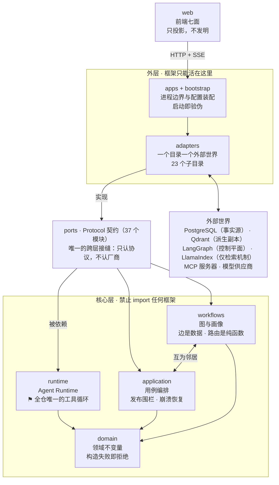
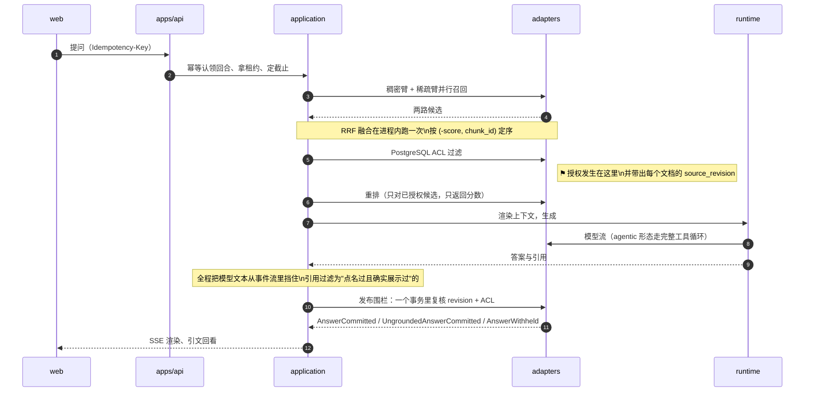
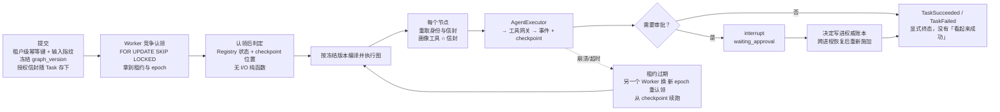
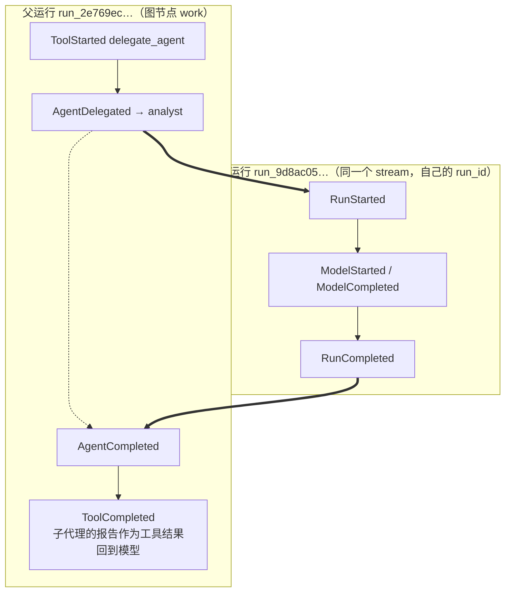

# Agent Workbench

中文 | [English](README.en.md)

一个 clean-room 实现的通用 Agent 平台，提供两种产品形态：**Chat**（带权限校验的
知识库问答）与 **Task**（可恢复、可审批的自动化工作流）。

架构上只有一条主张：**自研 Agent Runtime 持有唯一的 Tool Loop**。LangGraph、
LlamaIndex、MCP 一律经 Port/Adapter 接入，负责各自那一段，不接管核心循环。

| 你是谁 | 从哪读 |
|---|---|
| 想看成色与证据 | [**十分钟版本**](docs/HIGHLIGHTS.md)——真实运行的事件流、门禁数字、四个技术判断 |
| 想立刻跑起来 | [快速开始](#三快速开始)，一条命令，不联网、不连数据库 |
| 想知道**没做什么** | [**已知缺口**](docs/known-gaps.md)——四类分类，每条附位置与"做完"的判据 |
| 想读设计依据 | [文档地图](docs/README.md)、[架构基线](docs/architecture-baseline.md)、[ADR 索引](docs/adr/) |

---

## 一、功能

### 1.1 Chat：带权限校验的知识库问答

- **多轮对话**，会话与消息持久化在 PostgreSQL，`chat_turns` 是幂等事实源。
- **检索问答**：固定两步检索（`chat.retrieval_shape` 可选 `agentic`，**默认
  `fixed`**——固定形态才可复现评测）。答案给出引用，每条带 `chunk_id`、
  `document_id` 和 `document_version`。
- **权限贯穿全程**：检索候选按 ACL 过滤，答案发布前**再复核一次** source revision
  与授权；撤权与答案发布由文档行锁线性化。reranker 跑在授权之后，因此不可能引入
  提问者无权读的段落。
- **答不上来就说答不上来**，而不是给一个像模像样的答案。这是评测里单独考核的一项。
- **联网兜底**：语料答不上时可调用外部搜索（默认关闭）。用了网页的回答**不计为接地**，
  界面上区分显示。
- **每一轮列出被授权的工具**，调用过的高亮；工具调用显示"工具名 + 这次调的是什么"
  （如 `web_search · 北京今天天气`），失败显示错误消息而不是错误码。
- **流式输出**走 SSE，断线可按游标续读。

### 1.2 Task：可恢复、可审批的工作流

提交一个目标，Agent 自己拆解、检索、干活、产出文件，中途可以停下来等人批准。

**两张图，提交时选定并冻结**：

| 图 | 节点链路 | 用途 |
|---|---|---|
| 固定研究图 | `understand → plan → route →`{`research_internal`\|`research_external`}`→ synthesize → critic → quality_gate → approval → export` | 检索、综合、自我批评式的研究报告 |
| `v2_general` | `understand → work → review →`(`approval`)`→ export` | 通用干活：读工具、写工作区、渲染文档 |

- **提交预判（triage）**：`POST /v1/tasks/triage` 让模型先判该走哪张图，判不准就问人，
  失败回落默认值。
- **人在环中（HITL）**：`export` 这类外部副作用需要人批准。图在 LangGraph interrupt
  处停住，决定写进权威账本，跨进程恢复后重新施加。
- **任务工作区**：一个 Task 内可变的文件名压在不可变的字节上。写一个名字产生新
  manifest，manifest 本身也是 artifact——所以"工作区的哪一版"是 checkpoint 能持有的
  一个 id，节点重放看到的是它入口那一版。
- **一次性沙箱**（默认关闭）：一次调用一个容器，文件进文件出，无网络、只读根、
  非 root、丢弃 capability，内存/CPU/进程数/墙钟都有上限。
- **只读取用外部世界**（默认关闭）：`fetch_page` 与 `download_document` 都是 GET，
  取用前过**解析后**的地址闸门——只有全局可路由地址放行，重定向逐跳过闸。
- **产物导出**：`.docx` 等文件进 ArtifactStore，可在控制台直接读（文字预览）与下载。
- **子代理派生**（默认关闭）：一次运行可以在循环中途派生另一次运行，把一个聚焦的
  子问题交出去。子运行走的是**同一个** Runtime——递归的是调用层数，不是循环的份数。
  三道闸写在类型里：子代理的工具是父代理工具的**交集**；到达深度上限时委派工具**从
  工具表里消失**（孙子从没见过它，而不是某个计数器被正确地加过一次）；子信封只能
  **降低**风险上限，没有参数能抬高它。
- **全程留痕**：每次工具调用都留下 `ToolProposed → PermissionResolved → ToolStarted
  → ToolCompleted` 四件套，**被拒的那次也留痕**，而不是消失。

### 1.3 知识库与摄取

创建知识库 → 上传文件 → 异步摄取（解析、切块、向量化、写 Qdrant）→ 可检索。
支持 PDF、Word、Markdown、纯文本。

- 文档按 **revision** 管理，改版与撤权通过 revision 栅栏生效。
- 摄取 Worker 用 PostgreSQL `SKIP LOCKED` 竞争领取，带 lease/heartbeat/fencing。
- **摄取失败会说出口**：`documents` 表按 revision 记 `failed_revision` +
  `failure_code`，文档状态有 `failed` 一档，而不是永远显示"正在索引"。
- 知识库**提前声明自己是不是只读的**：只读时整块不渲染上传入口。

### 1.4 Web 控制台

React + TypeScript，八个页面：**Chat**、**Tasks**（任务时间线与生命周期）、
**Code**（编码会话与文件预览）、**知识库**（资料与上传）、**用量**（三个模式各花了
多少 token 和钱）、**效果评测**（评测报告）、**计算机**（屏幕控制的边界与会话面板）、
**运行状态**。

一次运行做了什么会折叠成阶段，展开能看到原始事件与 payload——**折叠只改称呼，不丢
事件**。任务发生过委派时，时间线上方多出一个「参与的 Agent」面板：按谁派生谁的树列出
每个运行、各自的状态与花费，选中一行就把下面的执行过程收窄到那一个运行。

### 1.5 接口与工具

**HTTP API**（FastAPI）：`/v1/chat`（会话、消息、SSE）、`/v1/tasks`（提交、查询、
时间线、运行树、取消、triage）、`/v1/knowledge-bases`、`/v1/uploads`、`/v1/search`、
`/v1/approvals`、`/v1/artifacts`（含 `/preview`）、`/v1/projects`、`/v1/code`、
`/v1/usage`、`/v1/computer`（只读反代，ADR-095）、`/v1/evaluation`、
`/health/live|ready`。

**命令行**：`agent-cli`（演示与提交）、`agent-api`、`agent-task-worker`、
`agent-ingestion-worker`、`agent-config-check`、`agent-evidence`，以及四个自有 MCP
server：`agent-word-mcp`、`agent-web-mcp`、`agent-sandbox-mcp`、`agent-computer-mcp`
（全部只绑 loopback）。

**Agent 可用工具**（进程内 17 个）：`knowledge_search`、`web_search`、
`external_search`、`workspace_list/read/write/edit/grep`、
`project_list/read/write/edit/grep`（编码会话里的项目目录，ADR-072／074）、
`project_run`（在宿主上跑命令，**destructive，先展示再执行**，ADR-077）、
`sandbox_run`、`export_artifact`、`delegate_agent`（派生子代理，**默认关**）；
另有经 MCP 接入的 `mcp_web_fetch_page`、`mcp_web_download_document`、
`mcp_word_render_document`。

哪个 server 的工具进哪个 Agent 由配置的 `audience` 声明（`research` / `synthesis` /
`sandbox` / `delegation`），加一个读取器是改配置不是改代码。这条间接性是**必需**而非
讲究：一个 Agent 若把工具名写死在自己的静态表里，就会在没装那个工具的部署上向工具网关
索要它，而网关对没注册的名字直接抛错——一个"关掉的开关"于是变成"每个任务都失败的
节点"。

**可观测**：OpenTelemetry trace 与 metrics（Port + OTLP Adapter，核心层不导入 SDK）。

---

## 二、架构

### 2.1 一句话与全景图

**两种产品形态共用一份自研 Agent Runtime，而这份 Runtime 拥有全仓库唯一一条
`模型 → 工具 → 结果 → 模型` 循环。** LangGraph、LlamaIndex、MCP 一律从
Ports/Adapters 进来，谁都不许在这条循环里占一轮。

依赖箭头一律**由外向内**。核心层不认识任何框架——这不是约定，是一条会让 CI 变红的
测试。



> **两处如实说明。** `workflows` 与 `application` 是一对**互相引用的邻居**而非严格
> 上下层（各有 3–4 处互相 import），画成单向箭头就是画错了。另外 `evaluation/` 是
> core 侧的自足小包（只 import 自己），不在主链上，图里没画。

### 2.2 每一层是什么

| 层 | 它是什么 | 允许依赖 | 被禁止什么（括号内是强制它的守卫） |
|---|---|---|---|
| **domain**<br/>`domain/` | 把"什么状态根本不该存在"写进类型本身，让不变量由**构造失败**保证，而不是靠每个调用方记得检查 | 标准库、Pydantic、domain 自身，**外加一个 `regex`**（`domain/workspace.py` 用它带超时的匹配引擎撑起 `GREP_TIMEOUT_SECONDS`；标准库 `re` 没有超时） | 任何框架/SDK；任何 I/O；可变或接受未知字段（`DomainModel` 全局 `frozen=True, extra="forbid"`）；`TaskState` 不得长出消息记录或框架对象——它要能写进图 checkpoint |
| **ports**<br/>`ports/`（37 个） | 用 `typing.Protocol` 把"系统需要什么能力"和"谁来提供"分开 | 仅 domain、标准库、Pydantic | 写任何实现（这里没有 SQL、没有 HTTP、没有向量库调用）；`ports/model.py` 的导入受 `MODEL_STREAM_OWNERS` 白名单管制 |
| **runtime**<br/>`runtime/` | 全仓唯一一份工具循环：把一次运行跑到**终态**，并在循环上装齐预算、截止、上下文、取消、重复调用五道闸 | 仅 domain + ports | import 任何框架；**任何模块（含 adapters）不得再写第二份消费模型流的循环**；把 "allow, pending approval" 当 allow 直接派发 |
| **workflows**<br/>`workflows/` | 控制流写成能单独读、单独测的**声明**：边是数据、路由是纯函数、每个 agent 能看什么够到什么是一张写死的表 | domain、ports、application | import langgraph（图的编译只在 `adapters/langgraph/`）；画像扩权（`permitted_tools` 只做交集，没有能反转方向的参数）；节点回头向注册表要当前 epoch |
| **application**<br/>`application/` | 把"一次问答""一个 Task""一次编码会话"的编排步骤、授权围栏与失败处理写在只依赖 domain/ports 的地方 | domain、ports、workflows | import 框架；直接读 `os.environ`；**自己长出工具循环**——要跑 agent 只能过 `ports/agent_executor` |
| **adapters**<br/>`adapters/`（22 个目录 + 两个散装模块） | 一个目录接一个外部世界，把各家方言在自己边界上翻成 ports 的协议 | ports、domain、第三方框架 | 除 `adapters/langgraph` 外不得 import langgraph 或 `workflows`；**LlamaIndex 的 agent / query_engine / response_synthesizer 在整棵源码树里都禁用**，连 `as_query_engine()` 这类方法调用一并禁 |
| **apps + bootstrap**<br/>`apps/` `bootstrap/` `workers/` | 让"一份 TOML"变成"若干个各自只拿到自己那一份、启动时就能验伪的独立进程" | core 四层 + adapters + 框架 | `os.environ` **只允许出现在 bootstrap 包内**；`Settings` 类型不得越过 `projections.py` 继续传播；TOML 里禁止写库连接串；单值 `Literal` 表达的不变量改不动——要改先写 ADR |
| **web**<br/>`web/src/` | 把后端那套事实翻译成人能核对的界面，而不是自己再造一份执行模型 | `web/src/api/`（唯一出网处）、后端 HTTP + SSE | 直连数据库或向量库（`fetch` 只出现在两个文件里）；折叠事件时丢弃事件——原始 payload 必须仍可达 |

这条边界是一条**会让 CI 变红**的测试
（[`tests/architecture/test_dependency_boundaries.py`](tests/architecture/test_dependency_boundaries.py)），
它连**方法调用**都禁——不过那一半是**两个写死的属性名**（`as_query_engine` /
`as_chat_engine`），因为它们挂在本项目确实会建的 `VectorStoreIndex` 上、不需要新的
import；其余守卫都只处理 import 形态。理由见
[十分钟版本 §3.1](docs/HIGHLIGHTS.md#31-让越权在类型上不可能而不是靠信任)。

> **它是黑名单，不是白名单，这一点要说清楚。** `FORBIDDEN_CORE_IMPORTS` 列的是禁止项，
> 所以**没人列过的第三方包进核心层不会让 CI 变红**——上面那个 `regex` 就是这样进来的，
> 它有正当理由，而"有正当理由"和"被守住"是两件事。登记在
> [已知缺口](docs/known-gaps.md)。

### 2.3 哪个能力落在哪一层

能力用人话写，落点是真实模块。

| 能力 | 主要落点 | 一起参与的层 |
|---|---|---|
| 答案发出去之前**再查一遍权限**，撤权就不发 | application `chat.py::_release` | adapters/persistence（同一事务里复核 revision 与 ACL） |
| 没把握就不冒充有据，且"要撤回的那句"从没流出去过 | application `answer_release.py` | domain（`live_text` 是封闭二元组） |
| 引用只能指向**真被展示给模型**的段落 | domain `context.py` + application `citations.py` | — |
| 检索到什么由向量库说了算，**谁能看由 PostgreSQL 说了算** | application `retrieval.py` | adapters/vector、adapters/persistence、adapters/reranking |
| 稠密+稀疏双臂融合，且全流程**只融合一次** | adapters `vector/fusion.py`（纯函数） | application（决定何时调它） |
| 工具调用**只有一个地方**能被拦下 | runtime `tool_gateway.py` | ports/policy、ports/hooks |
| 跑太久、花太多、绕太多圈就自己停下 | runtime `budgets.py` | domain（预算是值，请求只能收紧不能放宽） |
| 对话太长自动压缩，并且**明说自己被压缩过** | runtime `compaction.py`（ADR-081） | ports/model（那次摘要照常计价与观测） |
| 只读操作并发、写/外部操作排队独占 | runtime `tool_scheduler.py`（纯函数） | domain/tools（risk 与 concurrency 一致性在构造期就查） |
| **子代理派生**（一次委派是一次运行，不是新循环，ADR-082，默认关） | runtime（同一个 AgentExecutor 再进一层） | domain/agents（子信封是父信封的交集）、adapters/tools/`delegate.py` |
| 同一个请求重发不会做两遍真实副作用 | application（幂等键 + 输入指纹） | ports/tool_executions（意图/结果双写台账） |
| 任务崩了还能接着跑 | application `task_recovery.py`（无 I/O 纯判定） | adapters/langgraph（Postgres checkpoint）、adapters/persistence（`SKIP LOCKED` + 租约 + epoch） |
| 同一个任务不会被两个进程同时跑 | ports/task_registry + ports/execution_guard | workflows `execution_scope.py`（租约来自认领时刻，不回头查） |
| 关键一步要人点头，且"谁批的"不可伪造 | workflows `approval.py`（唯一中断点） | ports/approvals（账本是唯一事实源） |
| 每个 agent 只被展示它该看的东西 | workflows `agent_profiles.py` 的 `admits` 闭集 | domain（授权信封） |
| 编码会话（不进回合账本、不可恢复、产物是文件） | application `code_session.py` | adapters/filesystem、apps/api |
| 上传的资料被向量化并能被搜到 | workers/ingestion + adapters/ingestion | adapters/embedding、adapters/vector |
| 外网检索**先判地址再抓**，默认拒绝 | adapters `research/`（resolve-then-judge） | — |
| 看得到一次运行做了什么，还能展开到原始事件 | domain/events（durability 是事件类型的属性） | ports/event_log、web `stepGroups.ts` |
| 看得到**谁派生了谁、子代理做到哪了** | application `run_tree.py`（完全从事件重建，不另存一份） | web `RunPanel.tsx`（ADR-083） |
| 配置写错、能力声明与代码不符，**进程直接起不来** | bootstrap `settings.py` 跨域校验 + 单值 `Literal` | 全层（`agent-config-check` 离线跑三套 profile） |

### 2.4 一次 Chat 问答的流转



**这条路径的要点是倒数第二步**：撤权发生在生成之后、发布之前时，系统**扣下答案**
（`AnswerWithheld`）而不是把它发出去。答案、助手历史、回合终态在同一个事务里提交。

### 2.5 一次 Task 运行的流转



**两张图，提交时选定并冻结：**

| 图 | 节点链路 |
|---|---|
| `v1` 研究图 | `understand → plan → route →`{`research_internal` ∥ `research_external`}`→ synthesize → critic → quality_gate → approval → export` |
| `v2` 通用图 | `understand → work → review →`（`approval`）`→ export`，`review` 可回边到 `work` |

条件节点是 `route` / `quality_gate` / `approval`；两条研究分支在 `synthesize` 处以
**排序并集** fan-in，因而可交换、可重入。

**可靠性机制**：执行租约 + 心跳 + epoch fencing、事务 Outbox、自研 PostgreSQL
checkpointer（带 fencing）、retry / dead-letter、advisory execution guard、
per-stream gap-free 事件序列与幂等 `event_key`。

节点在**领取时**拿到的不可变 `ExecutionLease` 下写入——不是每次向 Registry 问最新
epoch，否则失去租约的 Worker 会用顶替者的 epoch 通过账本围栏。

### 2.6 多 Agent：一次委派是一次运行，不是一个新循环

ADR-082 起，一次运行可以在循环中途派生另一次运行。**默认关**
（`multi_agent.delegation_enabled = false`）。



关键在于它**不是**第二个执行器：委派工具的 handler 调用的是**同一个**
`AgentExecutor`，所以"唯一工具循环"这条主张没有被破坏——递归的是调用层数，不是循环
的份数。

三道闸都写在类型里，而不是靠调用方记得：

| 闸 | 怎么实现的 |
|---|---|
| 子代理够不到父代理够不到的工具 | `permitted_child_tools` 是**交集**，没有能反转方向的参数 |
| 递归会停 | 到达深度上限时，**把委派工具从子代理的工具表里拿掉**——孙子从没见过那个工具，而不是某个计数器被正确地加了一次 |
| 委派不能用来逃出信封 | `child_envelope` 只能**降低**风险上限，没有任何参数能抬高它 |

子运行写进**父运行同一条事件流**，用自己的 `run_id`。于是"谁派生了谁"可以从事件流
里重建（ADR-083）：

- `GET /v1/tasks/{id}/runs` —— 运行树，导航用
- `GET /v1/tasks/{id}/timeline?run_id=…` —— 只看某一个运行，索引查找
- 控制台的**「参与的 Agent」面板**把这棵树画出来，选中一行就把下面的执行过程收窄到
  那一个运行

### 2.7 技术栈

| 层 | 选型 | 职责边界 |
|---|---|---|
| Agent Runtime | **自研** | Tool Loop、Policy、预算、取消——**不外包** |
| 工作流控制面 | LangGraph | 编译控制流声明；`TaskState` 字段即图通道 |
| 检索 | 自研 + LlamaIndex Adapter | LlamaIndex 只做检索契约，**默认未启用** |
| 向量库 | Qdrant | dense / sparse 存储；融合在本进程内做 |
| Embedding | BGE-M3 | dense + lexical，缺权重**拒绝构造** |
| 重排 | BGE reranker | 跑在授权之后，返回按位对齐的分数 |
| 模型 | DeepSeek（OpenAI 兼容） | 流式；服务端 `web_search` 不引入第二把 key |
| 持久化 | PostgreSQL 16 + Alembic | 会话、任务、事件、checkpoint、outbox |
| 工具协议 | MCP SDK v2 | Streamable HTTP，启动时冻结成本地 binding |
| 前端 | React + TypeScript + Vite | Chat / Tasks / Code / 知识库 / 评测 / 计算机 / 运行状态 / 用量 |
| 可观测 | OpenTelemetry | Port + OTLP Adapter，核心层不导入 SDK |

配置为**单一 schema（当前 `1.19`）**，跨域校验在启动时完成；声称的能力与代码不符
会**在配置加载阶段失败**，而不是躺在那里没人读。

---

## 三、快速开始

前置：Python 3.12 与 `uv`。

**零依赖演示**——不需要数据库、不需要联网、不需要 API key，输出逐字节可复现：

```bash
uv run agent-cli demo
```

想看策略拒绝时 handler **完全不会被调用**：

```bash
uv run agent-cli demo --deny
```

**本地门禁**——先 `uv sync --frozen --group dev --no-editable`，把 `.env.example`
复制为 `.env` 并替换占位值，然后：

```bash
uv run agent-config-check --profile development && uv run ruff format --check . && uv run ruff check . && uv run pyright && uv run pytest
```

**完整本机拓扑**（PostgreSQL、Qdrant、API、Worker、控制台）见
[本机运行手册](docs/running-locally.md)；容器化演示见
[Compose 部署](docs/deployment.md)——API 只映射到 `127.0.0.1:8000`。

---

## 四、边界

> [!WARNING]
> **当前 Identity Adapter 只信任请求头**，因此 `agent-api` 只能用于受控的本机开发，
> 不得暴露到局域网或公网。监听地址与 Compose 端口均限制为 loopback，但那只是防止
> 意外暴露的机制，**不是身份认证**（[ADR-044](docs/adr/0044-no-remote-no-production-identity.md)）。

能力状态只按 `Planned → Implemented → Tested → Demonstrated` 升级，
**没有可链接的测试或演示证据不得升级**。当前明确未完成的包括：生产身份认证与远程
部署、RAGAS runner、Langfuse、CrewAI 对照 benchmark、动态 Multi-Agent supervisor 与
agent 间投递（mailbox）、旧 Qdrant Point 的物理清理。**agent spawn 已实现**
（[ADR-082](docs/adr/0082-a-delegation-is-a-run-not-a-new-loop.md)），编排的骨架仍是
提交时冻结的固定图。LlamaIndex 检索、MCP、沙箱、只读取用、联网搜索与子代理派生
**均默认关闭**，各有其不能打开的理由。

当前 Compose 只用于本机演示，不能作为生产部署或生产级多 Worker 的证明。

**逐条的分类、仓库位置与"做完了算什么样"，见[已知缺口](docs/known-gaps.md)**；
实测门禁数字与真实运行证据见[十分钟版本](docs/HIGHLIGHTS.md)。

---

## 五、文档

| 文档 | 用途 |
|---|---|
| [十分钟版本](docs/HIGHLIGHTS.md) | 真实事件流、门禁数字、技术判断 |
| [已知缺口](docs/known-gaps.md) | **没做的部分**，四类分类，附判据 |
| [实施状态](docs/status.md) | 逐 PR 的实现与测试证据 |
| [架构与技术选型基线](docs/architecture-baseline.md) | 产品边界、分层、可靠性协议 |
| [配置管理契约](docs/configuration.md) | 配置来源、密钥规则、快照语义 |
| [本机运行手册](docs/running-locally.md) ／ [Compose 部署](docs/deployment.md) | 怎么跑起来 |
| [前端设计基线](docs/frontend-design.md) | 前端结构、协议边界、响应式策略 |
| [ADR 索引](docs/adr/) | 85 份实施期决策记录（0012–0098，0050 与 0053 预留未写） |
| [完整文档地图](docs/README.md) | 分层索引与按角色的阅读路径 |

---

## 许可证与来源边界

以 [Apache License 2.0](LICENSE) 发布。使用或分发时请保留
[NOTICE.md](NOTICE.md)——Apache-2.0 第 4(d) 条要求随附它。依赖各自的许可证不受本
仓库许可证影响，判定规则见 [compliance.md](docs/compliance.md)。

本仓库为 clean-room 实现，边界见 [NOTICE.md](NOTICE.md) 与
[合规说明](docs/compliance.md)。
