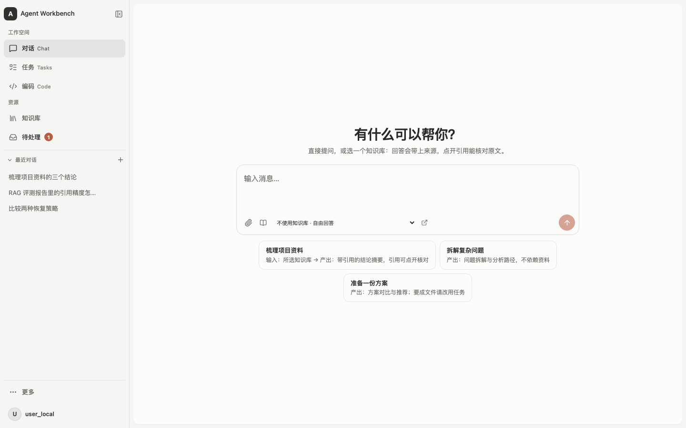

# Agent Workbench

中文 | [English](README.en.md)

**一个能依据资料回答、执行长任务、在关键动作前等待批准，并留下可核验结果的 Agent 工作台。**
Code 与受限的计算机控制是它的能力延伸。



它能做三件事，每一件都留得下证据：

- **资料问答**：回答带来源，每条引用可以点开核对原文；刷新之后引用还在，资料被撤回后引用会正确地打不开。
- **可恢复的任务**：长任务分步执行，导出前停下来等人批准；Worker 重启后从 checkpoint 接着跑，不是重来。
- **编码交付**：在指定文件夹里修改真实文件，跑命令前先问你，每一次写入都记在回合里。

三条演示怎么走、讲哪一句技术：[docs/demo-scripts.md](docs/demo-scripts.md)。开始之前先看运行状态页顶上的
「演示前自检」——它说「可以开始演示」再开始。

启动：macOS / Linux 用 `scripts/dev.sh up --with-retrieval`；Windows 只要 Docker Desktop，`scripts\stack.cmd`
一条命令起全套（[Windows 快速开始](docs/windows-quickstart.md)）。

---

一个 clean-room 实现的通用 Agent 平台，提供两种产品形态：**Chat**（带权限校验的
知识库问答）与 **Task**（可恢复、可审批的自动化工作流）。

架构上只有一条主张：**自研 Agent Runtime 持有唯一的 Tool Loop**。LangGraph、
LlamaIndex、MCP 一律经 Port/Adapter 接入，负责各自那一段，不接管核心循环。

| 你是谁 | 从哪读 |
|---|---|
| 想先看它长什么样、怎么演示 | [三条演示](docs/demo-scripts.md)，以及上面那张图 |
| 想在十分钟内看清整个项目 | [**本地架构面板**](#零先把整个项目看一遍)——一条命令，离线页面，数字全部现算 |
| 想看成色与证据 | [**十分钟版本**](docs/HIGHLIGHTS.md)——真实运行的事件流、门禁数字、四个技术判断 |
| 想读懂 Agent 本身怎么跑的 | [Agent Harness](#二agent-harness一次运行被谁裹着) → [Agent Runtime](#三agent-runtime唯一的那条工具循环) → [Tool Gateway](#四tool-gateway一次工具调用要穿过的门) |
| 想立刻跑起来 | [快速开始](#九快速开始)，一条命令，不联网、不连数据库 |
| **手上是一台 Windows** | [**Windows 快速开始**](docs/windows-quickstart.md)——只要 Docker Desktop，一条命令起全套（这条路不需要 Python / uv / Node） |
| 想知道**没做什么** | [**已知缺口**](docs/known-gaps.md)——五类分类，每条附位置与"做完"的判据 |
| 想读设计依据 | [文档地图](docs/README.md)、[架构基线](docs/architecture-baseline.md)、[ADR 索引](docs/adr/) |

---

## 零、先把整个项目看一遍

### 0.1 一条命令，一个离线的架构面板

**macOS / Linux：**

```bash
scripts/dev.sh panel
```

**Windows**（`dev.sh` 是 bash，在 Windows 上没有这条路）：

```bat
scripts\panel.cmd
```

在资源管理器里双击也行。cmd 与 PowerShell 都能跑；两处都接同样的参数
（`--port 9000`、`--no-open`、`--check`）。要跳过启动器直接跑，用 `py` 而不是
`python`：

```bat
py -3 scripts\architecture_panel.py --serve
```

启动器存在的一半理由就在这个差别里：一台**没装 Python** 的 Windows 上，PATH 里照样有一个
`python.exe`——那是应用商店的执行别名，跑起来会打开商店然后退出。启动器逐个
**试着跑**候选解释器而不是问名字解析得到不，所以它不会把面板交给那个壳子。

它构建一个自包含的 HTML 并在 `127.0.0.1:8770` 上提供服务。**不需要数据库、不需要
Qdrant、不需要 API key、不联网**——它读的是工作树本身。十二个分区：

| 分区 | 里面是什么 |
|---|---|
| 概览 | 规模数、启动命令、全景分层图 |
| 分层与守卫 | 七层各自的边界，以及核心层第三方白名单、具名拒绝表、模型流持有者名单的**实际内容** |
| Agent Runtime | 循环图、一轮循环的每一步、五道闸各自的落点、`runtime/` 每个模块 |
| Tool Gateway | 四个阶段、三个答案、每一个拒绝出口 |
| 两条主链路 | Chat 与 Task 的流转，以及子代理委派 |
| 工作流图 | 两张图的节点与边，**从 `_STATIC_EDGES` 与编译器的条件边目标表里读出来画的** |
| 模块浏览器 | 326 个模块，可搜路径 / 摘要 / 符号名；每行的说明是该模块 docstring 的第一行 |
| HTTP 接口 | 77 个端点，从路由装饰器解析 |
| 工具目录 | 进程内工具与 MCP 工具，读的是声明它们的那个常量 |
| 配置画像 | 十一个 profile，以及 82 条写成单值 `Literal` 的不变量 |
| 决策记录 | 95 份 ADR，可搜 |
| 门禁与规模 | 测试目录、控制台 feature、进程入口 |

**面板上每一个数字都是构建那一刻数出来的，没有一个是写在页面里的。** 这不是讲究：
这个仓库已经被"写在无关事实旁边的数字"咬过一次——`CLAUDE.md` 里的 `458/458` 在测试
数破八百之后还活了几个月，因为一个写在别处的数字没有任何东西会在它过期时失败。面板
是比一个段落大得多的暴露面，所以它一行数字都不许手写。

余下那一半——"循环上的五道闸""网关的四个阶段"这类**关于架构而不是关于文件**的话——
写在 `scripts/architecture_panel.py` 的 `NARRATIVE` 里，但每一条都点名一个真实路径与
符号，并且：

```bash
uv run python scripts/architecture_panel.py --check
```

会在它点名的东西不存在时失败。所以手写的那一半也不能悄悄烂掉。

**它不 import 标准库以外的任何东西**，所以在一台只装了 Python 的机器上就能开——
不需要 `uv sync`、不需要虚拟环境、不需要仓库里其它任何一个服务。这条性质是刻意维持的，
不是碰巧：面板是一个人**还不知道这个仓库是什么**的时候打开的东西，一个要求先把环境
装好的第一步就把顺序搞反了。`tests/deployment/test_architecture_panel.py` 守着它，
连同另外几条 Windows 上才会犯的错——路径分隔符、控制台代码页、批处理文件的编码与换行。

> **关于 Windows 的如实说明。** 本仓库的测试跑在 POSIX 上，上面那些是**规则断言**，
> 不是一次 Windows 上的真实运行：每一条断言的是"让 Windows 行为成立的那条规则"，
> 而不是"在 Windows 上跑过了"。规则比运行弱，测试里写明了这一点。

其它用法：`--build DIR` 只产出静态页面，`--json` 只吐扫描出的数据（可以拿去做别的
检查），`--port` 换端口。这三个都要直接调那个 Python 脚本——两个启动器都会自己补上
`--serve`，所以经它们传 `--build` 会既构建又起服务。**监听地址写死在 `127.0.0.1`**——这个页面把源码树的 docstring
铺开给人看，而 `python -m http.server` 的默认绑定是每一个网卡。

### 0.2 三十秒版本


依赖箭头一律**由外向内**。核心层不认识任何框架——这不是约定，是一条会让 CI 变红的
测试（[`tests/architecture/test_dependency_boundaries.py`](tests/architecture/test_dependency_boundaries.py)）。

> **两处如实说明。** `workflows` 与 `application` 是一对**互相引用的邻居**而非严格
> 上下层（各有 3–4 处互相 import），画成单向箭头就是画错了。另外 `evaluation/` 是
> core 侧的自足小包（只 import 自己），不在主链上，图里没画。

---

## 一、这是什么：两种产品形态

### 1.1 Chat：带权限校验的知识库问答

- **多轮对话**，会话与消息持久化在 PostgreSQL，`chat_turns` 是幂等事实源。
- **检索问答**：固定两步检索（`chat.retrieval_shape` 可选 `agentic` / `routed`，**默认
  `fixed`**——固定形态才可复现评测）。答案给出引用，每条带 `chunk_id`、
  `document_id` 和 `document_version`。
- **权限贯穿全程**：检索候选按 ACL 过滤，答案发布前**再复核一次** source revision
  与授权；撤权与答案发布由文档行锁线性化。reranker 跑在授权之后，因此不可能引入
  提问者无权读的段落。
- **答不上来就说答不上来**，而不是给一个像模像样的答案。这是评测里单独考核的一项。
- **联网兜底**：语料答不上时可调用外部搜索（默认关闭）。用了网页的回答**不计为接地**，
  界面上区分显示。
- **每一轮列出被授权的工具**，调用过的高亮；工具调用显示"工具名 + 这次调的是什么"
  （如 `web_search · 北京今天天气`），失败显示错误消息而不是错误码。
- **流式输出**走 SSE，断线可按游标续读。

### 1.2 Task：可恢复、可审批的工作流

提交一个目标，Agent 自己拆解、检索、干活、产出文件，中途可以停下来等人批准。

- **提交预判（triage）**：`POST /v1/tasks/triage` 让模型先判该走哪张图，判不准就问人，
  失败回落默认值。
- **人在环中（HITL）**：`export` 这类外部副作用需要人批准。图在 LangGraph interrupt
  处停住，决定写进权威账本，跨进程恢复后重新施加。
- **任务工作区**：一个 Task 内可变的文件名压在不可变的字节上。写一个名字产生新
  manifest，manifest 本身也是 artifact——所以"工作区的哪一版"是 checkpoint 能持有的
  一个 id，节点重放看到的是它入口那一版。
- **一次性沙箱**（默认关闭）：一次调用一个容器，文件进文件出，无网络、只读根、
  非 root、丢弃 capability，内存/CPU/进程数/墙钟都有上限。
- **只读取用外部世界**（默认关闭）：`fetch_page` 与 `download_document` 都是 GET，
  取用前过**解析后**的地址闸门——只有全局可路由地址放行，重定向逐跳过闸。
- **产物导出**：`.docx` 等文件进 ArtifactStore，可在控制台直接读（文字预览）与下载。
- **子代理派生**（默认关闭）：见 [§6.3](#63-多-agent一次委派是一次运行不是一个新循环)。
- **全程留痕**：每次工具调用都留下 `ToolProposed → PermissionResolved → ToolStarted
  → ToolCompleted` 四件套，**被拒的那次也留痕**，而不是消失。

### 1.3 知识库与摄取

创建知识库 → 上传文件 → 异步摄取（解析、切块、向量化、写 Qdrant）→ 可检索。
支持 PDF、Word、Markdown、纯文本。

- 文档按 **revision** 管理，改版与撤权通过 revision 栅栏生效。
- 摄取 Worker 用 PostgreSQL `SKIP LOCKED` 竞争领取，带 lease/heartbeat/fencing。
- **摄取失败会说出口**：`documents` 表按 revision 记 `failed_revision` +
  `failure_code`，文档状态有 `failed` 一档，而不是永远显示"正在索引"。
- 知识库**提前声明自己是不是只读的**：只读时整块不渲染上传入口。

### 1.4 Web 控制台

React + TypeScript + Vite。`HashRouter`，八个页面组件全部 `lazy()` 加载：

| 路由 | 页面 | 说明 |
|---|---|---|
| `/chat`、`/chat/:sessionId` | Chat | 会话、引用回看、SSE |
| `/work`、`/work/:taskId` | Tasks | 任务时间线与生命周期 |
| `/code/:sessionId?` | Code | 编码会话与文件预览 |
| `/knowledge` | 知识库 | 资料与上传 |
| `/usage` | 用量 | 三个模式各花了多少 token 和钱 |
| `/evaluation` | 效果评测 | 评测报告 |
| `/computer` | 计算机 | 屏幕控制的边界与会话面板（ADR-095） |
| `/system` | 运行状态 | 健康与配置投影 |

`/code/:sessionId?` 是**一条**带可选参数的路由而不是两条兄弟路由：写成两条时，第一次
发送触发的 `/code → /code/:id` 会重挂整个页面，把还开着的那一轮的 `running` 标志丢掉。

左下角的头像打开**设置**：本地身份、模型密钥、外观、用量、运行状态。模型密钥那一格
可以把 provider key 存进 checkout **之外**的文件（[ADR-101](docs/adr/0101-the-console-may-hand-over-a-key-it-can-never-read-back.md)），
但**存进去就读不回来**——接口只回四个字符的指纹，没有返回明文的方法。它还把「已存下」
和「这个进程正在用」分成两格说：模型客户端在组装期构造一次，所以刚存的 key 要等下次
启动才生效，而一个说了「已保存」却什么也没变的开关，读起来就是坏了。

运行状态那一格列出这台部署能做什么、缺什么（[ADR-102](docs/adr/0102-a-deployment-says-what-it-could-not-assemble.md)），
并且把附加的零件分成两种：**开关型**的（联网搜索、任务分流、Code 会话、子代理委派）
可以在行上拨，拨的是**下一次启动**，「这次启动」和「下次启动」分开写
（[ADR-103](docs/adr/0103-an-optional-part-can-be-switched-from-the-console-for-the-next-start.md)）；
**安装型**的（MCP 工具、沙箱、知识库检索）标「需要安装」，因为一个开关兑现不了它们。
两条启动路径——Compose 的容器启动脚本和 `scripts/dev.sh` 的控制台 arm——用同一个探针为
存下的开关让路，所以拨下去的东西不取决于你是怎么起的它
（[ADR-104](docs/adr/0104-the-native-launcher-yields-to-a-stored-switch.md)）。

一次运行做了什么会折叠成阶段，展开能看到原始事件与 payload——**折叠只改称呼，不丢
事件**。任务发生过委派时，时间线上方多出一个「参与的 Agent」面板：按谁派生谁的树列出
每个运行、各自的状态与花费，选中一行就把下面的执行过程收窄到那一个运行。

前端**唯一出网的地方**是 `web/src/api/` 下的两个文件（`client.ts` 12 处 `fetch(`、
`sessionStream.ts` 1 处）。SSE 用的是 `fetch` + `response.body.getReader()`，全树没有
一个 `EventSource`。别处出现 `fetch(` 就是这条边界破了。

### 1.5 接口与工具

**HTTP API**（FastAPI，**77 个端点**）：`/v1/chat`（会话、消息、SSE）、`/v1/tasks`
（提交、查询、时间线、运行树、取消、triage）、`/v1/knowledge-bases`、`/v1/uploads`、
`/v1/search`、`/v1/approvals`、`/v1/artifacts`（含 `/preview` 与 `/pdf`）、
`/v1/projects`、`/v1/code`、`/v1/usage`、`/v1/computer`（只读反代，ADR-095）、
`/v1/evaluation`、`/v1/settings`（模型密钥，ADR-101）、
`/v1/system`（这台部署没装配起什么，ADR-102；拨一个零件的开关，ADR-103）、`/health/live|ready`。逐条清单在[面板](#零先把整个项目看一遍)的
「HTTP 接口」页，它是从路由装饰器解析出来的，不是抄的。

**命令行**：`agent-cli`（演示与提交）、`agent-api`、`agent-task-worker`、
`agent-ingestion-worker`、`agent-config-check`、`agent-evidence`，以及四个自有 MCP
server：`agent-word-mcp`、`agent-web-mcp`、`agent-sandbox-mcp`、`agent-computer-mcp`
（全部只绑 loopback）。

**Agent 可用工具**（进程内 17 个）：`knowledge_search`、`web_search`、
`external_search`、`workspace_list/read/write/edit/grep`、
`project_list/read/write/edit/grep`（编码会话里的项目目录，ADR-072／074）、
`project_run`（在宿主上跑命令，**destructive，先展示再执行**，ADR-077）、
`sandbox_run`、`export_artifact`、`delegate_agent`（派生子代理，**默认关**）；
另有经 MCP 接入的 `mcp_web_fetch_page`、`mcp_web_download_document`、
`mcp_word_render_document`。

哪个 server 的工具进哪个 Agent 由配置的 `audience` 声明（`research` / `synthesis` /
`sandbox` / `delegation`），加一个读取器是改配置不是改代码。这条间接性是**必需**而非
讲究：一个 Agent 若把工具名写死在自己的静态表里，就会在没装那个工具的部署上向工具网关
索要它，而网关对没注册的名字直接抛错——一个"关掉的开关"于是变成"每个任务都失败的
节点"。

**可观测**：OpenTelemetry trace 与 metrics（Port + OTLP Adapter，核心层不导入 SDK）。

---

## 二、Agent Harness：一次运行被谁裹着

"唯一一条工具循环"说的是这条循环的**实现**只有一份，不是它只能被进入一层。外面这几层
每一层只做一件事，而且都实现同一个 [`ports/agent_executor.py`](src/agent_workbench/ports/agent_executor.py)
里的 `AgentExecutor` 协议——所以加一层不改调用方，删一层也不改。


### 2.1 执行器栈

| 层 | 落点 | 它只做这一件事 |
|---|---|---|
| 调用方 | 图节点 / Chat 回合 / Code 会话 | 拿到的是一个 `AgentExecutor`，不知道下面有几层，也不需要知道 |
| `DelegationScopingExecutor` | [`application/delegation.py`](src/agent_workbench/application/delegation.py) | 为每一次运行进入一个委派作用域。它裹的是**执行器**而不是节点：能不能委派是"运行"的属性，于是以后任何一个新的调用方都自动被覆盖。子运行的深度比父大 1，正是因为进作用域那一刻 ContextVar 还持有父的上下文 |
| `BudgetedAgentExecutor` | [`workflows/task_handlers.py`](src/agent_workbench/workflows/task_handlers.py) | ADR-040：每次 agent 调用先向 Registry 记一笔账，而且**在拿并发名额之前**——记账的那个往返不该占着一个名额发生。目前只记录，还不按次数拒绝 |
| `BoundedParallelExecutor` | 同上 | 同时最多几次 agent 调用。子代理有**自己的第二个池**：共用父的池会死锁——父在一次工具调用里等着，名额却一直被它占着，而子在排队等那个只有父返回才会释放的名额 |
| `ClaudeLikeAgentRuntime` | [`runtime/agent_runtime.py`](src/agent_workbench/runtime/agent_runtime.py) | **循环本身**（[§3](#三agent-runtime唯一的那条工具循环)） |
| `ToolGateway` | [`runtime/tool_gateway.py`](src/agent_workbench/runtime/tool_gateway.py) | 一次工具调用的四个阶段（[§4](#四tool-gateway一次工具调用要穿过的门)） |
| `ToolExecutor` | [`runtime/tool_executor.py`](src/agent_workbench/runtime/tool_executor.py) | 跑一个**已经被授权**的 handler，带超时与 5 秒心跳，保证恰好一个 `ToolResult` 离开 |
| handler | `adapters/tools/` · `adapters/mcp/` | 17 个进程内工具，加上经 MCP 接入的那些。它们看不见上面任何一层 |

同一份协议还有三个别的实现：`DeferredExecutor`（一格占位，装配期把环剪开）、
`ArtifactPersistingExecutor`（把纯文本的完成结果落成产物，不动协议）、
`FakeAgentExecutor`（脚本化的测试替身，零依赖演示与门禁用它）。

### 2.2 组合根在启动时把它装起来

装配发生在 `apps/*/composition.py` 与 `bootstrap/`，三件事值得单独说：

- **工具注册表是不可变的。** 跑起来之后不会多出一个工具——否则"当时有哪些工具"这个
  问题，对一份已经写完的事件日志就没有答案了。撤销走的是**实时授权**，在下一次决定
  时生效，而不是改这张表。
- **`DeferredExecutor` 把环剪开。** 启动运行的那个工具必须在网关读的注册表里；网关被
  构造进运行时；而运行时正是那个工具需要的东西。总得有个东西先被命名再存在，这里就是
  那个地方——一格占位而不是一个闭包，因为占位没被绑定时的失败要能说清是谁没绑。
- **MCP 目录在进程启动时冻结一次。** Worker 起来之后再启动的 server，那个 Worker 这
  辈子都看不到它——一个健康的 Worker 缺着它存在的理由那件工具。所以 `demo-worker`
  先探两个 server 再启动。

### 2.3 一个协议，所以"委派"不需要任何人守规矩

因为每一层都实现同一个 `AgentExecutor`，委派工具的 handler 拿到的**就是这一摞里的同一
个执行器**。"一次委派是一次运行，不是一个新循环"于是不是一句纪律，而是一个装配事实
（[ADR-082](docs/adr/0082-a-delegation-is-a-run-not-a-new-loop.md)）。

---

## 三、Agent Runtime：唯一的那条工具循环

`ClaudeLikeAgentRuntime._run` 是一个 `while True`。它的循环体检查五道闸，跑**恰好一次**
模型流，把这次调用映射成一个终态或者一批工具调用，把这批调用交给 Tool Gateway 的四个
阶段，再把结果按模型自己的调用顺序回填，然后进入下一轮。


**两个不变量在每一条路径上都成立**，模块 docstring 把它们写在第一段：

1. 模型见过的每一个 `tool_call_id` 都以**恰好一个** `ToolResult` 收尾。未知工具、被拒、
   handler 抛异常、超时、批量中途取消——每一种都产生结果而不是缺口，因为模型无论如何
   都在等那个 id，而一个缺席的答复是一段永远接不下去的对话。
2. 结果按模型自己的调用顺序提交，尽管执行是**真并行**的（`plan_tool_batches` +
   `asyncio.gather`）。

### 3.1 一轮循环，按顺序

| # | 这一步 | 落点 | 跳闸时发生什么 |
|---|---|---|---|
| 1 | 取消检查 | `cancellation.cancelled` | 一轮里查**六次**，这是第一次 |
| 2 | 预算闸（开始这一轮之前） | `domain/runs.py::halt_reason_for` | `budget_exceeded` + 对应的 `StopReason`。`max_tool_calls` **故意不在这里问**：一个用光了工具额度的运行，仍然应该有一轮把答案写出来 |
| 3 | 上下文闸 | `context_reason_for`（ADR-080） | 看的是**上一次请求实际有多大**，不是累计 token——累计值随轮数近似平方增长，用它判断窗口会越判越早 |
| 4 | 压缩（只在 3 跳闸时） | `runtime/compaction.py`（ADR-081） | 头一条永远留下；切点向后推到协议边界，绝不把 `tool_use` 和它的结果劈开；摘要以 **assistant** 身份回到对话。压不动就停下，`stop_reason="context_limit"` |
| 5 | 取消再查一次 | — | 专门放在压缩调用之后：一个被取消的摘要器不能被记成"上下文超限" |
| 6 | 决定这一轮广告哪些工具 | `budget.tool_allowance_spent` | 额度花光时工具**从请求里撤下**，而不是留着被拒——模型看不见的工具不会被反复提议 |
| 7 | 模型流 | `_stream_model` → `_consume` | 一次调用，一条流，整段套在 `asyncio.timeout(deadline)` 里。全仓唯一一处 `async for` 消费模型流 |
| 8 | 计量这一轮 | `ledger.usage.merged(...)` | `last_input_tokens` 与累计用量**分开记**，因为第 3 步问的是前者 |
| 9 | 终态判定 | `_terminal_for_turn`（8 条分支） | 没有工具调用 → 完成；有 → 往下走一批 |
| 10 | 准入 | `gateway.propose` + 两个断路器 | 每一个被提议的调用都先留痕，**包括下一步就要被拒的**。然后工具额度切一刀；同名同参数**第 4 次**才拒——计数器记的是「这次之前见过几回」，所以前三次都放行 |
| 11 | 网关 | `prepare` → `authorize` | [§4](#四tool-gateway一次工具调用要穿过的门) |
| 12 | 调度 | `runtime/tool_scheduler.py`（纯函数，70 行） | 连续的只读调用凑一组、最多 4 个；写 / 外部 / 破坏性一律**独占成组** |
| 13 | 执行 | `ToolExecutor` | 时限取「工具声明 / 运行剩余 / 部署上限」三者最小；每 5 秒一次心跳 |
| 14 | 对齐与写回 | `domain/tools.py::align_results` | 按模型自己的调用顺序回填；只给**被准入的**调用计费 |
| 15 | 断路器结算 | `repeat_refusals > 2` | 结束运行——**并且是在把那些拒绝写进消息之后**才结束，所以运行终止时手里还握着它被告知过什么 |

第 10 步的顺序值得单独看：**签名计数在其它检查之前就加**。理由写在代码里——一次拒绝
对模型很便宜（几乎不花 token，完全没有副作用），所以一个反复重提同一个被拒调用的模型
会一路烧到步数上限；先计数才能让断路器在第三次就合上。

### 3.2 循环上的五道闸

| 闸 | 它拦的是什么 | 落点 |
|---|---|---|
| **预算** | 步数、token、成本、截止。三个谓词分管三处：开始一轮前、这轮 token 结算后、派发工具前。预算是**值**，请求只能收紧不能放宽。声明了成本上限却没有价目表时，运行在第一次调用之前就被拒——一个执行不了的上限不如没有 | `domain/runs.py` |
| **截止** | 「运行截止」与「运行时信封」取内层的那个，并且**记住是哪一个赢的**：前者是 `budget_exceeded`，后者是可重试的 `provider_error`。模型 profile 自己的超时刻意不在这里，它在 adapter 里，嵌在这道界限之内 | `runtime/budgets.py` |
| **上下文** | 超过窗口 × 0.75 触发压缩。压缩本身是一次普通的模型调用（profile 为 `compact`），它的 token 与成本**失败时照样计入**——供应商已经收了这笔钱；但 `steps` 不加，因为循环没有前进一步 | `runtime/compaction.py` |
| **取消** | 一轮里查六次。被取消时，已经准备好的调用逐个变成 `cancelled` 的 `ToolResult`——它们仍然欠模型一个答复，不能凭空消失 | `agent_runtime.py::_refuse_cancelled` |
| **重复调用** | **两种机制**。同一轮里重复的 `tool_call_id` 直接判整轮失败（那是供应商的错，不是模型的选择）；跨轮的同名同参数**第 4 次**被拒（`MAX_IDENTICAL_CALLS = 3` 比的是「此前见过几回」），连续被拒超过 2 次运行结束 | `agent_runtime.py` |

### 3.3 状态机与终态

一次运行的位置由一张写死的转移表管着，非法的边直接抛 `InvalidStateTransition`：

```
building_context  → model_streaming
model_streaming   → validating_tools | completed
validating_tools  → authorizing | recording_results
authorizing       → executing_tools | recording_results
executing_tools   → recording_results
recording_results → model_streaming | compacting
compacting        → model_streaming
```

每一个非终态还额外有到 `failed` 与 `cancelled` 的边。**终态恰好三个**——`completed`、
`failed`、`cancelled`——而 `StopReason` 有九个值：`completed`、`max_steps`、
`max_tool_calls`、`token_budget`、`cost_budget`、`context_limit`、`deadline`、
`cancelled`、`error`。**没有"看起来成功"这一档。**

注意 `building_context → compacting` **不是**一条合法的边，而它不可达也不是巧合：
`context_reason_for` 在 `last_input_tokens <= 0` 时返回 `None`，所以压缩只可能从
`recording_results` 起跳。

### 3.4 `runtime/` 的十一个模块

| 模块 | 行 | 它拥有什么 |
|---|---|---|
| `agent_runtime.py` | 1478 | 循环、账本、五道闸、终态映射、压缩调用 |
| `tool_gateway.py` | 1184 | 一次工具调用的全部审查与派发 |
| `tool_executor.py` | 365 | 一个 handler、它的超时、它的心跳 |
| `compaction.py` | 275 | 压缩里**不需要模型**的那一半：切哪里、给摘要器看什么、省了多少 |
| `schema_validation.py` | 249 | 支持的 JSON Schema 子集（17 个关键字、7 种类型）与参数校验 |
| `hook_bus.py` | 156 | 部署方提供的 `before_tool` 检查，超时与失败都算拦下 |
| `fake_executor.py` | 141 | 脚本化替身：零依赖演示与门禁靠它逐字节可复现 |
| `budgets.py` | 136 | 截止的算术：内层的赢，并记住是哪一个 |
| `state.py` | 103 | 上面那张转移表 |
| `tool_scheduler.py` | 70 | 只读并行 / 写独占的分组，纯函数 |
| `__init__.py` | 45 | 导出 |

**独占不是调度器的判断**：`ToolSpec.validate_risk_consistency` 在**构造期**就拒绝一个
非只读却声明可并行的规格，也拒绝一个不带任何权限范围的写工具。调度器只是照着读。

### 3.5 一条守卫，两种形状

`tests/architecture/test_dependency_boundaries.py::test_the_model_tool_loop_has_exactly_one_owner`
用两种互不重叠的方式守同一句话：

- **按形状**：AST 遍历核心层，找 `async for` 且其迭代对象是 `.stream(...)` 调用（或一个
  绑定到它的名字——运行时把迭代器存进变量以便关闭它），断言结果集**恰好等于**
  `{"runtime/agent_runtime.py"}`。
- **按词汇**：整棵产品树里，凡是 import `agent_workbench.ports.model` 的模块都必须在
  `MODEL_STREAM_OWNERS`（7 个）里；并且有一条对照断言要求 `agent_runtime.py` **确实**
  出现在被观察到的集合里，这样一个坏掉的 import 提取器不能让一次空扫描看起来干净。

它的 docstring 顺带写清了 ADR-082 立足的那条区分：**"一条工具循环"约束的是有多少份
实现，不是它可以被进入多深。**

---

## 四、Tool Gateway：一次工具调用要穿过的门

原生 handler、MCP 工具、LangChain 工具都以同一个 `ToolBinding` 到达这里，所以"这次能不
能跑、用这些参数、在此刻"只有一个实现。默认是**拒绝**，依据是**提交时冻结**的授权信封。


### 4.1 四个阶段

| 阶段 | 做什么 | 值得知道的那一点 |
|---|---|---|
| `advertise` | **每次运行一次**，不是每次调用一次 | 未注册的名字抛 `UnknownToolError`；带 `operation_key` 的（会记账本的副作用）抛 `PolicyDeniedError`——[ADR-075](docs/adr/0075-a-ledgered-effect-is-issued-not-proposed.md)：那种工具由节点**签发**，从不摆到模型面前让它提议 |
| ① `propose` | 记下参数字节数与 SHA-256 | **包括下一步就要被拒的那些**。被拒的调用从事件流里消失，等于把"有人试过这件事"也一起删了 |
| ② `prepare` | 解析绑定 → 参数 ≤ 65,536 字节 → JSON Schema 校验 → `before_tool` 钩子 | 钩子若改写了参数，大小与 schema **再查一遍**；钩子只能改参数，改不了工具名，也改不了 `tool_call_id`。钩子的异常**只有类型名跨过边界**——后端的异常消息里带过 DSN |
| ③ `authorize` | 最多 3 轮策略决定 | 每一轮都发一条 `PermissionResolved`。"需要审批"是**粘性**的：后一轮忘了重复也撤不掉 |
| ③b 审批 | 有闸就等，没闸就拒 | 闸给回的答案要落在合法词表里才算数——一个不认识的词不能靠"它不等于 deny"变成许可。超时、取消、闸自己报错，都记成 deny 并留痕 |
| ④ `invoke` | 派发；账本工具多一道 | 见 [§4.4](#44-账本副作用距不可逆那一行再授权一次) |

### 4.2 三个答案，没有第四个

`ports/policy.py` 的 `PolicyEngine` 只有一个方法，返回三种效果之一：

| 效果 | 含义 | 之后发生什么 |
|---|---|---|
| `allow` | 在提交时冻结的信封之内，且权限范围齐备 | 进入调度与执行；账本工具还要在派发前再问一次 |
| `deny` | 未知工具 / 不在提交时的信封里 / 缺少权限范围 | 留下 `PermissionResolved` 与 `ToolFailed`。**哪一个范围缺**刻意不写进 `reason_code` |
| `allow_with_modified_input` | 策略改写了参数——这是一个**决定**，不是副作用 | 按 schema 重新校验改写后的参数，然后**再问一次**。3 轮不收敛就拒 |

改写必须重新校验并重新决定，否则"改写"就成了同时绕过两道检查的那条路。

仓库里目前只有一个实现：`adapters/policy/envelope.py::EnvelopePolicyEngine`，53 行，
三个拒绝理由一个通过理由。它的 docstring 老实写着自己**还没做**的那部分——信封 ∩
设置策略下限 ∩ 实时 ACL ∩ 实时注册表的完整 deny-overrides 求交。

### 4.3 三层收窄

```
提交时冻结的授权信封                    ⊇   节点画像 ∩ 信封              ⊇   子代理信封
task_runs.submitted_authorization_envelope   permitted_tools(profile, …)      child_envelope(parent, …)
每次恢复重新施加                             画像只做交集                     风险上限只能降
```

三层每一层都是**交集**，没有一层能变宽。`AuthorizationEnvelope.permits` 的默认值也是
拒绝形状的：`allowed_tools=()`、`max_tool_risk="read"`、
`approval_required_risks=("write","external","destructive")`。它先看 `denied_tools`
（拒绝优先），再要求在 `allowed_tools` 里，最后比风险等级——**所以把一个工具的风险调
高，就等于在不改任何信封的前提下把它从所有历史 Task 里收回。**

### 4.4 账本副作用：距不可逆那一行，再授权一次

带 `operation_key` 的工具走一条更长的路：

1. 没有账本 / 没有 task / 没有 lease epoch → 直接拒（"没有可以记在上面的东西"）。
2. `operation_key` 从**最终参数**算出来，不是从 `tool_call_id`——重发的同一个请求要能
   认出自己。
3. 记意图。同一个 key 换了参数再来 → `invalid_tool_input`；账本说这件事已经做过 →
   `tool_failed`，**不会再做第二遍**。
4. **第二次授权**，距不可逆那一行只有一步：只认 `allow` 且不再要求审批。这一次的改写
   **不予采纳**——已经记下的意图必须描述真正发生的那次调用；这一次又要求审批也不再问
   人——那会让一个抖动的策略把同一个人问两遍。任何一种拒绝都先把这条操作记成**失败**
   再拒绝，因为"什么都没派发"本身也是知识。
5. 派发、记结果。答不上来的那几种错误（超时 / 取消 / 超预算）标记**待人工对账**——
   对一次外部写入而言，"没收到答复"不等于"没有发生"。

### 4.5 两件在构造期就会失败的事

- 任一工具的 `input_schema` 用了不支持的关键字 → **进程起不来**，而不是这次调用失败。
  一个执行不了的 schema 是一个不存在的检查。
- 有 `operation_key` 的绑定却没有账本 → `ValueError`，并且**点名**是哪几个工具。

---

## 五、分层与守卫

### 5.1 每一层是什么

| 层 | 它是什么 | 允许依赖 | 被禁止什么（括号内是强制它的守卫） |
|---|---|---|---|
| **domain**<br/>`domain/`（25 个模块） | 把"什么状态根本不该存在"写进类型本身，让不变量由**构造失败**保证，而不是靠每个调用方记得检查 | 标准库、Pydantic、domain 自身，**外加一个 `regex`**（`domain/workspace.py` 用它带超时的匹配引擎撑起 `GREP_TIMEOUT_SECONDS`；标准库 `re` 没有超时） | 任何框架/SDK；任何 I/O；可变或接受未知字段（`DomainModel` 全局 `frozen=True, extra="forbid"`）；`TaskState` 不得长出消息记录或框架对象——它要能写进图 checkpoint |
| **ports**<br/>`ports/`（38 个模块，48 个 Protocol） | 用 `typing.Protocol` 把"系统需要什么能力"和"谁来提供"分开 | 仅 domain、标准库、Pydantic | 写任何实现（这里没有 SQL、没有 HTTP、没有向量库调用）；`ports/model.py` 的导入受 `MODEL_STREAM_OWNERS` 白名单管制 |
| **runtime**<br/>`runtime/`（11 个模块） | 全仓唯一一份工具循环：把一次运行跑到**终态**，并在循环上装齐预算、截止、上下文、取消、重复调用五道闸 | 仅 domain + ports | import 任何框架；**任何模块（含 adapters）不得再写第二份消费模型流的循环**；把 "allow, pending approval" 当 allow 直接派发 |
| **workflows**<br/>`workflows/`（10 个模块） | 控制流写成能单独读、单独测的**声明**：边是数据、路由是纯函数、每个 agent 能看什么够到什么是一张写死的表 | domain、ports、application | import langgraph（图的编译只在 `adapters/langgraph/`）；画像扩权（`permitted_tools` 只做交集，没有能反转方向的参数）；节点回头向注册表要当前 epoch |
| **application**<br/>`application/`（36 个模块） | 把"一次问答""一个 Task""一次编码会话"的编排步骤、授权围栏与失败处理写在只依赖 domain/ports 的地方 | domain、ports、workflows | import 框架；直接读 `os.environ`；**自己长出工具循环**——要跑 agent 只能过 `ports/agent_executor` |
| **adapters**<br/>`adapters/`（23 个目录 + 两个散装模块） | 一个目录接一个外部世界，把各家方言在自己边界上翻成 ports 的协议 | ports、domain、第三方框架 | 除 `adapters/langgraph` 外不得 import langgraph 或 `workflows`；**LlamaIndex 的 agent / query_engine / response_synthesizer 在整棵源码树里都禁用**，连 `as_query_engine()` 这类方法调用一并禁 |
| **apps + bootstrap + workers** | 让"一份 TOML"变成"若干个各自只拿到自己那一份、启动时就能验伪的独立进程" | core 四层 + adapters + 框架 | `os.environ` **只允许出现在 bootstrap 包内**；`Settings` 类型不得越过 `projections.py` 继续传播；TOML 里禁止写库连接串；单值 `Literal` 表达的不变量改不动——要改先写 ADR |
| **web**<br/>`web/src/` | 把后端那套事实翻译成人能核对的界面，而不是自己再造一份执行模型 | `web/src/api/`（唯一出网处）、后端 HTTP + SSE | 直连数据库或向量库（`fetch` 只出现在两个文件里）；折叠事件时丢弃事件——原始 payload 必须仍可达 |

### 5.2 守卫的实际内容

那条会让 CI 变红的测试是
[`tests/architecture/test_dependency_boundaries.py`](tests/architecture/test_dependency_boundaries.py)。
它管四张表，[面板](#零先把整个项目看一遍)的「分层与守卫」页把它们的当前内容直接列出来：

- **核心层第三方白名单**只有 **`pydantic`** 与 **`regex`** 两条（[ADR-099](docs/adr/0099-a-denylist-cannot-say-no-to-what-nobody-listed.md)），
  外加标准库和 `agent_workbench` 自己。**名单之外一律红，无论有没有人想到过要禁它。**
- **具名拒绝表**（34 条：`crewai`、`langchain*`、`langgraph`、`llama_index`、`fastapi`、
  `anthropic`、`docx`……）不管"拒绝"，白名单已经拒绝了；它管**诊断信息**——报错说的是
  "把这次集成挪到 adapter 后面去"，而不是一句泛泛的越界。有一条测试断言这两张表不许相交。
- **方法调用守卫**只有**两个写死的属性名**：`as_query_engine` 与 `as_chat_engine`。
  它们挂在本项目确实会建的 `VectorStoreIndex` 上、不需要新的 import，所以 import 形态
  的守卫看不见它们。其余守卫都只处理 import 形态。
- **模型流持有者**是七个模块的白名单。名单之外拿不到模型流，也就写不出第二条工具循环。

> 白名单这条是 2026-08-31 才改的。此前是**黑名单**，于是上面那个 `regex` 一路绿灯进来——
> 它有正当理由，而"有正当理由"和"被守住"是两件事。

### 5.3 哪个能力落在哪一层

能力用人话写，落点是真实模块。

| 能力 | 主要落点 | 一起参与的层 |
|---|---|---|
| 答案发出去之前**再查一遍权限**，撤权就不发 | application `chat.py::_release` | adapters/persistence（同一事务里复核 revision 与 ACL） |
| 没把握就不冒充有据，且"要撤回的那句"从没流出去过 | application `answer_release.py` | domain（`live_text` 是封闭二元组） |
| 引用只能指向**真被展示给模型**的段落 | domain `context.py` + application `citations.py` | — |
| 检索到什么由向量库说了算，**谁能看由 PostgreSQL 说了算** | application `retrieval.py` | adapters/vector、adapters/persistence、adapters/reranking |
| 稠密+稀疏双臂融合，且全流程**只融合一次** | adapters `vector/fusion.py`（纯函数） | application（决定何时调它） |
| 工具调用**只有一个地方**能被拦下 | runtime `tool_gateway.py` | ports/policy、ports/hooks |
| 跑太久、花太多、绕太多圈就自己停下 | runtime `budgets.py` | domain（预算是值，请求只能收紧不能放宽） |
| 对话太长自动压缩，并且**明说自己被压缩过** | runtime `compaction.py`（ADR-081） | ports/model（那次摘要照常计价与观测） |
| 只读操作并发、写/外部操作排队独占 | runtime `tool_scheduler.py`（纯函数） | domain/tools（risk 与 concurrency 一致性在构造期就查） |
| **子代理派生**（一次委派是一次运行，不是新循环，ADR-082，默认关） | runtime（同一个 AgentExecutor 再进一层） | domain/agents（子信封是父信封的交集）、adapters/tools/`delegate.py` |
| 同一个请求重发不会做两遍真实副作用 | application（幂等键 + 输入指纹） | ports/tool_executions（意图/结果双写台账） |
| 任务崩了还能接着跑 | application `task_recovery.py`（无 I/O 纯判定） | adapters/langgraph（Postgres checkpoint）、adapters/persistence（`SKIP LOCKED` + 租约 + epoch） |
| 同一个任务不会被两个进程同时跑 | ports/task_registry + ports/execution_guard | workflows `execution_scope.py`（租约来自认领时刻，不回头查） |
| 关键一步要人点头，且"谁批的"不可伪造 | workflows `approval.py`（唯一中断点） | ports/approvals（账本是唯一事实源） |
| 每个 agent 只被展示它该看的东西 | workflows `agent_profiles.py` 的 `admits` 闭集 | domain（授权信封） |
| 编码会话（不进回合账本、不可恢复、产物是文件） | application `code_session.py` | adapters/filesystem、apps/api |
| 上传的资料被向量化并能被搜到 | workers/ingestion + adapters/ingestion | adapters/embedding、adapters/vector |
| 外网检索**先判地址再抓**，默认拒绝 | adapters `research/`（resolve-then-judge） | — |
| 看得到一次运行做了什么，还能展开到原始事件 | domain/events（durability 是事件类型的属性） | ports/event_log、web `stepGroups.ts` |
| 看得到**谁派生了谁、子代理做到哪了** | application `run_tree.py`（完全从事件重建，不另存一份） | web `RunPanel.tsx`（ADR-083） |
| 配置写错、能力声明与代码不符，**进程直接起不来** | bootstrap `settings.py` 跨域校验 + 单值 `Literal` | 全层（`agent-config-check` 离线跑三套 profile） |

---

## 六、两条主链路

### 6.1 一次 Chat 问答


**两个位置决定了这条链路的性质。**

第一个是**第 4 步**：授权发生在 PostgreSQL 过滤那一刻，而重排排在它之后。顺序本身就是
保证——重排器不可能引入一段提问者无权读的文本，因为它根本没见过那些候选。

第二个是**倒数第二步**：撤权发生在生成之后、发布之前时，系统**扣下答案**
（`AnswerWithheld`）而不是把它发出去。发布围栏在**一个事务**里复核 revision 与 ACL，
锁序是会话 → 回合 → 文档（按 id 排序）→ 事件流；答案、助手历史、回合终态一起提交。

三种终态各自是一条事件：`AnswerCommitted`（有据，带引用）、
`UngroundedAnswerCommitted`（无据，并且**明说**自己没有接地）、`AnswerWithheld`。
另有两条离线的恢复路径：`ChatTurnReaper` 终结过期的 `running` 回合，
`ChatPendingReleaseRecovery` 在原来那个 HTTP 客户端早就走了之后，把卡在
`release_pending` 的回合逐行重新驱动完。

### 6.2 一次 Task 运行


**两张图，提交时选定并冻结**（节点与边是[面板](#零先把整个项目看一遍)从
`_STATIC_EDGES` 与编译器的条件边目标表里读出来画的，不是抄的）：

| 图 | 节点链路 | 条件节点 |
|---|---|---|
| `v1` 固定研究图（10 节点） | `understand → plan → route ⇉ {research_internal ∥ research_external} → synthesize → critic → quality_gate → approval → export` | `route`、`quality_gate`、`approval` |
| `v2_general`（5 节点） | `understand → work → review →`（`approval`）`→ export` | `review`、`approval` |

- `route` 的路由函数**永远返回两条分支**——它是固定 fan-out，不是一次选择。两条分支在
  `synthesize` 处以**排序并集**（`merge_refs`）fan-in，因而可交换、可结合、幂等。
- `quality_gate` 是一条四出口的条件边：`approval` / `export` / `synthesize`（改稿回边）
  / `END`。走 `END` 的那一支是"不需要报告"或"改稿次数用完"，自 ADR-060 起它算**成功**
  而不是失败。`approval` 是两出口，`END` 那一支是人否决了——全图唯一一次刻意的终态失败。
- 两张图的 `review`/`quality_gate` 回边**共用同一份改稿额度**，不是各有一份。
- **条件节点不跑 agent**：`profile_for()` 对一个纯路由节点直接抛 `KeyError`。
- `approval` 是**全图唯一的中断点**。`workflow.export_requires_approval` 为假时这道闸
  被**跳过**，而不是被伪造成一条通过记录——不会凭空多出一行审批。

**可靠性机制**：执行租约 + 心跳 + epoch fencing、事务 Outbox、自研 PostgreSQL
checkpointer（带 fencing，检查点自身也有版本与升级路径，[ADR-100](docs/adr/)）、
retry / dead-letter、advisory execution guard、per-stream gap-free 事件序列与幂等
`event_key`。

节点在**领取时**拿到的不可变 `ExecutionLease` 下写入——不是每次向 Registry 问最新
epoch，否则失去租约的 Worker 会用顶替者的 epoch 通过账本围栏，而那正是围栏要挡的那件事。

### 6.3 多 Agent：一次委派是一次运行，不是一个新循环


[ADR-082](docs/adr/0082-a-delegation-is-a-run-not-a-new-loop.md) 起，一次运行可以在循环
中途派生另一次运行。**默认关**（`multi_agent.delegation_enabled = false`）。

关键在于它**不是**第二个执行器：委派工具的 handler 调用的是[§2](#二agent-harness一次运行被谁裹着)
那一摞里的**同一个** `AgentExecutor`——递归的是调用层数，不是循环的份数。

三道闸都写在类型里，而不是靠调用方记得：

| 闸 | 怎么实现的 |
|---|---|
| 子代理够不到父代理够不到的工具 | `permitted_child_tools` 是**交集**，没有能反转方向的参数 |
| 递归会停 | 到达深度上限时，**把委派工具从子代理的工具表里拿掉**——孙子从没见过那个工具，而不是某个计数器被正确地加了一次 |
| 委派不能用来逃出信封 | `child_envelope` 只能**降低**风险上限（默认压到 `read`），`denied_tools` 与审批要求原样往下传 |

子代理有**自己的第二个并发池**：共用父的池会死锁，理由写在
`apps/task_worker/composition.py` 里。装配还会在启动时拒绝一个
`max_children_per_run ** max_delegation_depth > max_agent_invocation_attempts_per_task`
的部署——一个自己就能把自己撑爆的配置，不该等到运行时才发现。

子运行写进**父运行同一条事件流**，用自己的 `run_id`。于是"谁派生了谁"可以从事件流里
重建（ADR-083），而不必另存一份树：

- `GET /v1/tasks/{id}/runs` —— 运行树，导航用
- `GET /v1/tasks/{id}/timeline?run_id=…` —— 只看某一个运行，索引查找
- 控制台的**「参与的 Agent」面板**把这棵树画出来，选中一行就把下面的执行过程收窄到
  那一个运行

---

## 七、事件：一份协议，四个消费者

CLI 输出、SSE、审计轨迹和 OpenTelemetry 消费的是**同一批事件**，没有谁另发明一套
回调。事件描述发生了什么，**不决定执行走到哪**：会话存储拥有聊天历史，LangGraph
checkpointer 拥有工作流位置，这份日志只拥有观察。

**37 个事件类型，其中恰好 3 个是 transient**：`ModelDelta`、`ModelThinkingDelta`、
`ToolProgress`。

> **durability 是事件类型的属性，不是调用方的选择**（`EVENT_DURABILITY` 是一张写死
> 的表）。调用方不能把一条 token delta 提升进持久日志，也不能把一个终态降级出去。
> 逐 token 写行会让一次聊天变成写放大问题；而**只有持久事件带序号**，所以 SSE 游标
> 是 `(stream_id, 最后一个持久事件的序号)`，断线重连从那里续读。

一次工具调用留下的四件套：

```
ToolProposed  →  PermissionResolved  →  ToolStarted  →  ToolCompleted / ToolFailed
（每一个被提议的     （每一轮策略一条）      （派发那一刻）      （成功或失败，
  调用，包括就要                                              带 duration_ms）
  被拒的那些）
```

**被拒的那次也留痕**：`refuse()` 构造一个失败的 `ToolResult` 并照样走 `_record`，所以
它留下的是"走到第几步被拦下"，而不是从事件流里消失。需要审批时另外插入
`PermissionRequested` + `RunPaused` + `ToolApprovalDecided`，**包括超时的那次**。

`ToolProgress` 有两个生产者，含义不同：handler 自己报的 `report(message, percent)`
（规范化后发出，空的丢弃、超 256 字符截断、百分比钳到 0..100，绝不把异常抛回
handler），以及执行器每 5 秒一次的心跳——**心跳不带百分比**，因为"已过时间 ÷ 声明超时"
看起来像进度而它不是（[ADR-068](docs/adr/0068-a-running-tool-owes-the-reader-a-sign-of-life.md)）。

`record_step_inputs`（ADR-019，默认关）控制三处正文预览：`ModelStarted.prompt_preview`、
`ToolProposed.argument_preview`、`ToolCompleted.output_preview`。而
`ToolCompleted.truncated` / `workspace_writes` / `project_writes` **刻意不在这个开关
后面**——它们是结构，不是正文。

---

## 八、进程、配置与本机拓扑


### 8.1 配置是契约，不是一袋值

单一 schema（当前 **`1.19`**），跨域校验在启动时完成：一个配置声称、而代码没有的能力，
**在配置加载阶段就失败**，而不是躺在那里没人读。

`config/config.<name>.toml`，由 `AW_CONFIG_FILE` 选择，**十个**：`local`（无 MCP）、
`word-local`、`web-local`、`code-local`、`computer-local`、`sandbox-local`、
`demo-local`（并集，控制台跑的就是它），加上 `default`/`test`/`production`。

这些 profile 是**分开的文件而不是一个开关**：每一份都会把自己的工具名冻进每一个新提交
的 Task 授权信封，所以一个更宽的 profile 会加宽这个部署上的**每一个** Task。

`agent-config-check --profile` 只接受三个名字——`development`、`test`、`production`；
其余七个用 `--config config/config.<name>.toml` 校验。

**82 条不变量写成单值 `Literal`**（`bootstrap/settings.py`），比如
`registry_backend = "postgresql"`、`claim_strategy = "skip_locked"`、
`runtime.executor = "claude_like"`、`max_parallel_write_tools = 1`。它们在类型上只有一
个合法值：**改它们不是改一行配置，是先写一份 ADR**。完整清单在[面板](#零先把整个项目看一遍)
的「配置画像」页。

`database.dsn`、`guard_dsn`、`listen_dsn` 在 `FORBIDDEN_TOML_PATHS` 里，只能来自环境——
连接串是凭据，即使今天这一份没有密码。`os.environ` 只允许出现在 `bootstrap` 包内。

### 8.2 仓库导览

| 目录 | 里面是什么 |
|---|---|
| `src/agent_workbench/domain/` | 25 个模块。不变量写进类型 |
| `src/agent_workbench/ports/` | 38 个模块、48 个 Protocol。唯一的跨层接缝 |
| `src/agent_workbench/runtime/` | 11 个模块。**唯一的工具循环**与 Tool Gateway |
| `src/agent_workbench/workflows/` | 10 个模块。两张图、agent 画像、审批中断点、执行租约作用域 |
| `src/agent_workbench/application/` | 36 个模块。Chat 回合、Task 生命周期、编码会话、崩溃恢复、运行树 |
| `src/agent_workbench/adapters/` | 23 个目录 + 2 个散装模块。一个目录接一个外部世界 |
| `src/agent_workbench/apps/` | `agent-api`、三个 worker/CLI，以及四个自有 MCP server |
| `src/agent_workbench/bootstrap/` | 18 个模块。设置、投影、各类工厂、启动期校验 |
| `tests/` | 20 个目录。`architecture/` 是让越界变红的那个，`contracts/` 是"一个契约，每种实现"的那个，`e2e/` 是杀掉 Worker 再看它恢复的那个 |
| `web/src/` | 八个 feature、八个页面；出网只在 `api/` 的两个文件里 |
| `config/` | 十一个 profile |
| `migrations/` | 32 个 Alembic 版本，单 head |
| `evals/` | `chat` / `rag` / `triage` 金标集；runner 在 `scripts/run_*_eval.py` |
| `docs/adr/` | 96 份决策记录，编号 0012–0109（0050 与 0053 预留未写） |
| `docs/assets/` | 本 README 里的 SVG；面板把同样这几个文件内联进页面——**一份图，两个读者** |
| `scripts/` | `dev.sh`（本机唯一知道环境的地方，bash）、`stack.cmd`（**Windows 上起整栈的唯一入口**，ASCII + CRLF）、`panel.cmd`（面板的 Windows 入口）、`architecture_panel.py`（面板本体，只用标准库）、评测与基准脚本 |

---

## 九、快速开始

前置：Python 3.12 与 `uv`——**除了容器那条路**，它只要 Docker Desktop。

**Windows 只有容器这一条路**（`dev.sh` 是 bash），从零开始的完整步骤见
[**Windows 快速开始**](docs/windows-quickstart.md)。这两句要放在本节开头，因为上一版
把那条前置写成了全节统一的前置，而三十几行之后又说容器路不需要它——于是一个手上只有
Windows 的读者在第一行就判定自己跑不了，然后不会再读到第三十四行。

**先看一眼整个项目**——不需要数据库、不需要联网、不需要 key，也不需要先把环境装起来：

```bash
scripts/dev.sh panel          # macOS / Linux
```

```bat
scripts\panel.cmd             :: Windows（双击亦可）
```

**零依赖演示**——输出逐字节可复现：

```bash
uv run agent-cli demo
```

想看策略拒绝时 handler **完全不会被调用**：

```bash
uv run agent-cli demo --deny
```

**本地门禁**——先 `uv sync --frozen --group dev --no-editable`，把 `.env.example`
复制为 `.env` 并替换占位值，然后：

```bash
uv run agent-config-check --profile development && uv run ruff format --check . && uv run ruff check . && uv run pyright && uv run pytest
```

`.env` 不是可选的：上面第一条命令没有它就停在 `3 validation errors for
LoadedSettings`，读起来像 checkout 坏了，而它不是。

**整套跑起来**（PostgreSQL、Qdrant、API、双 Worker、摄取 worker、两台 MCP server、
控制台）。Windows 上只需要 Docker Desktop，不需要 uv / Python / Node：

```bat
scripts\stack.cmd            :: 构建、启动、等到健康、打开控制台（双击亦可）
```

macOS / Linux 是同样的两步——**分两步不是讲究**，`compose up --build` 在带中文的
目录下会死在 buildx 的 gRPC header 上，原因见下方文档：

```bash
docker build -t agent-workbench:local . && docker compose --profile demo up -d --wait
```

控制台在 `http://127.0.0.1:8000/ui/`。**首次运行按几十分钟算**：镜像带真实检索运行时，
起来之前还要把约 6.7 GB 模型权重取进一个具名卷。模型**只在 `encoder` 一个服务里加载一次**
（[ADR-0106](docs/adr/0106-one-process-holds-the-weights-and-the-others-ask-it.md)），
其余进程向它要向量，所以一台 32 GB 的 Windows 在 Docker Desktop 默认设置下就够——
它仍在构建之前先量一次内存，两条线与那一个实测数字见
[Windows 快速开始 §0](docs/windows-quickstart.md)。

自 [ADR-0105](docs/adr/0105-one-command-may-assemble-everything-a-container-can.md) 起，
容器这条路装配起一台 Linux 容器拓扑装配得出的**全部**：真实检索、Word 与 web MCP、
真实图 Worker 与人工审批、Code、分流、子代理委派；自
[ADR-0107](docs/adr/0107-the-sandbox-broker-alone-holds-the-socket.md) 起还有**沙箱**——
Docker socket 只挂进一个只跑沙箱 server 的容器，API 与 Worker 经两端回环的隧道够到它。
**Computer use 是唯一留在容器外的一件**：容器够不着桌面，所以它在 Windows 主机上原生跑
（`scripts\computer.cmd`，只需要 uv，
[ADR-0108](docs/adr/0108-a-screen-adapter-for-windows-composes-its-own-frame.md)）。
控制台的「运行状态」页逐行列出实际装配结果
（[ADR-102](docs/adr/0102-a-deployment-says-what-it-could-not-assemble.md)）。

原生拓扑见[本机运行手册](docs/running-locally.md)，容器化细节见
[Compose 部署](docs/deployment.md)——API 只映射到 `127.0.0.1:8000`。

**第一次起来时没有 provider key，所以 Chat 还答不了，而 Task 也还不是真的**——这不是
坏了，「运行状态」页会把它连同其它没装配起来的能力一起列出来。Chat 那条路由根本没有被
挂载；两个 Task Worker 跑的是**合成 handler**，它们不联系 provider、不执行工具，
approval 自己批自己，**任务会走到 `succeeded` 而一次模型调用和一次工具调用都没发生过**，
并且从控制台上看和真 Worker 一模一样。存一把：左下角头像 → 设置 → 模型密钥，
然后重启**读配置的那三个进程**：

```bat
scripts\stack.cmd restart    :: Windows；只重启沙箱、API 与两个 Worker，数据库与 encoder 不动
```

```bash
docker compose --profile demo restart api task-worker task-worker-b
```

同一条命令也是在「运行状态」页拨完一个零件开关之后要跑的那条——key 和开关都只对
**下一次启动**生效（[ADR-101](docs/adr/0101-the-console-may-hand-over-a-key-it-can-never-read-back.md)、
[ADR-103](docs/adr/0103-an-optional-part-can-be-switched-from-the-console-for-the-next-start.md)）。

**门禁与规模的实测数字**在 [HIGHLIGHTS §2](docs/HIGHLIGHTS.md#2-门禁与规模)，
本 README 不复制它们——一个抄在别处的数字没有任何东西会在它过期时失败。要一份**此刻**
的现算数，开[面板](#零先把整个项目看一遍)。

---

## 十、边界

> [!WARNING]
> **当前 Identity Adapter 只信任请求头**，因此 `agent-api` 只能用于受控的本机开发，
> 不得暴露到局域网或公网。监听地址与 Compose 端口均限制为 loopback，但那只是防止
> 意外暴露的机制，**不是身份认证**（[ADR-044](docs/adr/0044-no-remote-no-production-identity.md)）。
> 架构面板同样只绑 `127.0.0.1`：它把源码树的 docstring 铺开给人看。

能力状态只按 `Planned → Implemented → Tested → Demonstrated` 升级，
**没有可链接的测试或演示证据不得升级**。当前明确未完成的包括：生产身份认证与远程
部署、RAGAS runner、Langfuse、CrewAI 对照 benchmark、动态 Multi-Agent supervisor 与
agent 间投递（mailbox）、旧 Qdrant Point 的物理清理。**agent spawn 已实现**
（[ADR-082](docs/adr/0082-a-delegation-is-a-run-not-a-new-loop.md)），编排的骨架仍是
提交时冻结的固定图。LlamaIndex 检索、MCP、沙箱、只读取用、联网搜索与子代理派生
**均默认关闭**，各有其不能打开的理由。

`before_tool` 钩子的边界写在这里：协议、总线、超时都在，**仓库自己不提供任何一个钩子
实现**——那是部署方的扩展点，不是一个已经在用的特性。

当前 Compose 只用于本机演示，不能作为生产部署或生产级多 Worker 的证明。

**逐条的分类、仓库位置与"做完了算什么样"，见[已知缺口](docs/known-gaps.md)**；
实测门禁数字与真实运行证据见[十分钟版本](docs/HIGHLIGHTS.md)。

---

## 十一、技术栈

| 层 | 选型 | 职责边界 |
|---|---|---|
| Agent Runtime | **自研** | Tool Loop、Policy、预算、取消——**不外包** |
| 工作流控制面 | LangGraph | 编译控制流声明；`TaskState` 字段即图通道 |
| 检索 | 自研 + LlamaIndex Adapter | LlamaIndex 只做检索契约，**默认未启用** |
| 向量库 | Qdrant | dense / sparse 存储；融合在本进程内做 |
| Embedding | BGE-M3 | dense + lexical，缺权重**拒绝构造** |
| 重排 | BGE reranker | 跑在授权之后，返回按位对齐的分数 |
| 模型 | DeepSeek（OpenAI 兼容） | 流式；服务端 `web_search` 不引入第二把 key |
| 持久化 | PostgreSQL 16 + Alembic | 会话、任务、事件、checkpoint、outbox |
| 工具协议 | MCP SDK v2 | Streamable HTTP，启动时冻结成本地 binding |
| 前端 | React + TypeScript + Vite | 八个页面；Node 24.x（`engines` 钉 24.14.0） |
| 可观测 | OpenTelemetry | Port + OTLP Adapter，核心层不导入 SDK |

---

## 十二、文档

| 文档 | 用途 |
|---|---|
| **[本地架构面板](#零先把整个项目看一遍)** | `scripts/dev.sh panel`——现算的全景，离线 |
| [十分钟版本](docs/HIGHLIGHTS.md) | 真实事件流、门禁数字、技术判断 |
| [已知缺口](docs/known-gaps.md) | **没做的部分**，五类分类，附判据 |
| [实施状态](docs/status.md) | 逐 PR 的实现与测试证据 |
| [架构与技术选型基线](docs/architecture-baseline.md) | 产品边界、分层、可靠性协议 |
| [配置管理契约](docs/configuration.md) | 配置来源、密钥规则、快照语义 |
| [**Windows 快速开始**](docs/windows-quickstart.md) | **Windows 上从零到全套**，中文，唯一的那条路 |
| [本机运行手册](docs/running-locally.md) ／ [Compose 部署](docs/deployment.md) | 怎么跑起来（后者为英文） |
| [前端设计基线](docs/frontend-design.md) | 前端结构、协议边界、响应式策略 |
| [ADR 索引](docs/adr/) | 96 份实施期决策记录（0012–0109，0050 与 0053 预留未写） |
| [完整文档地图](docs/README.md) | 分层索引与按角色的阅读路径 |

---

## 许可证与来源边界

以 [Apache License 2.0](LICENSE) 发布。使用或分发时请保留
[NOTICE.md](NOTICE.md)——Apache-2.0 第 4(d) 条要求随附它。依赖各自的许可证不受本
仓库许可证影响，判定规则见 [compliance.md](docs/compliance.md)。

本仓库为 clean-room 实现，边界见 [NOTICE.md](NOTICE.md) 与
[合规说明](docs/compliance.md)。
