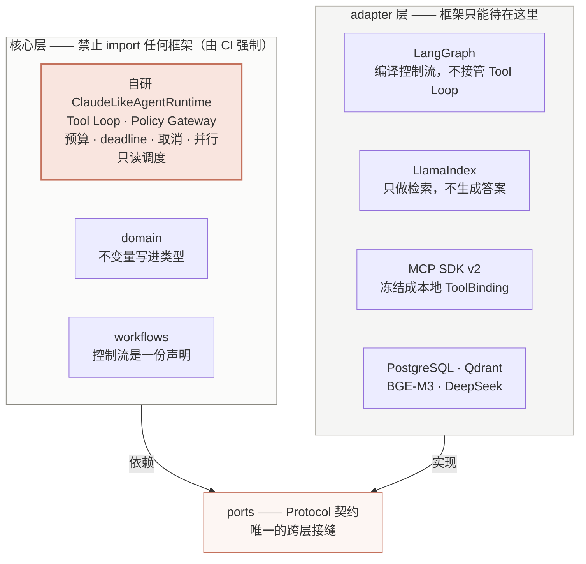

# Agent Workbench：十分钟版本

完整叙述见 [README](../README.md)，逐 PR 证据见[实施状态](./status.md)。这一页只回答三个问题：
**它现在真的能做什么、它的架构主张是什么、以及有没有证据。**

---

## 1. 它现在真的能做什么

下面是 2026-08-10 在本机跑的一个真实任务（`task_43dc512e…`）留下的事件流，**逐条来自
PostgreSQL 里的持久事件，不是示意图**：

```text
TaskSubmitted → TaskClaimed
  ToolProposed   external_search        → PermissionResolved  outside_submitted_envelope   ← 授权信封拒绝
  ToolProposed   mcp_web_fetch_page     → PermissionResolved  within_submitted_envelope
  ToolStarted    mcp_web_fetch_page     → ToolCompleted                                    ← 真的读了那一页
  ToolProposed   workspace_list/write   → PermissionResolved  within_submitted_envelope
  ToolStarted    workspace_write        → ToolCompleted                                    ← 产物落进任务工作区
waiting_approval                                                                           ← 停下来等人
  ApprovalDecided approved
TaskClaimed (epoch 2)                                                                      ← 换 epoch 重新领取，从 checkpoint 续跑
  ToolProposed   export_artifact        → ToolStarted → ToolCompleted
TaskSucceeded
```

一条链路同时演示了五件事：**只读取用外部世界**、**任务工作区**、**外部研究节点是一个 Agent**、
**导出必须由人批准**、**跨进程恢复**。每一次工具调用都留下
`ToolProposed → PermissionResolved → ToolStarted → ToolCompleted` 四件套；被拒的那一次也留痕，
而不是消失。产出的报告文件里带着审批 id 与草稿 artifact id，可以从这份报告倒查回是谁批准的。

另一条产品线是 Chat。问一个语料覆盖得到的问题，它给出答案与 5 条引用，每条带
`chunk_id`、`document_id` 和 **`document_version`**——最后那个字段是撤权与改版的栅栏。
问一个语料答不上来的问题，它**明说答不上来**：

> The evidence does not answer the question. … I cannot infer the knowledge base's topic
> from this evidence.

这比给出一个像模像样的答案更难做到，也更值得看。

---

## 2. 架构主张：Tool Loop 只有一个主人



这条边界不是文档里的一句倡议，它是一条**会让 CI 变红**的测试
（[`tests/architecture/test_dependency_boundaries.py`](../tests/architecture/test_dependency_boundaries.py)）：
核心层 import `langgraph`、`llama_index`、`fastapi`、`httpx` 中的任何一个都失败。

更能说明态度的是它连**方法调用**都禁：`as_query_engine` 与 `as_chat_engine` 挂在项目自己会构造的
`VectorStoreIndex` 上，召唤它们**不需要任何新 import**，所以只守 import 是不够的。一个
QueryEngine 会在检索内部把答案生成出来——位置在 ACL 检查的下游、发布闸门的上游，也就是
**文本经由一条发布闸门看不见的路径到达读者**。规则是照着"它实际会被怎样违反"写的。

---

## 3. 三个技术判断

这个项目的多数工作不是加功能，而是**找出没有症状的错误**，以及把一部分错误设计成不可能发生。

### 3.1 让越权在类型上不可能，而不是靠信任

reranker 跑在**授权之后**。它的 Port 返回的是「每段一个分数、按位置对齐」，
**不是重排好的段落列表**（[`ports/reranker.py`](../src/agent_workbench/ports/reranker.py)）：

> 一个返回段落的适配器可以少给一段、重复一段，或者返回一段从没交给过它的东西，而调用方
> 无法把 bug 与排序区分开。分数让契约可以按长度校验，并把重排留在**知道 PostgreSQL 授权了哪些
> 候选**的那一层。于是"reranker 不可能引入提问者无权读的段落"由构造成立，而不是靠信任。

超时、异常、分数条数不符——三条路径都窄回退到已授权的原顺序，没有任何一条会扩大授权范围。

### 3.2 一个没有任何症状的 bug

BGE-M3 的词法投影头 `sparse_linear.pt` 与主权重分开存放，而 FlagEmbedding **不把它的缺失当错误**：
它会新建一个 `Linear` 然后继续跑。于是下游每一道检查都通过——向量宽度是对的（宽度来自词表，
不来自这个投影），维度守卫也过——**它们只是一个随机投影，每个进程都不一样**。

代价记在代码注释里：两份被撤回的诊断，以及一份 hybrid 臂其实是「一串互不相关的采样」的消融报告。
所以检查被前移到构造模型之前，缺权重就**拒绝构造**，并在错误信息里附上取回权重的命令。

修复之后重测，结论与作废的那些**相反**，而 [`ABLATION.md`](../evals/rag/reports/ABLATION.md)
公开作废了自己此前的两条论断，并且拒绝给延迟现象一个过早的归因：

> 不写结论是刻意的。本文件上一版就是把整个延迟数量级归因给一个刚找到的 bug，而那个归因后来被
> 证明不完整——找到一个能解释现象的原因，不等于找到了全部原因。

### 3.3 检查被它本该拦住的东西满足

同一类缺陷出现过两轮，都是**围栏在场、但被它该拦的东西满足**：

- epoch 比当前 attempt 更旧的 `intended` 行，被下一个 Worker 读成"还没做过，去做"——于是外部
  副作用做了两次。改成转人工核对；
- 图节点每次向 Registry 问**最新** epoch 再写入——一个已经失去租约的 Worker 会拿顶替者的 epoch
  通过账本围栏。改成在**领取时**拿到的不可变 `ExecutionLease` 下写入；
- `knowledge_search` 把**检索到的全部**段落记进 journal，于是超出结果预算、根本没渲染给模型的
  段落也能通过引用校验。改成只记**渲染给模型的**。

还有一轮是"装齐了但没接上"：能力在组合根装配完整、配置与信封全对，而**真正跑的那条分支没接上**
——外部研究节点从不调用模型，`synthesize` 从不进入工作区会话，三个工作区工具每次都失败而 run
仍然报告成功。ADR-032 把测试为什么没挡住单独记了一笔：那条测试断言的是"目录会被交给这个
profile"，没有断言"图里那个节点会用这个 profile 跑起来"——**只测装配、不测调用的断言，正是这类
缺陷的藏身处**。

---

## 4. 证据

三组数字来自三种环境，**只能分别引用，不能相加**：

| 环境 | 结果 |
|---|---|
| 本机，无外部服务 | `1996 passed / 644 skipped` |
| 本机，真实 PostgreSQL + Qdrant | `2629 passed / 11 skipped` |
| CI，真实 PostgreSQL 16 + Qdrant，**每个 PR 都跑** | 920 项，2 项环境跳过 |
| 本机，真实服务 + DeepSeek | 上面第 1 节那条完整 Task |

静态门禁：Ruff format/lint 通过（441 files）、Pyright strict `0 errors / 0 warnings`、
前端 Vitest `114 passed` 与严格 TypeScript/ESLint 通过、锁文件与依赖许可证门禁通过。

规模（2026-08-11，只数 git 跟踪的文件）：Python 源码 51831 行、测试 62171 行、
前端 TypeScript 12657 行；23 份数据库迁移；38 份 ADR（基线内 11 份 + 实施过程中
27 份，编号 0012–0038 连续）。测试行数多于源码行数是有意的——本项目的规矩是
**测试先证明是红的再变绿，且没有对照组的测试不算数**：只断言"这个被拒绝"的测试，分不出一个正常
工作的校验器和一个把什么都拒绝的校验器。

**CI 那个真服务 job 不是每次都全绿**：`test_the_hybrid_and_dense_paths_agree_on_the_tie_break`
会偶发失败，原因是下面写着的那条已知缺口（并列分数没有确定性次序）。如实写出来，是因为把它
记成一个稳定的通过数字，既高估了这个 job，也掩盖了一条真实缺陷。

---

## 5. 边界

能力状态只按 `Planned → Implemented → Tested → Demonstrated` 升级，**没有可链接的测试或演示证据
不得升级**。按这条规矩，以下明确**未**完成：

- **生产身份认证**。当前 Identity 适配器只信任请求头，所以 API 只能在受控本机使用；监听地址
  限制在 loopback，但那是防误暴露的机制，不是身份认证；
- **已知可复现性缺口**：并列检索分数没有确定性次序，同一个问题两次提问可能得到不同的上下文与
  引用。它同时是上面那个 CI 偶发失败的原因；
- LlamaIndex 检索适配器已建成并通过契约测试，但**没有成为默认**——缺的不是实现，是一份能把两条
  检索路径区分开的等价性度量，而那次评测**测不出来**。"测不出来"不是切流量的理由；
- ingestion 未迁移到 LlamaIndex、RAGAS runner 未落地，因此能力表里这两项**整体保持 Planned**：
  适配器存在不等于框架集成已完成；
- WP15 阶段五的第二张图 `v2_general` 已有真实模型的端到端验收（2026-08-11，
  `task_3ae4d5a0…`：`understand → work → review → export → succeeded`，产出可下载
  可预览的 `.docx`）。**跑通它的代价是修掉四个各自独立的缺陷**——其中两个会静默地
  让正确的行为失败（`with_entry` 的 `model_copy` 绕过校验、路由能返回的目标不在边
  表里），过程与证据见 status.md 2026-08-11；
- Langfuse、CrewAI 对比、动态 Multi-Agent supervisor、生产部署未完成；
- 当前 Compose 只用于本机演示，不能作为生产部署或生产级多 Worker 的证明。

---

## 6. 五分钟自己跑

不需要数据库、不需要联网、不需要 API key，输出逐字节可复现：

```bash
uv run agent-cli demo
```

想看策略拒绝时 handler **完全不会被调用**：

```bash
uv run agent-cli demo --deny
```

完整本机拓扑（PostgreSQL、Qdrant、API、Worker、控制台）见[本机运行手册](./running-locally.md)与
[Compose 部署](./deployment.md)。

---

> 本仓库为 clean-room 实现，边界见 [NOTICE.md](../NOTICE.md) 与 [合规说明](./compliance.md)。
