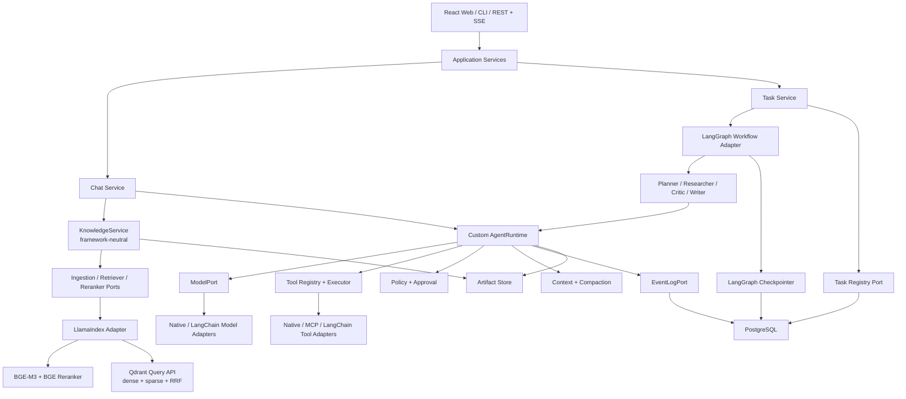
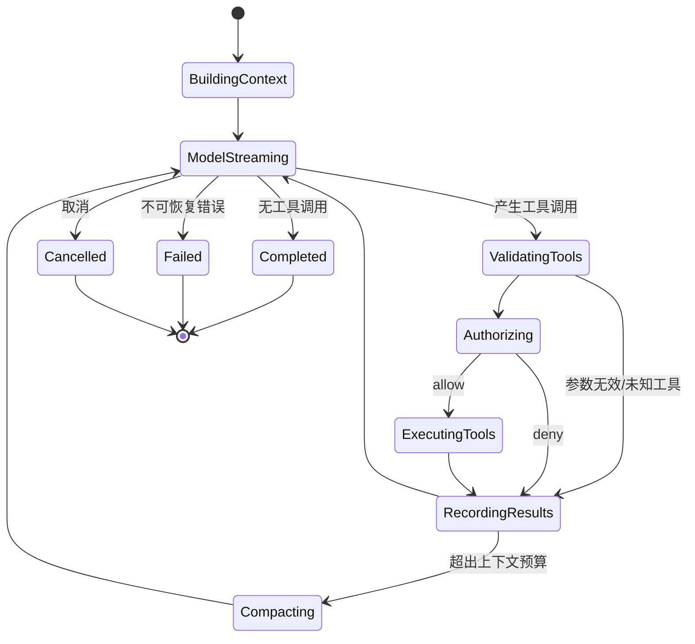
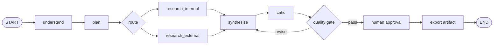
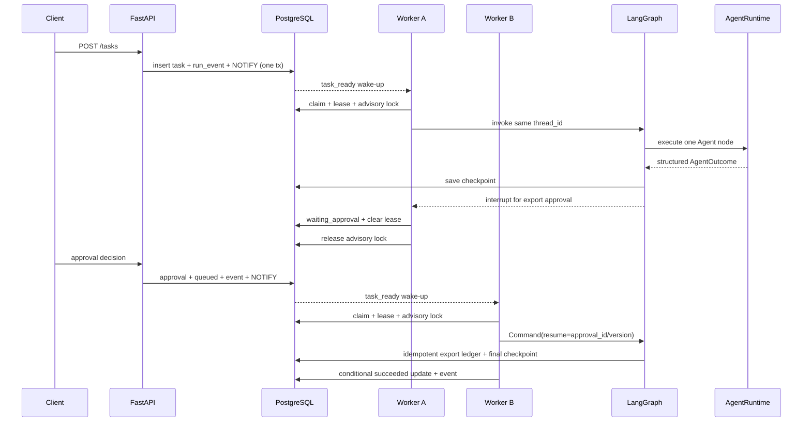
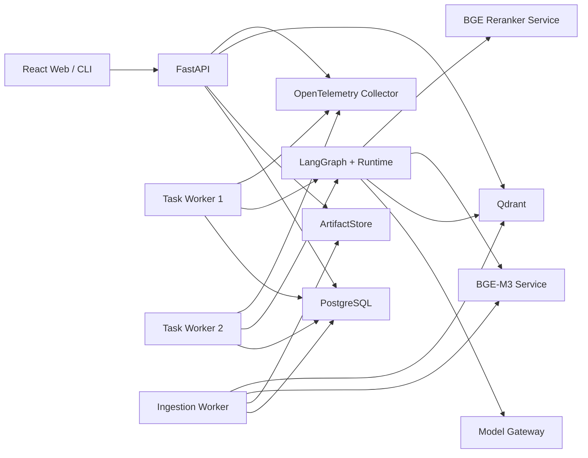

# Agent Workbench：架构与技术选型基线 v1.3

> 基线编号：APB-001
>
> 日期：2026-07-22
>
> 状态：已接受的目标架构；后续改变核心边界时必须新增 ADR，而不是直接穿透分层
>
> 实现状态：**部分实现**；Resume v1 尚未完成，逐项证据见第 17 节
>
> 目标：面向校招展示一个“Chat + RAG、Task + Multi-Agent、自研 Claude Code 风格 Runtime”的通用 Agent 项目

一句话定位：

> **Agent Workbench 是面向知识工作的 Chat + Task 双模式 Agent 平台：自研工具调用 Runtime 负责安全行动，LlamaIndex 负责可评测 RAG，LangGraph 负责可恢复工作流，PostgreSQL 负责可靠任务协调与事件重放。**

## 1. 基线结论

项目只设一个核心 Agent 行动循环：**自研 `AgentRuntime`**。

- 自研 Runtime：负责单个 Agent 内部的 `Model → Tool → Result → Model` 循环，以及工具执行、安全、上下文和事件语义。
- LlamaIndex：负责 RAG ingestion、索引与 retrieval 适配；不使用其 Agent executor。
- LangChain Core：只作为模型/Tool 生态适配层和可替换契约样例；不承担 RAG 主链或 Agent 循环。
- LangGraph：负责跨步骤、跨 Agent、可暂停和可恢复的 Task 工作流；不执行 Runtime 已经负责的同一次工具调用。
- CrewAI：不进入 v1 主链路；以后只作为独立 `BenchmarkTaskRunner` 对照实验。AutoGen 不进入当前范围。

硬性规则：

> 自研 AgentRuntime、第三方 Agent executor、LangGraph ToolNode 三者中，只能有一个组件负责同一次 Tool Calling 循环。

本项目选择自研 Runtime。因此，主链路不使用 LlamaIndex、LangChain、CrewAI 的预置 Agent 循环。

### 1.1 已锁定的职责

| 问题 | 唯一负责人 | 明确不负责 |
|---|---|---|
| 单 Agent 如何行动 | 自研 `ClaudeLikeAgentRuntime` | Task 拓扑、RAG 索引 |
| 长任务如何推进/恢复 | LangGraph | 同一次 Model→Tool 循环 |
| 文档如何摄取和检索 | LlamaIndex Adapter | Chat Session、Agent 决策、Task 状态 |
| dense+sparse 索引与融合 | Qdrant Query API | 文档/ACL 事实源 |
| 产品状态、事件、任务协调 | PostgreSQL | 向量检索 |
| 大文件和原始文档 | S3-compatible ArtifactStore | Task 状态和事件游标 |
| 第三方多 Agent 对照 | CrewAI Benchmark | 生产执行或恢复语义 |

### 1.2 交付优先级

- **P0 简历 v1**：Runtime、Chat RAG、LangGraph Task、受控 Multi-Agent、PostgreSQL 恢复、最小 UI、测试与指标。
- **Optional Lab**：CrewAI benchmark、MCP Adapter、Langfuse 自托管 profile、高级 compaction、Redis Streams 扩展。
- **明确不承诺**：AutoGen、无限递归 Agent、生产级 OS Sandbox、Kubernetes、所谓泄漏代码复刻。

## 2. 产品基线

### 2.1 项目定位

项目暂定名为 **Agent Workbench**：面向知识工作而不是代码编辑的通用 Agent 平台。

它提供两种互补模式：

1. **Chat 模式**：上传文档、带引用问答、连续追问、可选 Agentic Retrieval。
2. **Task 模式**：把开放任务转成可观察、可审批、可恢复的多阶段工作流。

v1 使用“研究报告生成”作为统一演示场景：

```text
Chat：上传 PDF/Markdown → 建立知识库 → 带引用问答

Task：提出研究目标
   → 需求理解
   → 制订计划
   → 两个研究节点并行
   → 交叉审查
   → 生成报告
   → 人工审批
   → 导出产物
```

该场景不是平台边界。领域能力必须作为 Tool、Agent Profile 或 Workflow 插件接入，不能写死进 Runtime。

### 2.2 v1 必须展示的知识

- 自研流式 Tool-Calling Agent Runtime。
- LlamaIndex ingestion/retrieval、2-step RAG 与 Agentic Retrieval。
- `langchain-core` 的 Model/Tool 互操作 Adapter 与 contract test，不使用其 Agent executor。
- LangGraph State、条件边、并行节点、checkpointer、interrupt 和恢复。
- Tool schema、权限、并发、超时、取消、幂等和审计。
- 多 Agent 的上下文隔离、预算和结果合并。
- RAG 离线评测、运行时测试、失败注入和可观测性。
- FastAPI、事件流、PostgreSQL、容器化和 CI。

### 2.3 v1 明确不做

- 递归无限子 Agent、自由组队、群聊式或持久 mailbox；Graph node/reducer 是 v1 的 Agent 间通信机制。
- 任意宿主机 Shell、浏览器自动化和 IDE/Worktree 集成。
- 插件市场、MCP OAuth 全流程和热更新。
- GraphRAG、多模态 RAG、知识图谱和强化学习。
- Kubernetes、服务网格和过早微服务拆分。
- CrewAI、LangChain Agent 或其他第三方 Agent executor 进入默认执行链。
- 对 Claude Code 产品行为做一比一复制。

## 3. 总体架构



一句话边界：

> Runtime 解决“一个 Agent 如何安全行动”；LangGraph 解决“一个长期任务如何推进”；LlamaIndex 解决“知识如何进入索引并被检索”。

## 4. 分层与单向依赖

### 4.1 层次划分

| 层 | 职责 | 可以依赖 | 禁止依赖 |
|---|---|---|---|
| `domain` | 稳定领域类型、不变量、错误语义 | Python 标准库、Pydantic 基础类型 | LangChain、LangGraph、FastAPI、数据库 SDK |
| `ports` | Model、Retriever、Store、Sandbox 等协议 | `domain` | 具体供应商实现 |
| `runtime` | 自研 Agent 循环、工具调度、权限、上下文 | `domain`、`ports` | LangGraph、FastAPI、具体数据库 |
| `knowledge` | 框架无关 ingestion/retrieval 用例、citation、RAG eval | `domain`、`ports` | LlamaIndex/Qdrant 类型、Application/UI |
| `workflows` | 框架无关 TaskState、节点处理器、路由规则 | `domain`、`ports`、`AgentExecutor` | `StateGraph`、`Command`、`interrupt`、Runtime 内部实现 |
| `application` | Chat、Task、Session、Approval 用例 | 上述稳定接口 | 直接调用向量库和数据库 SDK |
| `adapters` | LlamaIndex、LangChain、LangGraph、Qdrant、MCP、数据库、模型实现 | `domain`、`ports` | 反向要求核心继承框架类型 |
| `interfaces` | REST、SSE、CLI、Web UI | `application` | 直接执行 Tool 或写 checkpoint |
| `bootstrap` | 配置、依赖注入和进程启动 | 所有模块 | 领域逻辑 |

### 4.2 不可违反的依赖规则

```text
interfaces → application → domain/ports
runtime ─────────────────→ domain/ports
knowledge ───────────────→ domain/ports
workflows ───────────────→ domain/ports + AgentExecutor
adapters ────────────────→ 实现 ports
bootstrap ───────────────→ 仅负责组装
```

框架类型必须停在 Adapter 边界：

- 核心层不能出现 `BaseTool`、`AIMessage`、`StateGraph`、`QueryEngine`。
- `ToolSpec` 不能直接等于 LangChain Tool。
- `TaskState` 不能保存模型、数据库连接或不可序列化对象。
- 更换模型、LlamaIndex、向量库或 LangGraph checkpointer 时，Runtime 不得修改。

## 5. 建议代码目录

```text
agent-workbench/
├── web/                           # React + TypeScript，后期加入
├── src/agent_workbench/
│   ├── apps/                      # 进程入口（打包进 wheel）
│   │   ├── api/                   # FastAPI、REST、SSE
│   │   └── cli/                   # 调试和演示入口
│   ├── domain/
│   │   ├── schema.py              # 序列化基类与 schema 版本
│   │   ├── identifiers.py         # ID 约束与生成器
│   │   ├── messages.py
│   │   ├── events.py
│   │   ├── runs.py
│   │   ├── tools.py
│   │   ├── policies.py
│   │   ├── artifacts.py
│   │   ├── context.py
│   │   └── errors.py
│   ├── ports/
│   │   ├── model.py
│   │   ├── agent_executor.py
│   │   ├── hooks.py
│   │   ├── event_log.py
│   │   ├── conversation_store.py
│   │   ├── task_registry.py
│   │   ├── ingestion.py
│   │   ├── document_store.py
│   │   ├── outbox.py
│   │   ├── artifact_store.py
│   │   ├── retriever.py
│   │   ├── embedding.py
│   │   ├── sparse_encoder.py
│   │   ├── reranker.py
│   │   ├── memory.py
│   │   ├── approval.py
│   │   ├── sandbox.py
│   │   └── telemetry.py
│   ├── runtime/
│   │   ├── agent_runtime.py       # 循环本体
│   │   ├── state.py               # 7.1 状态机的可执行表
│   │   ├── tool_registry.py
│   │   ├── tool_gateway.py       # schema → policy → timeout → 归一化
│   │   ├── budgets.py            # 有效 deadline = 各层下界取 min
│   │   ├── tool_scheduler.py     # 纯函数：并发分组与 exclusive 屏障
│   │   ├── schema_validation.py  # 受支持的 JSON Schema 子集
│   │   ├── tool_executor.py
│   │   ├── tool_scheduler.py
│   │   ├── policy_engine.py
│   │   ├── hook_bus.py
│   │   ├── context_engine.py
│   │   ├── compaction.py
│   │   └── cancellation.py
│   ├── knowledge/
│   │   ├── ingestion.py
│   │   ├── retrieval.py
│   │   ├── citations.py
│   │   └── evaluation.py
│   ├── workflows/
│   │   ├── task_state.py
│   │   ├── nodes/                 # 框架无关 handler
│   │   ├── routing.py
│   │   └── definitions.py
│   ├── application/
│   │   ├── chat_service.py
│   │   ├── task_service.py
│   │   ├── session_service.py
│   │   └── approval_service.py
│   ├── adapters/
│   │   ├── models/
│   │   ├── embeddings/bge_m3.py
│   │   ├── rerankers/bge_v2_m3.py
│   │   ├── llama_index/           # Document/Node/Ingestion/Retriever mapping
│   │   ├── langgraph/             # graph、runner、fenced_checkpointer
│   │   ├── qdrant/
│   │   ├── mcp/
│   │   ├── persistence/
│   │   ├── sandbox/
│   │   └── telemetry/
│   └── bootstrap/
│       ├── container.py
│       └── settings.py
├── tests/
│   ├── architecture/
│   ├── contracts/
│   ├── runtime/
│   ├── recovery/
│   ├── security/
│   ├── workflows/
│   ├── rag_evals/
│   ├── end_to_end/
│   └── support/
│       ├── failpoints.py          # 可命名阻塞/崩溃点，禁止概率 sleep
│       ├── async_barriers.py      # 精确控制 Worker 交错顺序
│       └── lease_controller.py    # 测试中直接推进 lease 状态
├── evals/
│   ├── rag/
│   ├── tasks/
│   └── benchmarks/crewai/         # Optional Lab，独立进程/路径
├── migrations/
├── docker-compose.yml
└── pyproject.toml
```

## 6. 框架无关核心契约

### 6.1 `ModelPort`

```python
class ModelPort(Protocol):
    def stream(self, request: ModelRequest) -> AsyncIterator[ModelEvent]: ...
```

`ModelEvent` 表达文本增量、完整工具调用、usage 和结束原因。核心不读取 Anthropic/OpenAI/LangChain 原生消息对象。

### 6.2 `ToolSpec` 与 `ToolBinding`

```python
@dataclass(frozen=True)
class ToolSpec:
    name: str
    description: str
    input_schema: dict
    output_schema: dict | None
    concurrency: Literal["parallel", "exclusive"]
    risk: Literal["read", "write", "external", "destructive"]
    idempotency: Literal["safe", "keyed", "unsafe"]
    timeout_seconds: int
    permission_scopes: tuple[str, ...]
    schema_version: int = 1

@dataclass(frozen=True)
class ToolBinding:
    spec: ToolSpec
    handler: ToolHandler
```

`ToolSpec` 可序列化；handler 只存在于运行时注册表。Native、MCP 和 LangChain Tool 都必须先转换成该契约，再进入统一 Tool Gateway。

### 6.3 `AgentExecutor`

```python
class AgentExecutor(Protocol):
    async def run(
        self,
        request: AgentRunRequest,
        emit: EventSink,
        cancellation: CancellationToken,
    ) -> AgentOutcome: ...
```

生产默认实现只有 `ClaudeLikeAgentRuntime`。v1 不承诺在 Tool Loop 中间跨进程恢复；Task 级恢复由 LangGraph checkpoint 完成，持久取消事实由 `task_runs` 保存并传播为进程内 `CancellationToken`。真正的 Runtime mid-loop resume 必须先增加 `agent_run_snapshots`、消息游标和 orphan Tool 协议，放入 Optional Lab。

CrewAI 不实现这份协议，因为它不能天然保证相同的 cancellation、EventSink、ToolGateway 和恢复语义；对比实验使用更窄的 `BenchmarkTaskRunner`，缺失能力必须标为 unsupported。

### 6.4 `PolicyEngine`

```python
class PolicyEngine(Protocol):
    async def decide(
        self,
        call: ToolCall,
        context: ExecutionContext,
    ) -> PolicyDecision: ...
```

决策结果只能是：

```text
allow | deny | allow_with_modified_input
```

任何 Hook、模型或用户修改工具参数后，都必须重新执行 schema validation 和 policy evaluation。

v1 的人工审批位于 LangGraph 明确的业务边界，例如“批准后导出报告”。任意模型临时提出写 Tool 后在 Runtime 中间暂停并恢复，属于后续 Runtime checkpoint 能力，不能提前宣称支持。

### 6.5 `ContextPacket`

```python
class ContextPacket(BaseModel):
    chunks: list[ContextChunk]
    citations: list[Citation]
    retrieval_trace_id: str | None
    token_estimate: int
```

Chat 的固定检索和 Agent 的检索 Tool 都输出同一结构，使引用、评测和上下文预算共享实现。

### 6.6 知识链路 Ports

```python
class IngestionPort(Protocol):
    async def ingest(self, document: SourceDocument) -> IngestionResult: ...

class RetrieverPort(Protocol):
    async def retrieve(self, query: RetrievalQuery) -> ContextPacket: ...

class EmbeddingPort(Protocol):
    async def encode_dense(self, texts: list[str]) -> list[list[float]]: ...

class SparseEncoderPort(Protocol):
    async def encode_sparse(self, texts: list[str]) -> list[SparseVector]: ...

class RerankerPort(Protocol):
    async def rerank(self, query: str, chunks: list[ContextChunk]) -> list[ContextChunk]: ...
```

`knowledge` 只使用上述接口。LlamaIndex `Document/Node`、Qdrant Point、FlagEmbedding 输出必须在 Adapter 内映射，不能成为核心领域类型。

### 6.7 统一事件协议

每条事件至少包含：

```text
event_id, event_key?, schema_version, stream_id, task_id, run_id, sequence,
timestamp, parent_event_id, event_type, durability, payload
```

v1 事件类型：

```text
RunStarted
ContextBuilt
ModelStarted
ModelDelta
ModelCompleted
AnswerCommitted
AnswerWithheld
ToolProposed
PermissionRequested
PermissionResolved
ToolStarted
ToolProgress
ToolCompleted
ToolFailed
ContextCompacted
AgentDelegated
AgentCompleted
RunPaused
RunCompleted
RunFailed
RunCancelled
```

CLI、SSE、审计日志和 OpenTelemetry 消费同一事件协议，不各自发明回调。

PostgreSQL `event_streams/events` 是当前唯一持久事件事实源，`EventLogPort` 只是其
框架无关接口。
`ModelDelta`、高频 Tool progress 属于 transient stream，不逐 token 写数据库；
`ModelCompleted`、Tool/审批/节点状态、错误和终态属于 durable event。事件用于审计与
观察，不替代 Conversation Store、LangGraph checkpoint 或 Runtime checkpoint。

对使用检索证据的 Chat，`ModelCompleted` 只表示 Provider 已经结束一次模型调用，**不等于
答案已获准公开**。Chat application 必须在 Runtime 外包一层 answer release gate：

1. 最终 ACL/evidence 复核前，`ModelDelta.text`、`ModelCompleted.text` 和
   `output_ref` 不得进入公开 EventLog 或 live subscriber；
2. 模型结束后先把候选与精确的 `(document_id, source_revision)` 集合写为内部
   `release_pending`，此状态不能出现在会话历史；
3. 最终发布事务按稳定顺序锁定 conversation/Turn、所有引用 document row 和 event
   stream，在锁内重新检查 tenant、deleted、精确 revision 与实时 owner/ACL；
4. 同一事务写 stream-local 稳定 `event_key` 的 `AnswerCommitted` 或不含候选答案的
   `AnswerWithheld`，追加唯一可见 assistant，并把 Turn 转为
   `committed/withheld`；任何一步失败必须一起回滚；
5. 所有内容、删除和 ACL writer 必须先锁同一 document row。这个共同写入协议使撤权
   与发布线性化；禁止绕过 Repository 直接执行不推进 revision 的 ACL-only 写入；
6. `release_pending` 重试必须使用持久化的 revision 集合重新进入同一发布事务，不能
   信任 prepare 时的授权结果。稳定 `event_key` 是重复调用防御，不替代原子事务；
7. Runtime/CLI/Task 的通用 `ModelCompleted` 契约保持不变，发布权限由拥有最终证据检查的
   application use case 决定。

SSE/UI 只能把 `AnswerCommitted` 视为可展示的检索型答案，不能把 Chat 路径中的
`ModelCompleted` 当作答案内容源。

### 6.8 Chat 固定执行 lease

同步 Chat 与可恢复 Task 的 lease 语义不同。Chat 没有 mid-loop checkpoint，也没有
可安全重放模型调用和副作用的 attempt ledger，因此 `running` Turn 只使用一个固定、
不可续租的 `lease_until`：

- claim 以 PostgreSQL 时钟计算 `request_timeout + orphan_grace`；
- `running` 必须持有 lease，进入 `release_pending/failed/cancelled` 时必须清空；
- request timeout、ASGI cancellation 和客户端断开只可条件终态化仍为 `running`
  的 Turn，不能覆盖已准备或已提交事实；
- `running → release_pending` 必须在 Turn 锁内验证数据库当前时间仍早于 lease；
- reaper 使用 `FOR UPDATE SKIP LOCKED` 把到期 Turn 转为稳定失败，不追加 assistant，
  不删除 user message，也不重新执行模型；
- 同 key 重试返回原失败；业务重试必须使用新 key。

如果未来要把到期 Turn 重新交给其他执行者，`lease_owner + lease_epoch + heartbeat +
所有 checkpoint/event/副作用写入 fencing` 必须一起加入，不能把固定 deadline 改名为
可恢复 lease 就宣称具备恢复能力。

## 7. 自研 Runtime 基线

### 7.1 状态机



### 7.2 必须守住的不变量

1. 每个已经暴露的 `tool_call_id` 最终有且仅有一个 `ToolResult`，包括未知工具、参数错误、拒绝、超时、异常和取消。
2. Tool 只有在最终参数通过 schema validation 和权限决策后才能执行。
3. 修改 Tool input 后必须重新验证、重新授权。
4. `parallel` Tool 可以并发；`write/external/destructive` Tool 通过 exclusive barrier。
5. 执行可并发，但提交给模型的 ToolResult 按原始 ToolCall 顺序稳定排列。
6. 非幂等副作用不自动重试；可重试副作用必须携带 idempotency key。
7. 副作用前先写 `ToolExecutionIntent`；完成后写结果。崩溃后状态不明的操作进入人工核对。
8. 取消信号传播到模型请求、Tool 和网络请求；跨 Agent 取消由 LangGraph/Task Worker 负责。
9. Compaction 只生成派生上下文，不删除原始事件。
10. Runtime 运行有 token、费用、时间和 Tool 次数预算；Task 层另有 Agent node 数与总预算。
11. 检索内容和 Tool 输出都是不可信数据，不能提升权限或覆盖系统策略。
12. checkpoint、日志和 trace 不保存 API Key、Cookie 或完整环境变量。
13. 每个 Session 只有一个主写入者；并行 Agent 使用独立 `agent_run_id`。
14. Event、Tool schema 和 GraphState 都带版本，并具有迁移测试。

## 8. Chat 与 Task 的具体组合

### 8.1 Chat + RAG

默认走可预测、可评测的 2-step RAG：

```text
用户问题
  → query rewrite
  → BGE-M3 dense + sparse encode
  → Qdrant Query API: dense top-N + sparse top-N + RRF
  → BGE-reranker-v2-m3
  → ContextPacket
  → AgentRuntime
  → 回答 / 引用 / 拒答 / 追问
```

固定 2-step 模式由 ChatService 触发一次检索；Runtime 在看到 `ContextPacket` 后决定回答、引用、拒答或追问。只有深度研究模式才把同一个 `knowledge_search` 暴露成 Tool，由 Runtime 决定是否继续检索；两条路径必须输出同一 `ContextPacket`。

LlamaIndex 负责 reader/connector、Node parsing、ingestion pipeline 和 Retriever Adapter，不使用 QueryEngine/Agent 做最终回答。普通 `HuggingFaceEmbedding` 不能自动得到 BGE-M3 sparse lexical weights，因此必须实现一个常驻 `BgeM3EncoderAdapter`，同批次输出 1024 维 dense vector 与 sparse `indices/values`；文档和查询共享 tokenizer、model revision、max length 与 precision。

融合所有者锁定为 **Qdrant Query API 的 RRF**：Qdrant 完成一次 dense+sparse fusion，LlamaIndex Adapter 只映射结果，不能再次 relative-score fusion。初始候选数建议 dense/sparse 各 40、rerank 后保留 6–10，但这些是评测调优参数而不是硬编码产品规则。Embedding 和 reranker 常驻加载、批处理、预热并设置并发/超时；不因模型支持 8192 tokens 就把 chunk 设为 8192。

### 8.2 Task + Multi-Agent

LangGraph v1 固定图：



- 确定性校验、路由、质量门禁优先使用普通 Python node。
- 需要开放推理和 Tool Calling 的节点使用 `AgentExecutor`。
- 固定阶段、并行分支和所有跨 Agent 路由都由 LangGraph 管理。
- Supervisor 是返回结构化 routing decision 的普通 Graph node；Researcher/Critic/Writer 是带不同 Profile 的 Agent node。
- Runtime 在单个 node 内只执行一个 Agent 的 Tool Loop，不创建或调度子 Agent。

v1 的 Agent node 只使用只读 Tool，允许在 checkpoint 提交前崩溃时重新计算。唯一写操作 `export_artifact` 是审批后的确定性 Graph node，幂等键固定为 `task_id + graph_node_operation_id + artifact_version`。

## 9. 状态所有权与持久化

| 状态 | 唯一权威来源 | 说明 |
|---|---|---|
| Chat 用户/助手完整消息 | PostgreSQL `conversation_sessions/messages` | 多轮会话事实源；事件日志不是聊天记录库 |
| Task 产品状态、claim、lease、取消、解析后的检索索引 | PostgreSQL `task_runs` | Task Registry；保存具体 Qdrant collection/index version，不保存工作流节点位置或可移动 alias |
| 工作流节点、分支、interrupt 位置、节点重试 | LangGraph checkpointer | Task 执行位置 |
| Runtime/Workflow 观察事件 | PostgreSQL `run_events` | 唯一 append-only 事件事实源；供 SSE、审计和 trace，不决定执行位置 |
| Tool 副作用 intent/result | PostgreSQL `tool_executions` | 幂等与崩溃核对 |
| 审批请求与决定 | PostgreSQL `approvals` | Graph checkpoint 中只保存 `approval_id` |
| 报告、文件、长 Tool 输出 | ArtifactStore | GraphState 和消息只存引用 |
| 文档、版本、ACL、ingestion 状态 | PostgreSQL + ArtifactStore | 原文和权限事实源 |
| chunk、dense/sparse vector、检索 payload | Qdrant | 可删除重建的派生索引 |
| 用户偏好和长期事实 | Memory Store | 与 RAG 文档分开 |
| 当前 prompt、compact summary | ContextEngine 派生状态 | 从 Conversation/Graph 输入/Artifact 构造，不从观察事件恢复 |
| 页面 loading、展开状态 | 前端本地状态 | 不进入后端领域模型 |

统一追踪层级：

```text
workflow_thread_id
  └── graph_node_id
      └── agent_run_id
          └── model_call_id
              └── tool_call_id
```

GraphState 只保存短小、可序列化的业务状态和引用：

```python
class TaskState(TypedDict):
    schema_version: int
    task_id: str
    objective: str
    plan: list[TaskStep]
    evidence_refs: list[str]
    draft_ref: str | None
    review_result: ReviewResult | None
    approval_id: str | None
    agent_outcome_refs: list[str]
    budget_usage: BudgetUsage
```

不要把 `current_step`、Task 产品 `status`、完整消息、文档正文、Tool 大结果或模型实例放入 GraphState。执行位置由 checkpoint 的 `next/tasks` 表示，产品状态由 `task_runs` 表示。

### 9.1 PostgreSQL-only 协调基线

v1 的应用控制面不依赖 Redis 或 Celery。PostgreSQL 同时承担 Conversation Store、Task Registry、任务竞争领取、持久事件、审批和执行账本；LangGraph checkpointer 仍是工作流执行位置的唯一事实源。

```text
PostgreSQL
├── conversation_sessions/messages # Chat 消息
├── task_runs                  # 产品状态、排队、lease、取消
├── LangGraph checkpoint 表    # graph 执行位置和恢复
├── run_event_streams/events   # append-only 事件、SSE replay
├── approvals                 # 审批请求和决定
├── tool_executions            # 副作用 intent、幂等结果
├── documents/versions/acl     # 知识事实与权限
├── ingestion_jobs             # 索引任务状态
├── outbox_events              # 跨 PostgreSQL/Qdrant 可靠投递
├── qdrant_index_generations   # collection/version 生命周期与保留
└── pg_notify(...)             # 只有低延迟唤醒，不承载事实
```

该方案的交付语义是 **at-least-once + 幂等提交**，不宣称 exactly-once。

`task_runs` 明确增加以下三列：

```text
resolved_qdrant_collection     TEXT
resolved_qdrant_index_version  TEXT
resolved_qdrant_index_generation_id UUID
```

不使用知识库的 Task 可以为空；涉及知识库的 Task 提交成功时三列必须同时
非空。generation ID 外键形成持久 reservation；它们是该 Task 检索语义的
一部分，不是 Qdrant 当前路由状态的缓存。

### 9.2 跨 Worker claim

Worker 用一个短事务原子领取任务：

```sql
WITH picked AS (
    SELECT id
    FROM task_runs
    WHERE status = 'queued'
      AND available_at <= clock_timestamp()
    ORDER BY priority DESC, created_at, id
    FOR UPDATE SKIP LOCKED
    LIMIT 1
)
UPDATE task_runs AS task
SET status      = 'running',
    lease_owner = :worker_id,
    lease_until = clock_timestamp() + :lease_duration,
    lease_epoch = lease_epoch + 1,
    attempt     = attempt + 1,
    updated_at  = clock_timestamp()
FROM picked
WHERE task.id = picked.id
RETURNING task.*;
```

领取后立即提交，绝不持有数据库行锁调用模型、HTTP 或 Tool。执行期依靠 `lease_until`、独立 heartbeat 和 `lease_epoch`；heartbeat、完成和失败更新都必须同时匹配 `lease_owner` 与领取时的 `lease_epoch`。

Registry fencing 不能单独阻止旧 Worker 写 LangGraph checkpoint。Worker claim 后使用 `pg_try_advisory_lock` 取得 task-scoped session lock：成功才恢复同一 `thread_id`；失败则条件释放自己的 lease、短退避后转回 `queued`，不能以 `running` 状态阻塞等待。

执行包装器在每个 node/副作用前后校验 advisory lock、取消状态和 `lease_epoch`。LangGraph PostgreSQL saver 必须包成 `FencedCheckpointer`：每次 `put/put_writes` 都在一个短事务中锁定 `task_runs` 行，校验 `status='running'`、`lease_owner`、`lease_epoch`、`lease_until`，只有仍有效才写 checkpoint。旧 epoch 或过期 lease 影响 0 行/校验失败时丢弃 node 输出并取消本次 Graph run。

`FencedCheckpointer` 拒写转换为明确的 `StaleExecution`/cancellation 信号，不能进入普通 retry policy。所有跨表事务固定加锁顺序 `task_runs → approvals/tool_executions → run_event_streams → checkpoint tables`；lease 时长、heartbeat 周期和 grace window 均为配置项并通过故障测试确定，不能把示例值当常量。

advisory-lock guard 必须从加锁到 Task 退出全程占住**同一条物理 PostgreSQL session 连接**。v1 使用独立直连；如果以后从 session pool checkout，则必须 pin 到任务结束后才归还。它不能经过 PgBouncer transaction-pooling 模式，也不能和普通短事务连接轮换。guard 连接与 `LISTEN` 连接职责不同，各自使用专用 session。

guard 连接断开必须立即触发 Graph cancellation；旧 Worker 不得自动重连继续执行，只能重新 claim。这样 session lock 防止正常情况下双执行，`FencedCheckpointer` 和副作用 ledger 则封住“node 前校验通过、执行期间 lease 丢失”的窗口。每个运行中 Task 会占用一条 guard 连接，Worker 并发上限和 PostgreSQL 连接预算必须对应配置。

stale-lease reaper 明确执行 `running → queued` 并写 `recovery_reason`，结合 `available_at` 退避、`max_attempts` 和 `dead_letter` 处理毒任务。`SKIP LOCKED` 只解决并发竞争领取，不负责请求去重，也不保证严格 FIFO；高优先级队列应增加 aging 以避免饥饿。

入队事务同时发送共享 `task_ready` 通知；Worker 被唤醒后仍执行上述 claim，而不是把 payload 当任务。Worker 还必须使用带抖动的有界轮询作为兜底，保证断线或丢通知时任务最终仍会被领取。

### 9.3 去重与副作用幂等

去重由数据库约束和执行账本承担：

```text
task_runs:       UNIQUE(owner_id, submission_dedup_key)
tool_executions: UNIQUE(task_id, operation_key)
run_events:      UNIQUE(stream_id, sequence)
approvals:       UNIQUE(task_id, graph_node_operation_id)
```

- `submission_dedup_key` 防止同一提交被重复创建。
- v1 唯一写操作使用稳定业务 `operation_key`；模型重新生成的 `tool_call_id` 不能单独充当跨重试幂等键。支持幂等键的外部 API 必须透传业务键。
- 对“外部副作用已成功、数据库尚未提交就崩溃”的不确定窗口，保存 intent 和 request hash；无法安全确认时进入人工核对，不能伪装成 exactly-once。
- 终态更新使用条件 `UPDATE` 和版本号；旧 attempt 或旧 lease 的写入影响 0 行时必须丢弃。

### 9.4 事件、SSE 与 `LISTEN/NOTIFY`

`run_events` 是 Chat、Task、Agent 的统一持久事件表。每个逻辑 stream 在 `run_event_streams` 中保存 `next_sequence`；append 事件时锁定对应 stream 行并分配 sequence，SSE cursor 使用 `(stream_id, sequence)`，避免全局自增 ID 在事务反向提交时造成永久漏读。

状态更新、事件或消息写入、唤醒信号必须在同一事务中发生：

```text
BEGIN
  条件更新 task_runs / approvals
  锁定 run_event_streams 并分配 sequence
  INSERT run_events (...)
  SELECT pg_notify('agent_events', '{"stream_id":"...","sequence":42}')
COMMIT
```

`NOTIFY` payload 只放 stream 和 sequence 等定位信息，不放正文；默认配置要求 payload 小于 8000 字节。通知在事务提交后才会投递，而且相同事务内同 channel、同 payload 的通知可能合并。监听者收到信号后仍查询持久表；通知重复、合并或断线丢失都不影响正确性。使用少量共享 channel，不为每个 Task 创建 channel。

监听恢复顺序固定为：

1. 建立专用长连接并执行、提交 `LISTEN`。
2. 根据本地 cursor 查询持久表完成首次 catch-up。
3. 收到通知后再次按 cursor 查询，而不是直接信任 payload。
4. 断线后重新 `LISTEN` 并补拉；空闲期也周期性 catch-up。

SSE 将 `stream_id:sequence` 编码为事件 ID，接受 `Last-Event-ID` 后补发缺失的 durable 事件。Transient token delta 可以实时发送但不保证逐 token replay；重连从最近 durable chunk 或完整消息继续。每个慢客户端使用有限内存缓冲；溢出时断开，让客户端依靠 cursor 重连。`LISTEN` 使用专用 session 连接，不能经过 transaction-pooling 模式复用。

取消也遵循同一原则：`cancel_requested_at/status` 是 PostgreSQL 中的事实，`NOTIFY` 只缩短 Worker 感知延迟。

固定 LangGraph v1 不需要 Agent mailbox：node 输入、GraphState reducer 和 `AgentOutcome` 已足够通信。若以后加入长生命周期 Agent 或跨 run 异步收件箱，必须新建持久 `agent_mailbox` 表，并使用 claim/ack/lease；`LISTEN/NOTIFY` 仍然只负责唤醒。该语义已经锁定，但实现属于 Optional Lab。

### 9.5 与 LangGraph checkpoint 的恢复边界

Task Registry 表示产品生命周期，LangGraph checkpoint 表示图执行位置。二者不伪装成一个分布式事务；Worker 取得 claim 与 advisory lock 后执行确定的 reconciliation：

1. Registry 已取消或处于其他不可恢复终态：不恢复 Graph，并传播 cancellation/终态。
2. `graph_version` 不兼容：转为 `waiting_migration`，不盲目恢复。
3. 无 checkpoint：从 `task_runs.input_ref` 构造初始 GraphState 并首次 invoke。
4. checkpoint 已结束：读取最终输出，幂等更新 `task_runs=succeeded`。
5. checkpoint 存在 approval interrupt，且 `approvals` 仍 pending：条件执行 `running → waiting_approval`、清空 lease，提交事件；Worker 释放 advisory lock 并结束，不占用执行资源。
6. checkpoint 存在 approval interrupt，且已有 approved/rejected decision：用同一 `thread_id` 执行 `Command(resume={approval_id, decision_version})`；Graph node 按 `approval_id` 回查 PostgreSQL 权威决定，不直接信任客户端 payload。
7. checkpoint 有待执行 node：使用同一 `thread_id` 继续，不重复追加相同输入。

审批 API 必须先锁定并条件校验 `task_runs`，再在同一个事务中按
`approval_id + decision_version` 幂等写 `approvals`，执行
`waiting_approval → queued`，记录 `resume_kind='approval'` 与
`approval_id`，插入事件并 `NOTIFY task_ready`。若 Task 已取消或不再
waiting，该状态转换失败，迟到的审批不能把终态重新打开。cancel 与 approve
并发时只能有一个合法转换，并通过 barrier 测试。任意 Worker 都可以随后
重新 claim；系统不依赖原 Worker 一直等待。

Graph 已完成但 Registry 仍 running 时走第 4 条；Registry running 但没有首个 checkpoint 时依据稳定 `input_ref/submission_dedup_key` 走第 3 条。所有终态写入必须匹配 lease epoch 并保持幂等；事件携带 `attempt`、`lease_epoch` 和 `graph_version`。



### 9.6 Redis 重新引入条件

Redis 不作为“将来流量大十倍”的模糊预留项。只有压测或生产指标证明 PostgreSQL 协调成为瓶颈时才新增 ADR，例如：

- claim p95 延迟、锁竞争或轮询负载超过目标；
- Worker/监听连接数、SSE fan-out 或通知队列占用持续逼近容量；
- 需要独立扩缩容、消息保留/消费组，或跨区域协调。

届时通过 transactional outbox 把任务投递到 Redis Streams 或专用 broker；高频实时 fan-out 可使用 Redis Pub/Sub。PostgreSQL 仍保留 Task Registry、事件和幂等事实源，不能改成数据库与 Redis 双写、各自都像真相。

### 9.7 PostgreSQL、ArtifactStore 与 Qdrant 的一致性

API 的 2 MiB 限制只作用于 JSON/metadata 等控制面请求，不允许把 PDF
multipart 正文塞进该请求。文档上传使用 ArtifactStore 数据面：

```text
create-upload(size/hash/metadata)
  → S3-compatible presigned PUT
    或本地独立 streaming endpoint
  → quarantine
  → complete + HEAD/hash/size/tenant 校验
  → PostgreSQL document/version/ACL + outbox
```

本地 streaming endpoint 必须边读边写，不把整个文件读入内存；真实文件
上限由 ArtifactStore 配额控制，服务端生成对象 key，校验成功前不能被
ingestion 引用。

Qdrant 只是可重建索引。后续重建流程固定为：

```text
PostgreSQL 提交 document/version/ACL + outbox
  → ingestion worker
  → ArtifactStore 读取原文
  → LlamaIndex parse/chunk
  → BGE-M3 dense+sparse encode
  → Qdrant idempotent upsert
  → PostgreSQL 标记 index_ready
```

`document_id/version/chunk_id` 必须稳定；删除使用 tombstone + reconciliation；ACL 同步到 Qdrant payload filter，但授权最终仍以 PostgreSQL 为准。Embedding 模型升级时建立带 model revision 的新 collection/version，完成回填和评测后通过 alias 切换，不在同一向量空间混入不同模型版本。

因此 Retrieval Service 必须先用 PostgreSQL 当前 ACL 编译候选范围，Qdrant
返回后、进入 rerank/ContextPacket/Citation 前，再按 document/version ID
批量向 PostgreSQL 重验。回答提交前还要重验实际引用版本；权限 revision
变化时丢弃答案并拒答或从仍授权的上下文重生成。必须用 barrier 覆盖
“Qdrant query 完成后、context 构造前 ACL revoke”的窗口。

Qdrant alias 只为新请求选择索引，不是可恢复语义。涉及知识库的 Task
提交服务必须在打开 PostgreSQL 短事务前把 alias 解析为具体 collection 和
index version，再用解析后的值生成 `run_semantics_snapshot`，并在同一
提交事务锁定可保留的 `qdrant_index_generations` 行并写入
`task_runs.resolved_qdrant_collection` 与
`task_runs.resolved_qdrant_index_version`、generation ID。generation 已
不可保留时事务回滚并重新解析。可恢复快照绝不保存 alias；resume 也绝不
重新解析或恢复 alias，而是始终使用这些具体值。目标缺失、
版本不兼容或字段与快照不一致时必须 fail closed / `waiting_migration`，
不能悄悄切换到 alias 当前指向的索引。

旧 collection 只有在不再 active、没有非终态 Task 引用、没有未完成
outbox/reconciliation 且 retention 到期后才可物理删除。alias 解析与 Task
提交之间发生切换/GC 时必须 reserve-or-retry，不能形成悬空引用。

production 使用的 BGE-M3 embedding revision 和 BGE reranker revision
必须分别是 Hugging Face 完整 40 位十六进制 commit SHA
（`^[0-9a-fA-F]{40}$`，持久化前规范化为小写）。分支、tag、短 SHA、
`main`、`latest` 等可移动 revision 均不能通过生产启动校验。

## 10. 技术选型基线

| 领域 | v1 选择 | 原因 |
|---|---|---|
| 语言 | Python 3.12 | 与目标框架生态一致 |
| 包与锁定 | `uv` + `pyproject.toml` | 环境和依赖可复现 |
| 类型/校验 | Pydantic v2 + `pydantic-settings>=2.14.2,<3` + Pyright | 协议与边界清晰；启动时校验实际安装版本，排除 CVE-2026-58203 受影响版本 |
| API | FastAPI | Python Agent 项目常见、支持异步 |
| 模型 | Provider-neutral `ModelPort`；首个 DeepSeek Adapter（OpenAI 兼容协议） | 具体 model ID、endpoint 与超时全部由配置锁定；换 Provider 只换 Adapter 与配置 schema，Runtime 不动 |
| 前端事件 | REST command + SSE event | 简单、可恢复；审批使用独立 REST command |
| 前端 | React + TypeScript | 只展示 Chat 引用、Task 图、事件流和审批 |
| 应用数据库 | PostgreSQL + Alembic | conversation、registry、event、approval、checkpoint、文档元数据的事实源 |
| 任务协调 | `SKIP LOCKED` + lease/fencing + advisory lock + fenced checkpointer | 竞争 claim、task 单执行者与旧 Worker checkpoint 拒写 |
| 实时唤醒 | PostgreSQL `LISTEN/NOTIFY` | 只作任务/事件/SSE 唤醒；持久表支持 replay |
| 向量检索 | Qdrant Query API | 派生 dense/sparse 索引、payload filter、服务端 RRF；需独立容量评估 |
| 大产物 | 本地/S3-compatible ArtifactStore | 开发与部署可替换 |
| RAG 索引/检索 | LlamaIndex | 使用 ingestion/retrieval 能力，不接管 Agent 循环 |
| 模型/Tool 生态 | `langchain-core` 最薄 Adapter | 一个模型与 Tool 转换的 contract test；不用 Agent/Memory/RAG 主链 |
| Embedding / Rerank | 常驻 BGE-M3 / BGE-reranker-v2-m3 Adapter | 显式 dense+sparse 编码、有限候选重排、版本和资源可观测 |
| Workflow | LangGraph + 数据库 checkpointer | durable Task 和 HITL |
| 多 Agent | LangGraph supervisor/worker nodes + 自研 Runtime | Graph 是唯一跨 Agent 控制面；不做 Agent-as-tool |
| 可观测性 | OpenTelemetry；Langfuse Optional Profile | OTel 为必做，Langfuse 不成为恢复事实源 |
| 评测/测试 | gold-set IR/citation + RAGAS offline + pytest | RAGAS 只作异步 LLM-judge 辅助，恢复测试保持确定性 |
| 并发测试 | pytest-asyncio + 真实 PostgreSQL 容器 + failpoint/barrier | 精确制造竞态，不用概率 sleep 或 SQLite 模拟数据库语义 |
| 本地交付 | Docker Compose | 一条命令启动演示环境 |

v1 应用本身没有 Redis/Celery 依赖；一个或多个 Worker 都通过 PostgreSQL claim。若可选的观测组件在其独立部署 profile 中自带缓存/队列，那是该组件的内部依赖，不进入应用控制面。

### 10.1 部署拓扑

配置把运行语义和部署信任边界分开：

```text
app.environment      = development | test | production
app.deployment_scope = local | remote
```

`local` 只表示未暴露到远程/共享网络的单机开发或测试部署；任意共享、
跨主机、staging 或 production 部署都属于 `remote`。启动校验必须强制：

```text
production → deployment_scope == remote
remote     → Qdrant URL 使用 HTTPS
remote     → qdrant.api_key_required == true 且 API key 已注入
local      → Qdrant host 只能是 loopback 或固定 Compose service allowlist
```

因此，非 production 的环境名不能成为远程 Qdrant 无鉴权的豁免条件。



Docker Compose 分三档：

- `core`：PostgreSQL、Qdrant、API、一个 Worker；保证普通笔记本能完成主演示。
- `models`：增加常驻 embedding/reranker 服务；资源不足时允许替换为远程 Adapter，但评测必须记录硬件和模型 revision。
- `observability`：增加 OTel backend；Langfuse 仅为 Optional Profile。

Task Worker 和 Ingestion Worker 是同一代码库的不同进程入口，不因此拆成微服务。生产风格的多 Worker 演示使用两个 Worker，证明 claim、单执行者保护和恢复，而不是追求吞吐数字。

### 10.2 关键取舍

| 决策 | 没选什么 | 取舍说明 |
|---|---|---|
| 自研 Runtime | LangChain/LlamaIndex/CrewAI Agent executor | 增加实现量，但能展示 Tool 协议、调度、权限、上下文与测试能力 |
| LlamaIndex 主 RAG | LangChain RAG 主链 | 文档 ingestion/retrieval 更聚焦；LangChain 保留最薄生态互操作 |
| Qdrant | pgvector/Chroma/Milvus | hybrid 与 payload filter 更突出；代价是双库一致性和额外资源，因此只作派生索引 |
| LangGraph Task | 纯自研工作流/CrewAI process | checkpoint、interrupt、fan-out/fan-in 更适合长期流程；不能接管内部 Tool Loop |
| PostgreSQL Task coordination | Redis/Celery | 组件更少且可靠性语义可解释；吞吐极限较低，用指标决定是否升级 |
| REST commands + SSE events | 全量 WebSocket | 当前交互主要是服务端流式输出，SSE 更简单且天然支持 `Last-Event-ID` |
| 固定 Graph Multi-Agent | 群聊式/递归 Agent | 可测试、可恢复、预算清晰；动态委派推迟到 Optional Lab |
| OTel 必做、Langfuse 可选 | 只依赖 LLM SaaS tracing | 标准遥测不绑定平台，同时保留 LLM 专用 UI 的扩展空间 |

精确 Python 包版本通常由 `uv.lock` 固定，并通过 Adapter contract tests
控制升级；安全下限是例外：进程启动必须用安装元数据校验实际安装的
`pydantic-settings` 满足 `>=2.14.2,<3`，包缺失、不可解析或越界都在任何
secret source 初始化前 fail closed，不能只相信 requirements 或 lockfile
文本。模型名、revision、precision、最大长度与 prompt version 必须记录到
每次运行和评测元数据中；production 的 embedding/reranker revision 还必须
满足完整 40 位十六进制 Hugging Face commit SHA 规则。

## 11. 增量开发里程碑

所有阶段都必须留下一个可运行、可测试的纵向切片。

### M0：Walking Skeleton 与契约

范围：

- 建立目录、依赖规则和领域模型。
- 定义 Model、Tool、Agent、Event、Store Port。
- 实现 `FakeModel`、内存 EventLog 和两个无副作用 Fake Tool。
- CLI 输入能够产生统一事件并返回固定结果。

验收门槛：

- 所有领域对象可版本化 JSON 序列化。
- ToolCall/ToolResult ID round-trip 测试通过。
- 架构测试禁止 Runtime 导入 LlamaIndex/LangChain/LangGraph/CrewAI。
- CI 不需要网络和真实模型。

### M1：自研单 Agent Runtime

范围：

- 一个真实模型 Adapter。
- 模型流、工具循环、schema validation。
- 串行执行，再增加 read-only safe parallel。
- timeout、cancel、最大轮数和预算。
- 未知工具、拒绝、异常均归一化为 ToolResult。

验收门槛：

- FakeModel 可稳定演示“文本 → 两个工具 → 结果 → 最终回答”。
- 每个 tool ID 恰有一个结果。
- 并发完成顺序变化时，提交顺序仍稳定。
- deny 后 handler 调用次数为零。
- 无限工具循环被预算终止。

### M2：LlamaIndex Chat + RAG

范围：

- Markdown、TXT、PDF ingestion。
- 先完成 LlamaIndex + BGE-M3 dense + Qdrant + citation 的可评测基线。
- 再实现 BGE-M3 自定义 sparse Adapter、Qdrant RRF 和 BGE rerank，并用同一数据集做消融对比。
- 2-step RAG、citation 和多轮 Chat。
- `knowledge_search` Tool，展示 Agentic RAG，但不作为默认路径。

验收门槛：

- 固定语料至少建立 20 个评测问题。
- 记录 Recall@k、引用正确率、拒答率和延迟。
- 回答能够定位文档和页码/段落。
- 重复导入幂等，不同知识库互相隔离。
- 给出 dense、dense+sparse、dense+sparse+rerank 三组 Recall/nDCG/latency 结果；没有收益的阶段可以不进入默认配置。

### M3a：LangGraph Task Workflow

范围：

- 实现固定研究报告图。
- State、条件边、一次 fan-out/fan-in。
- PostgreSQL checkpointer。
- 单 Worker 进程重启恢复。
- 普通 node 与 AgentExecutor node 混合。
- Task 查询接口和事件时间线。

验收门槛：

- 每条条件边都有测试。
- 节点失败后可从 checkpoint 恢复。
- 已完成并行节点不会无意义重跑。
- GraphState 只保存短状态和引用。
- 单个 Agent 节点可切换 FakeExecutor/自研 Runtime。

完成 M0–M3a 后形成可运行 MVP。

### M3b：PostgreSQL Task Coordination

范围：

- Task Registry、短事务 claim、lease/heartbeat/fencing、session advisory lock、`FencedCheckpointer` 和 stale-lease 恢复。
- 持久 `run_events` + per-stream sequence + `LISTEN/NOTIFY` 唤醒 + SSE cursor replay。
- reconciliation、取消传播、重试退避和 dead-letter 状态。
- 基于真实 PostgreSQL 的确定性并发测试支架：`LeaseController`、命名 failpoint 和 async/process barrier，精确暂停在 claim、node 返回、checkpoint 写入、Graph 完成和 Registry 提交边界。

验收门槛：

- 两个 Worker 并发竞争时同一 lease 只会被一个 Worker 获得。
- 旧 Worker 失去 lease 后不能写 Registry、checkpoint 或副作用。
- claim 后 advisory lock 失败会释放 lease、退避重排，不留下假 running 任务。
- Listener 断线期间产生的事件可在重连后完整补拉。
- Graph 已完成/Registry 未完成等崩溃窗口均有恢复测试。
- 竞态测试不使用固定 `sleep` 碰运气；测试必须断言指定 failpoint 已被命中，再按预定顺序释放两个 Worker。

### M4：权限、HITL 与副作用恢复

范围：

- Runtime Tool 的 `read/write/external/destructive` 风险分级和 allow/deny。
- 在 Graph 边界使用 `interrupt()` 实现报告导出审批、审批 API 和审计记录。
- `tool_executions`/operation ledger、稳定业务幂等键和恢复核对。
- 只增加一个确定性写入 node：`export_artifact`；Agent Runtime v1 不自主调用写 Tool。

验收门槛：

- 被拒 Tool 无副作用。
- 服务重启后仍停留在审批位置。
- 审批事务提交后、Graph resume 前崩溃，任意 Worker 仍能重新 claim 并恢复；迟到审批不能重开 cancelled Task。
- 同一 idempotency key 不重复导出产物。
- 尚未具备 OS 隔离时，文档只称“权限控制”，不称“安全 Sandbox”。

### M5：可控 Multi-Agent

范围：

- Planner、两个 Researcher、Critic、Writer Profile。
- LangGraph supervisor routing node、固定并行 subgraph、全局/每节点预算和取消传播。
- 输入投影和结构化 AgentOutcome，禁止复制完整父历史。
- 确定性 reducer 合并并行结果。
- compiled graph 使用 `static_agent_node_limit` 做启动断言；实际节点数从图
  派生。运行预算分别使用 `max_parallel_agent_invocations`、
  `max_agent_invocation_attempts_per_task` 和
  `max_tokens_per_agent_invocation`，不能把静态节点数与物理调用次数混为
  一谈。
- invocation attempt 计数必须持久化并受 fencing 保护；retry/reclaim 后的
  真实模型调用计数，命中已提交幂等结果则不重复计数。

验收门槛：

- 不同 Agent node 的上下文互相隔离。
- 一个 Researcher 失败时可以返回标注过的部分结果。
- 父任务取消能终止所有子运行。
- 达到 Task 或 node 预算时停止继续执行。
- 并行完成顺序不改变最终结构化结果顺序。

### M6：上下文、扩展与工程化

范围：

- Context budget、基础 compaction、Tool 大结果 Artifact 化。
- OpenTelemetry、token/cost/tool latency/approval 指标。
- FastAPI + React 演示界面、Docker Compose、README 和 CI。
- 真实安全隔离只有在明确威胁模型后再增加。

验收门槛：

- Compaction 前后 tool/result 协议保持合法。
- 原始事件不可被 compaction 修改。
- 三条固定 E2E 演示稳定通过。
- README 明确已实现、未实现和安全边界。

完成 M4–M6 后形成简历版 v1。

### M7：Optional Lab，不进入 v1 DoD

- `CrewAIBenchmarkTaskRunner`：独立对照路径，在相同任务、模型、预算、Tool 和评测集上比较成功率、成本、延迟与能力缺口。
- MCP Adapter：所有 MCP Tool 仍必须进入统一 Tool Gateway。
- Langfuse self-hosted profile：只消费 OTel/LLM trace，不承载恢复事实。
- Runtime mid-loop snapshot、Tool 级人工审批和 resume。
- 长生命周期 Agent mailbox、动态 Agent-as-tool。
- 只有指标触发后才做 Redis Streams/outbox 扩展。

Optional Lab 的完成数量不作为项目完成度或简历价值指标，AutoGen 不进入当前范围。

## 12. 测试与评测基线

### 12.1 自动化测试层次

| 类型 | 目标 |
|---|---|
| Architecture tests | 阻止依赖方向破坏和框架类型泄漏 |
| Contract tests | Model、Tool、Store、Agent Adapter 行为一致 |
| Runtime unit tests | 状态转移、配对、预算、取消、顺序 |
| Recovery tests | checkpoint、Registry reconciliation、幂等和进程重启 |
| Coordination tests | 真实 PostgreSQL + barrier/failpoint；覆盖 claim、lease、fencing、listener 和 replay |
| Security tests | 参数修改重校验、路径/域名策略、secret redaction |
| Workflow tests | 节点、边、reducer、interrupt、resume |
| RAG evals | gold-set IR、rerank、citation、拒答、延迟和资源 |
| E2E tests | Chat、Task、安全恢复三条完整演示 |

### 12.2 三条固定 E2E 演示

1. **Chat RAG**：上传 PDF，连续追问，回答展示可定位引用。
2. **Task Workflow**：创建研究任务，观察两个节点并行、审查、修订和报告生成。
3. **Approval + Recovery**：导出前暂停审批，重启服务，再批准并继续；产物只生成一次。

### 12.3 最低观测指标

- Runtime：成功率、tool error、平均轮数、取消延迟、协议修复次数。
- RAG：Recall@k、citation precision、拒答率、检索和生成延迟。
- Task：完成率、恢复率、节点重试次数、人工介入次数。
- Coordination：claim p95、锁等待、lease 过期率、notification queue、event replay lag。
- 成本：input/output/cache token、模型成本、每任务 Tool 次数。
- Multi-Agent：节点数、部分失败率、合并延迟、每节点上下文和预算使用。

配置中的规范指标 ID 与上述口径一致：

- RAG：`recall_at_k`、`precision_at_k`、`mrr`、`ndcg_at_k`、
  `rerank_ndcg_delta`、`rerank_recall_at_k`、`rerank_latency_ms`、
  `faithfulness`、`factual_correctness`、`answer_relevance`、
  `abstention_rate`、`abstention_accuracy`、`citation_precision`、
  `citation_recall`、`citation_locator_accuracy`、`retrieval_latency_ms`、
  `generation_latency_ms`、`token_usage`、`cost`。
- Task：`completion_rate`、`recovery_rate`、`node_retry_count`、
  `human_intervention_count`、`latency_ms`、`token_usage`、`cost`。
- Multi-Agent：`node_count`、`partial_failure_rate`、`merge_latency_ms`、
  `per_node_context_tokens`、`per_node_budget_usage`。

### 12.4 RAG 评测边界

| 层 | 主指标 |
|---|---|
| Retrieval | Recall@K、Precision@K、MRR、nDCG@K |
| Rerank | nDCG before/after、top-k recall、rerank latency |
| Answer | Faithfulness、Factual Correctness、拒答准确率 |
| Citation | Citation precision/recall、页码/段落定位正确率 |
| System | P50/P95、索引吞吐、错误率、CPU/GPU/RAM、token/cost |

RAGAS 只在手动或定时离线评测中提供 LLM-judge 辅助，不能替代带 relevant IDs 的人工 gold set，也不进入在线 Chat 请求。Judge model、prompt、temperature 和版本必须锁定，并用一部分人工结果校准 agreement；CI 不依赖实时外部 judge。

### 12.5 最小可靠性测试

这些测试必须是**确定性交错测试**，不能用“启动两个协程再 `sleep(0.5)`”等待偶然竞态：

- PostgreSQL repository 的生产时间来自数据库；测试通过 `LeaseController.expire_now(task_id, epoch)` 条件更新，把指定 lease 直接推进到过期，不等待真实时间流逝。
- Worker、Graph runner、`FencedCheckpointer`、Artifact writer 和 Registry repository 暴露仅测试启用的命名 failpoint；生产绑定为 no-op。
- `AsyncBarrier/ProcessBarrier` 必须先向测试报告“已到达某点”，测试再启动另一个 Worker 或触发 expire/crash，最后按固定顺序释放。
- 并发集成测试运行真实 PostgreSQL 容器，不使用 SQLite 或纯内存 Store 替代锁、事务、`LISTEN/NOTIFY` 和 advisory lock 语义。
- 允许 bounded timeout 作为“测试卡死”保护，但不能把 timeout/sleep 当成调度机制。

关键窗口与注入方式：

| 目标窗口 | Failpoint / 控制顺序 |
|---|---|
| claim 已提交但 advisory lock 尚未取得 | 阻塞 `after_claim_commit_before_advisory_lock` → 终止 Worker → lease 到期后由新 Worker claim；不得留下永久假 running |
| 旧 Worker node 完成后 lease 失效 | 阻塞 `after_node_before_checkpoint` → `expire_now` → 新 Worker claim → 释放旧 Worker，并断言 fenced reject |
| `FencedCheckpointer` 校验/写入原子性 | 阻塞 `after_fence_row_lock` → 启动 reaper/新 claim 并断言其等待 → 释放事务后验证唯一合法 checkpoint |
| Graph 完成但 Registry 未完成 | `after_final_checkpoint_before_registry_update` 抛出模拟进程崩溃 → 新 Worker reconciliation |
| 审批已提交但尚未恢复 | `after_approval_commit_before_dispatch` 终止 API/跳过通知消费 → 由轮询 Worker claim 并 resume |
| 外部产物已写但 ledger 未完成 | `after_artifact_write_before_ledger_commit` 崩溃 → 使用稳定 operation key 重试 |
| Qdrant upsert 已成功但 outbox 尚未确认 | `after_qdrant_upsert_before_outbox_ack` 崩溃 → reconciliation 幂等 upsert 并确认同一稳定 chunk ID |
| Listener 断线遗漏通知 | 断开专用 LISTEN session → 提交多条 durable events → 重连后按 cursor catch-up |

`testing.allowed_failpoints` 是测试进程允许激活的规范名称白名单；具体测试
每次只激活需要的点。未知名称必须在配置加载阶段失败，Listener 断线继续由
fixture 主动断开真实专用连接，不伪装成业务 failpoint。

1. 多 Worker 并发 claim 时，同一 Task 只有一个 Worker 同时持有有效 lease 与 advisory lock。
2. 旧 Worker lease 过期后恢复，`FencedCheckpointer`、fencing 和执行 guard 阻止其提交 checkpoint、Registry 与副作用。
3. Graph 完成但 Registry 更新前崩溃，重启后 reconciliation 能幂等完成。
4. Listener 断线期间产生事件，重连后按 `(stream_id, sequence)` 全部补齐。
5. 状态/事件事务回滚时不产生可见持久事件或有效通知。
6. `queued/running/waiting_approval` 三种状态都能正确取消；迟到审批不能重新排队 cancelled Task。
7. Worker 崩溃后从原 `thread_id` checkpoint 继续，不把同一输入追加两次。
8. 审批提交后在 resume 前或导出后崩溃并重试，任务仍可继续且产物只生成一个逻辑版本。
9. poison task 达到最大尝试次数后进入 dead-letter。
10. Qdrant upsert 中断后，outbox/reconciliation 能恢复索引且不制造重复 chunk。

## 13. 主要风险与控制

| 风险 | 基线控制 |
|---|---|
| 双重 Agent 循环 | 一个节点配置且只配置一个 `AgentExecutor` |
| 多份恢复真相 | LangGraph 管 Task 位置，Conversation Store 管消息，`run_events` 只管观察 |
| 消息转换丢失 tool ID | 每个 Adapter 做 round-trip contract test |
| 外部 Tool 绕过安全层 | 所有 Tool 必须进入统一 Tool Gateway |
| checkpoint 后重复副作用 | Tool intent ledger + idempotency key |
| Worker 失联后双写结果 | lease + heartbeat + fencing + advisory lock + node guard + fenced checkpointer |
| 审批后宕机永久等待 | approval 决定持久化后原子 requeue；任意 Worker 按 approval ID 恢复 |
| `NOTIFY` 断线丢失 | 持久 `run_events` + per-stream cursor catch-up；通知只作唤醒 |
| Task Registry 与 checkpoint 漂移 | 稳定 `thread_id` + 幂等状态更新 + 启动 reconciliation |
| Multi-Agent 上下文爆炸 | 输入投影、结构化结果和 Graph/node 预算 |
| Streaming 乱序 | 每个 run 单调 sequence；执行顺序和提交顺序分开 |
| RAG 只有演示没有证据 | 固定语料和离线评测集 |
| Qdrant 与文档事实漂移 | PostgreSQL outbox、稳定 chunk ID、重建与 reconciliation；Task 保存解析后的具体 collection/index version，恢复不跟随 alias |
| 远程 Qdrant 无鉴权或明文传输 | `app.deployment_scope=remote` 强制 HTTPS、`api_key_required=true` 和已注入 API key；production 必须 remote；`local` 仅接受 loopback/Compose allowlist host |
| 可移动模型 revision 改变向量语义 | production embedding/reranker revision 只接受完整 40 位十六进制 HF commit SHA |
| 框架升级污染核心 | 固定依赖版本；框架只存在 Adapter/Workflow 层 |
| Secret 来源静默覆盖 | env 与 mounted secret 同字段值不同时拒绝启动；错误只记录字段和来源 |
| 父级 JSON/大小写重复 env 绕过 secret 预检 | 只允许 `AW_SECTION__FIELD` 叶子变量；拒绝父级 JSON 和大小写归一后的重复键 |
| Service URL/校验错误在日志中夹带凭据 | endpoint 禁止 userinfo、query string 和 fragment；凭据只走独立 Secret 字段；Pydantic 隐藏错误输入值 |
| Secret loader 越界读取 | 启动校验实际安装的 `pydantic-settings>=2.14.2,<3`；扁平 secret 文件；显式禁止 nested-subdir；解析路径必须仍在挂载目录内 |
| 在线测试昂贵且不稳定 | CI 默认 FakeModel，少量手动/定时真实模型测试 |
| 权限被误称为 Sandbox | 文档显式给出威胁模型和隔离范围 |
| 范围失控 | P0 必须有测试；其他功能只进入 Roadmap |

### 13.1 v1 威胁模型与安全边界

| 威胁 | v1 控制 |
|---|---|
| Prompt injection/恶意文档 | 检索内容始终作为不可信 data；不能覆盖 system policy 或直接授权 Tool |
| Tool 越权 | Pydantic schema、allowlist、风险等级、PolicyEngine、超时和统一审计 |
| SSRF/危险 URL | 协议与域名 allowlist、DNS/IP 校验、响应大小和时间限制 |
| 路径穿越 | 逻辑 Artifact ID，不接受任意宿主机路径；规范化后检查根目录 |
| Secret 泄漏 | 配置从 secret provider/env 注入；TOML 禁止 DSN/secret；日志、event、trace 统一脱敏 |
| 恢复沿用过期宽松策略 | 决定性语义用旧 snapshot；有效授权取提交时 envelope、受控部署后的当前进程 Policy、实时 ACL/Tool Registry 的最严格交集 |
| 多租户数据泄漏 | PostgreSQL 查询强制 `owner_id/knowledge_base_id`；Qdrant payload filter 只是第二道约束 |
| 恶意大输出/资源耗尽 | token、Tool、文件大小、并发、时间和 Artifact 配额 |
| 写操作重复 | Graph boundary approval + 稳定业务幂等键 + execution ledger |

v1 没有进程/容器级不可信代码执行，因此只能称为“Tool 权限与输入控制”，不能称为安全 Sandbox。若以后增加 Shell、浏览器或用户代码执行，必须先新增威胁模型和 OS/容器隔离 ADR。

## 14. 基线 ADR

### ADR-001：自研 Runtime 是默认 AgentExecutor

- 状态：接受。
- 原因：体现 Claude Code 风格工具协议、调度、安全和上下文能力。
- 后果：LangChain/CrewAI 等预置 Agent 不能嵌套进入 Runtime；CrewAI 只运行独立 benchmark，不伪装实现生产 `AgentExecutor`。

### ADR-002：LangGraph 是 Task 唯一控制平面

- 状态：接受。
- 原因：需要 checkpoint、interrupt、条件路由和并行工作流。
- 后果：Runtime 不保存 Task 节点位置、不 spawn Agent；`run_events` 不承担第二套工作流恢复。

### ADR-003：LlamaIndex 只承担 RAG ingestion 与 retrieval

- 状态：接受。
- 原因：利用其 ingestion、index、retriever 能力，同时保留核心决策权。
- 后果：LlamaIndex Document、Node、Retriever 必须经过 Adapter；其 QueryEngine/Agent 不生成最终回答；hybrid fusion 只由 Qdrant Query API 执行一次。

### ADR-004：模块化单体优先

- 状态：接受。
- 原因：个人项目需要保证可完成、可测试和一键启动。
- 后果：v1 以 FastAPI、Worker 和 PostgreSQL 为最小部署单元；可以启动多个 Worker，但不拆微服务且应用不依赖 Redis/Celery。

### ADR-005：事件与产物分离

- 状态：接受。
- 原因：避免消息和 GraphState 被长 Tool 输出撑爆。
- 后果：durable 事件只保存结构化内容和 ArtifactRef；大正文进入 ArtifactStore；逐 token delta 不写 PostgreSQL。

### ADR-006：确定性测试优先于在线模型测试

- 状态：接受。
- 原因：Agent 正确性首先来自协议和状态机，而不是模型偶然表现。
- 后果：FakeModel、FakeTool 和 failure injection 是一等实现。

### ADR-007：v1 使用 PostgreSQL-only 协调

- 状态：接受。
- 原因：项目规模下，PostgreSQL 已能提供竞争领取、持久事件、唤醒与恢复原语；减少一个无法讲清职责的基础设施组件。
- 决策：`task_runs` 是 Task Registry 事实源；`FOR UPDATE SKIP LOCKED` 只用于竞争 claim；lease、heartbeat、fencing、advisory lock、执行 guard 和 `FencedCheckpointer` 处理 Worker 失联；唯一约束与 `tool_executions` 负责去重/幂等；`LISTEN/NOTIFY` 只作唤醒，事件本体先持久化。
- 后果：系统提供 at-least-once，不宣称 exactly-once；Worker 与 SSE listener 必须支持 cursor replay、重连和周期补拉；Redis 只能由新 ADR 基于观测指标引入，并通过 outbox 保持 PostgreSQL 为事实源。

### ADR-008：一个持久事件事实源

- 状态：接受。
- 决策：Chat、Task 和 Runtime durable events 统一进入 PostgreSQL `run_events`；`EventLogPort` 是访问接口，SSE/审计/OTel 是消费者或投影。
- 后果：Conversation 消息、Graph checkpoint 和事件观察数据不互相冒充；cursor 使用每 stream 提交有序 sequence，高频 delta 只瞬时传输。

### ADR-009：v1 不做 Runtime mid-loop 恢复和动态 Agent 调度

- 状态：接受。
- 原因：两者会与 LangGraph checkpoint/多 Agent 控制面重叠，并显著放大恢复和副作用复杂度。
- 后果：Runtime v1 在单个 Graph node 内完成一个 Agent Tool Loop；Graph 是唯一跨 Agent 编排者；Tool 级持久审批、Agent-as-tool 和 mailbox 属于 Optional Lab。

### ADR-010：Qdrant 是可重建派生索引

- 状态：接受。
- 决策：PostgreSQL/ArtifactStore 保存文档、版本、ACL 和原文；outbox 驱动 LlamaIndex+BGE ingestion；Qdrant 只保存 chunk/vector/payload。
- 后果：索引 upsert 必须幂等，删除和 ACL 更新可 reconciliation，模型升级使用新 collection/version 与 alias 切换。

### ADR-011：恢复旧 Task 不恢复旧安全策略

- 状态：接受。
- 决策：checkpoint 只恢复决定性的运行语义；提交时保存的 authorization
  envelope 是权限天花板，受控部署后的当前进程 Policy 是配置安全下限，
  ACL/Tool Registry 是实时安全约束。有效权限采用 deny-overrides 的最严格
  交集。
- 原因：只恢复旧 policy 会绕过后续安全收紧；只使用当前 policy 又可能在
  后续放宽时扩大旧 Task 权限。
- 后果：规则在 claim/resume、Tool dispatch 和副作用 commit 前重新评估；
  Policy 变更通过停止 claim、排空/取消与同 revision 重启部署，ACL/Tool
  Registry 可动态撤权；新增审批要求可以再次 interrupt，新的 deny 不能被
  旧审批绕过，无法安全合并时 fail closed。

### 实施期决定

ADR-001～011 定义基线本身。实施过程中做出的决定编号连续，但记录在
[docs/adr/](./adr/)——它们各自有自己的触发时机和重审条件：

| ADR | 决策点 | 状态 |
|---|---|---|
| [ADR-012 身份边界](./adr/0012-identity-boundary.md) | D0（WP04 前） | 接受 |

## 15. Definition of Done

只有同时满足以下条件，才能称为“简历版 v1”：

- 自研 Runtime 的核心不变量有自动化测试。
- Chat RAG 有固定数据集和可展示指标，而不只是一次成功截图。
- Task 可以在真实进程重启后从 checkpoint 恢复。
- 多 Worker claim、stale lease、advisory lock、fencing 和 `FencedCheckpointer` 有并发/故障测试。
- SSE 在 listener 断线后能按 per-stream cursor 补齐 durable 事件，不依赖 `NOTIFY` 保证投递。
- 审批后的副作用在恢复测试中只发生一次。
- Multi-Agent 有明确上下文隔离、预算、取消和部分失败策略。
- 所有外部 Tool 都经过统一 schema、Policy、timeout 和 audit 管线。
- 配置契约测试覆盖 secret 双来源冲突、越界 symlink、实际安装的
  `pydantic-settings>=2.14.2,<3`、`production → remote`、任意 remote
  Qdrant 的 HTTPS/鉴权要求，以及 production embedding/reranker 的完整
  40 位十六进制 HF commit SHA。
- Task 提交/恢复测试证明 alias 切换后旧 Task 仍使用
  `resolved_qdrant_collection/resolved_qdrant_index_version/generation_id`，
  快照中不存在可恢复 alias，非终态引用阻止旧 collection GC。
- UI 能展示 token、Tool、Agent、审批和工作流节点事件。
- CI 默认不调用真实模型，Docker Compose 可一条命令启动。
- README 包含架构图、Runtime 状态机、LangGraph 图、评测结果、安全边界和未实现项。
- 能够清楚解释“为什么没有把 LlamaIndex、LangGraph、CrewAI 等框架层层嵌套”。

## 16. 来源、合规与公开表述

该项目采用 clean-room 自主实现。可以吸收通用的工具调用型 Agent Runtime 设计思想与可观察行为，但不复制、分发或提交任何来源不明、非公开或可能受限制的源码、系统提示词、内部字符串和专有测试数据：

- 单一核心行动循环；
- ToolCall/ToolResult 协议不变量；
- 工具验证、权限、Hook、调度和结果归一化；
- 上下文治理和统一事件流；
- 权限、Sandbox 和工作区隔离分层。

公开 README 和简历使用“借鉴公开的工具调用型 Agent Runtime 设计思想，自主实现”，不使用“基于 Claude Code 泄漏源码”“复刻 Claude Code 内部代码”等表述。第三方依赖需要记录版本、许可证和 NOTICE；分析材料不进入产品源码包。

研究过程中形成的来源审阅笔记不随产品仓库分发。本文只固化能够由公开资料、
通用工程原则和本项目测试独立解释的设计决策；clean-room 边界见
[合规说明](./compliance.md)。

框架与数据库职责参考：

- [LlamaIndex Ingestion Pipeline](https://developers.llamaindex.ai/python/framework/module_guides/loading/ingestion_pipeline/)
- [LlamaIndex Retrievers](https://developers.llamaindex.ai/python/framework/module_guides/querying/retriever/)
- [LangGraph Overview](https://docs.langchain.com/oss/python/langgraph/overview)
- [LangGraph Persistence](https://docs.langchain.com/oss/python/langgraph/persistence)
- [LangGraph Interrupts](https://docs.langchain.com/oss/python/langgraph/interrupts)
- [Qdrant Hybrid Queries](https://qdrant.tech/documentation/search/hybrid-queries/)
- [BGE-M3 Model Card](https://huggingface.co/BAAI/bge-m3)
- [RAGAS Metrics](https://docs.ragas.io/en/stable/concepts/metrics/available_metrics/)
- [Pydantic Settings Management](https://pydantic.dev/docs/validation/latest/concepts/pydantic_settings/)
- [GHSA-4xgf-cpjx-pc3j / CVE-2026-58203](https://github.com/pydantic/pydantic-settings/security/advisories/GHSA-4xgf-cpjx-pc3j)
- [PostgreSQL `SELECT ... SKIP LOCKED`](https://www.postgresql.org/docs/current/sql-select.html)
- [PostgreSQL Advisory Lock Functions](https://www.postgresql.org/docs/current/functions-admin.html#FUNCTIONS-ADVISORY-LOCKS)
- [PostgreSQL `LISTEN`](https://www.postgresql.org/docs/current/sql-listen.html)
- [PostgreSQL `NOTIFY`](https://www.postgresql.org/docs/current/sql-notify.html)

## 17. 实现证据状态

具体工作包、PR 顺序、迁移、配置所有权和发布门禁见
[Agent Workbench 代码实施计划 v1.0](./implementation-plan.md)。

截至 2026-07-28，主分支基线为 `main@4d03f69`；当前开发分支在其上累计完成了
`knowledge_search` Adapter 与 PR-035～PR-039。
工程基线、领域契约、Ports、Fake Adapter、自研 Runtime、DeepSeek 流式 Adapter 与
API 装配、PostgreSQL Conversation/ChatTurn/EventLog、Local ArtifactStore、
文档/版本/ACL/事务 Outbox、摄取组件、Dense/Hybrid RAG、固定检索 Chat、
Upload / Artifact / Health / Chat / SSE API 已落地并有测试。LangGraph Workflow、
Task 协调、Multi-Agent、生产身份认证和生产部署仍未实现。

表中标为 Demonstrated 的两项都由同一条固定演示 `agent-cli demo` 覆盖：逐字节
可复现，由 golden 文件与 CI smoke 守护。它现在证明的是“输入 → 模型 → Tool →
ToolResult → 模型 → 回答”这条串行链路，以及 deny 分支下 handler 不被调用。
它不包含 Hook、并行读、真实模型、检索与恢复；不能把“有 contract test”写成
“已经在线演示”。

| 能力 | Planned | Implemented | Tested | Demonstrated |
|---|:---:|:---:|:---:|:---:|
| 工程与配置 Bootstrap | ✓ | ✓ | ✓ |  |
| 配置 ownership / CI | ✓ | ✓ | ✓ |  |
| 领域契约与事件协议 | ✓ | ✓ | ✓ |  |
| Ports 与 Fake Adapter | ✓ | ✓ | ✓ |  |
| CLI 纵向切片（walking skeleton） | ✓ | ✓ | ✓ | ✓ |
| 自研 Runtime：串行 Tool Loop | ✓ | ✓ | ✓ | ✓ |
| 自研 Runtime：Tool Gateway 与 schema 校验 | ✓ | ✓ | ✓ | ✓ |
| 自研 Runtime：预算、deadline 与取消传播 | ✓ | ✓ | ✓ |  |
| 自研 Runtime：并行只读调度与 exclusive 屏障 | ✓ | ✓ | ✓ |  |
| 自研 Runtime：Hook Bus 与参数重写重校验 | ✓ | ✓ | ✓ |  |
| 模型 Provider 配置契约（DeepSeek） | ✓ | ✓ | ✓ |  |
| DeepSeek Model Adapter（流式 HTTP） | ✓ | ✓ | ✓ |  |
| PostgreSQL ConversationStore / `chat_turns` + Alembic migrations | ✓ | ✓ | ✓ |  |
| PostgreSQL EventLog + durable event idempotency + SSE replay | ✓ | ✓ | ✓ |  |
| Local ArtifactStore | ✓ | ✓ | ✓ |  |
| Document / Version / ACL / transactional Outbox | ✓ | ✓ | ✓ |  |
| Ingestion Worker 组件（非可靠常驻进程） | ✓ | ✓ | ✓ |  |
| Upload / Artifact / Health API | ✓ | ✓ | ✓ |  |
| tenant-scoped 数据访问（以可信 PrincipalContext 为前提） | ✓ | ✓ | ✓ |  |
| 生产身份认证 | ✓ |  |  |  |
| LangChain model/tool 互操作 Adapter | ✓ |  |  |  |
| BGE-M3 + Qdrant Dense/Hybrid RAG 与离线评测 | ✓ | ✓ | ✓ |  |
| 固定检索 Chat + RAG（ACL 双检、发布门、多轮、请求幂等） | ✓ | ✓ | ✓ |  |
| Chat 固定执行 lease、取消清理与 terminal-only reaper | ✓ | ✓ | ✓ |  |
| Agentic `knowledge_search` 产品装配 | ✓ |  |  |  |
| LlamaIndex ingestion/retrieval Adapter | ✓ |  |  |  |
| LangGraph Task | ✓ |  |  |  |
| PostgreSQL Task coordination | ✓ |  |  |  |
| Multi-Agent | ✓ |  |  |  |
| UI / deployment / observability | ✓ |  |  |  |

当前身份边界的事实：开发 Header Identity Resolver 信任调用方自报的
tenant/principal，所以生产身份认证仍是 Planned。监听地址已强制为 loopback
（2026-07-26），Settings 与进程装配层各自拒绝可被其他机器访问的绑定地址；
这挡住了意外暴露，但不构成认证，能力表中的认证一栏不因此升级。

每个 milestone 合并时更新这张表，并链接测试报告、评测结果、演示视频或 release tag。没有证据的功能不能写成简历中的已实现成果。

## 18. 配置管理基线

配套的正式配置实现见
[Agent Workbench 配置契约](./configuration.md)。它包含
无密钥 TOML、环境变量模板、Pydantic Settings 类型与跨域校验、测试
overlay 和配置契约测试。

配置不是第二套架构设计。`settings.py` 将本报告已经锁定的职责边界编码为
单值类型和启动校验：PostgreSQL session guard、lease/fencing、wake-only
`LISTEN/NOTIFY`、Qdrant 单一融合、LangGraph 单一控制平面和 v1 Optional
Lab 边界都不能被一次错误的环境覆盖悄悄关闭。

启动入口还必须读取实际安装 distribution metadata，确认
`pydantic-settings` 满足 `>=2.14.2,<3` 后才初始化 secret source；依赖文件
或 lockfile 中写对版本范围不能替代这项运行时校验。`app.deployment_scope`
只能是 `local|remote`，production 必须是 remote，任何 remote 都必须为
Qdrant 启用 HTTPS 和 API key。

每次 Task 提交必须分开保存 `run_semantics_snapshot`、
`run_semantics_revision`、`graph_version`、`submitted_policy_revision`、
`submitted_policy_fingerprint` 和 `submitted_authorization_envelope`，
并在 `task_runs` 保存
`resolved_qdrant_collection`、`resolved_qdrant_index_version` 与
`resolved_qdrant_index_generation_id`。恢复时只沿用
model/runtime/graph/RAG 等决定性语义；API、DSN、secret、endpoint、
coordination、event stream、ArtifactStore、observability、evaluation、
testing、`optional_labs.*` 和 `policy.*` 使用当前配置。关闭的 Lab 不能被
旧 Task 快照重新打开。

涉及知识库的 Task 在提交时先把 Qdrant alias 解析为具体 collection/index
version，再用解析后的具体值生成语义快照并写入上述两列。alias 绝不进入
可恢复快照，也绝不在 resume 时保存、恢复或重新解析；它只影响新 Task，
否则同一 Task 会在中途切换检索语料版本。production 快照中的 embedding
与 reranker revision 必须是各自完整的 40 位十六进制 HF commit SHA。

每次 claim/resume、Tool dispatch 和副作用提交都重新执行当前 Policy、ACL
与 Tool Registry 校验；有效授权是“提交时 capability envelope ∩ 当前规则”
的 deny-overrides 最严格交集。v1 不做运行中配置或 Policy 热更新：
current Policy 是当前进程启动时由 immutable Settings 装配的安全下限；
人工 `policy.revision` 必须与 canonical rule fingerprint 一起形成 Policy
identity。Policy 变更必须停止新 claim、排空/取消旧 Worker，再以同一
identity 重启全部 Worker，禁止新旧 identity 混跑。部署完成后，收紧在下一授权边界影响
未结束 Task，但不能追溯撤销已经 dispatch 的外部效果；放宽不会扩大旧 Task
原始权限。动态紧急撤权使用当前 ACL 与 Tool Registry。无法安全合并或
policy schema 不兼容时必须 fail closed / waiting_migration。
