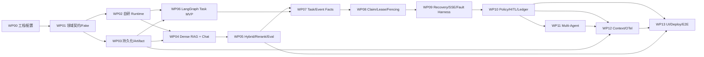

# Agent Workbench：代码实施计划 v1.0

> 计划编号：AWP-001
>
> 日期：2026-07-22
>
> 状态：截至 2026-07-28，主分支基线为 `main@e93d7a1`。已合入：
> 自研 Runtime、PostgreSQL/Artifact/Document/ACL/Outbox、Dense/Hybrid RAG 与评测、
> Reranker、固定检索 Chat/SSE、多轮上下文、EventLog 版本化与幂等键、
> `chat_turns` 请求幂等、原子发布、fixed-lease orphan recovery、
> 无人值守 pending 发布恢复、Turn + durable `ChatTurnExpired` 原子过期，
> 以及 WP06 的第一块——checkpoint-safe `TaskState` 与 `TaskWorkflowPort`。
> `main@e93d7a1` 本地门禁为 `859 passed / 260 skipped`（260 项全部因缺
> PostgreSQL/Qdrant/真实 BGE 权重而跳过，本轮无真实外部服务证据）；
> WP06-02/04（固定研究图的条件路由与确定性 fan-in reducer）已实现，
> 尚未合入 `main`；下一主线是 WP06 余下部分：Agent node handler（WP06-03）、
> LangGraph adapter（WP06-05）、PostgreSQL checkpointer（WP06-06）与
> Task Worker（WP06-07）；
> LlamaIndex/LangChain 互操作、可靠常驻 Ingestion Worker、
> Task Registry/lease/fencing、Multi-Agent 与 UI 仍开放
>
> 架构依据：[架构与技术选型基线 v1.3](./architecture-baseline.md)
>
> 配置依据：[配置管理基线 schema 1.2](./configuration.md)
>
> 目标：把“Chat + RAG、Task + Multi-Agent、自研 Claude Code 风格 Runtime”
> 落成一个可测试、可恢复、可评测、适合校招展示的通用 Agent 项目

---

## 1. 交付目标与范围

### 1.1 最终交付

简历版 v1 必须同时具备：

1. 框架无关的自研 `ClaudeLikeAgentRuntime`；
2. LlamaIndex 驱动的 ingestion/retrieval，以及 BGE-M3 + Qdrant hybrid RAG；
3. LangGraph 驱动的固定 Task Workflow 和可控 Multi-Agent；
4. PostgreSQL Task Registry、checkpoint、lease、fencing、事件与审批恢复；
5. FastAPI REST + SSE、React 演示界面和 CLI；
6. OpenTelemetry、离线评测、Docker Compose 和 CI；
7. 能证明可靠性与安全边界的确定性测试证据。

### 1.2 三个发布关卡

| 关卡 | 范围 | 可以对外怎么描述 |
|---|---|---|
| **MVP** | M0–M3a | 自研单 Agent、Chat RAG、单 Worker LangGraph Task 可运行 |
| **Reliable Core** | 再完成 M3b–M4 | Task 支持多 Worker、恢复、审批与幂等副作用 |
| **Resume v1** | 再完成 M5–M6 | 可控 Multi-Agent、UI、观测、评测、部署与完整证据 |

M7 是 Optional Lab，不计入 v1 完成度。

### 1.3 明确不做

- 不让 LangChain、LlamaIndex、LangGraph 或 CrewAI 接管自研 Tool Loop；
- 不做 AutoGen；
- 不做动态 Agent 群聊、递归委派或 Agent-as-tool；
- 不做 Runtime Tool Loop 中间的跨进程恢复；
- 不把 Redis/Celery 加入 v1 主链；
- 不宣称 exactly-once，只实现 at-least-once + 幂等提交；
- 没有 OS/容器级隔离前，不把 Policy/路径限制称为“安全 Sandbox”；
- 不复制、提交或公开任何来源不明的 Claude Code 私有实现。

---

## 2. 实施总原则

### 2.1 纵向切片优先

每个工作包必须同时留下：

- 一个可运行入口；
- 一组 Fake 驱动的确定性测试；
- 至少一个真实依赖集成测试；
- 一份机器可读取的测试或评测结果；
- README 中准确的能力状态。

不能先堆满 Adapter，再在最后一次性集成。

### 2.2 Port first、Fake first、real adapter second

实现顺序固定为：

```text
领域 DTO / Protocol
→ Fake Adapter + contract test
→ Application/Runtime 用例
→ 真实 Adapter
→ 集成测试
→ E2E 与观测证据
```

任何框架类型都必须在 Adapter 内完成转换。

### 2.3 配置只有一个入口

- 所有进程只能调用 `bootstrap.load_settings()`；
- 业务代码禁止直接读取 `os.environ`；
- Bootstrap 将完整 Settings 投影为模块所需的窄配置对象；
- 每个配置字段必须登记唯一消费模块；
- `public_config`、Task 语义快照和当前安全策略是三种不同产物，禁止混用。

### 2.4 测试决定功能是否存在

功能状态只能按以下证据升级：

```text
Planned → Implemented → Tested → Demonstrated
```

代码存在但没有契约测试，只能算 Implemented；没有固定演示或评测证据，
不能算 Demonstrated。

### 2.5 PR 的 Definition of Done

每个 PR 必须满足：

- 只有一个主要行为变化；
- Domain/Port schema 变更带版本或兼容说明；
- 新增配置字段已登记所有者和测试；
- 新增外部副作用具有稳定业务幂等键；
- 新增持久状态带 Alembic migration；
- 测试不访问真实在线 LLM；
- 错误、日志、事件和 trace 不包含 secret canary；
- 文档中的实现状态与测试证据同步更新。

---

## 3. 依赖图与开发车道



可并行的车道：

- **Runtime 车道**：WP01 → WP02；
- **Knowledge 车道**：WP03 → WP04 → WP05；
- **Workflow 车道**：WP06 → WP07；
- **Platform 车道**：WP08 → WP09；
- **Product 车道**：WP10 → WP11 → WP12 → WP13。

单人开发时仍按依赖顺序推进；“可并行”主要用于控制模块耦合，不代表必须
同时开工。

---

## 4. 正式代码库与进程入口

### 4.1 目标目录

```text
agent-workbench/
├── web/
├── src/agent_workbench/
│   ├── apps/
│   │   ├── api/
│   │   │   ├── main.py
│   │   │   ├── dependencies.py
│   │   │   └── routes/
│   │   └── cli/
│   │       ├── main.py
│   │       ├── demo.py
│   │       └── rendering.py
│   ├── domain/
│   ├── ports/
│   ├── runtime/
│   ├── knowledge/
│   ├── workflows/
│   ├── application/
│   ├── adapters/
│   │   ├── models/
│   │   ├── langchain/
│   │   ├── llama_index/
│   │   ├── langgraph/
│   │   ├── embeddings/
│   │   ├── rerankers/
│   │   ├── qdrant/
│   │   ├── persistence/
│   │   ├── artifacts/
│   │   └── telemetry/
│   └── bootstrap/
│       ├── settings.py
│       ├── container.py
│       ├── readiness.py
│       └── processes.py
│   └── workers/
│       ├── task_worker.py
│       └── ingestion_worker.py
├── tests/
│   ├── architecture/
│   ├── config/
│   ├── contracts/
│   ├── runtime/
│   ├── knowledge/
│   ├── workflows/
│   ├── coordination/
│   ├── recovery/
│   ├── security/
│   ├── end_to_end/
│   └── support/
├── evals/
├── migrations/
├── config/
├── docker/
├── scripts/
├── pyproject.toml
├── uv.lock
└── docker-compose.yml
```

进程入口位于包内 `src/agent_workbench/apps` 与 `src/agent_workbench/workers`，
而不是仓库顶层：wheel 只打包 `src/agent_workbench`，顶层目录中的入口无法成为
已安装的 console script。前端 `web/` 不进入 Python 包。

### 4.2 四个生产入口

| 入口 | 职责 | 禁止行为 |
|---|---|---|
| `agent-api` | REST command、SSE、上传控制面、readiness | 直接执行 Tool、直接写 checkpoint |
| `agent-task-worker` | claim、LangGraph、Agent node、reconciliation | 提供 HTTP UI、依赖客户端连接存活 |
| `agent-ingestion-worker` | outbox、parse/chunk、embedding、Qdrant upsert | 成为文档/ACL 事实源 |
| `agent-cli` | 本地调试、演示、评测入口 | 绕过 Application Service |

Eval Runner 使用 CLI 子命令或独立进程，不进入在线 API 请求路径。

### 4.3 依赖组

`pyproject.toml` 至少拆分：

```text
core          Pydantic、FastAPI 基础、结构化日志
persistence   SQLAlchemy/asyncpg、Alembic、LangGraph PostgreSQL saver
rag           LlamaIndex、Qdrant client、BGE/FlagEmbedding、PDF parser
workflow      LangGraph、最薄 LangChain adapter
telemetry     OpenTelemetry
evaluation    RAGAS 与离线评测工具
dev           pytest、pytest-asyncio、Pyright、Ruff、架构测试
labs          CrewAI、MCP、Langfuse 等 Optional Lab
```

主依赖由 `uv.lock` 固定；配置安全下限仍由启动代码再次验证。

### 4.4 Identity 与 tenant 输入边界

现有基线锁定了 `owner_id/tenant/ACL` 过滤，但没有锁定身份供应商。代码必须
先定义框架无关的 `PrincipalContext`，并遵守：

- `owner_id/tenant_id/scopes` 由 Interface 层认证结果产生；
- Chat、Task、上传请求正文不能自行指定权威 owner；
- Application Service 只接收已解析的 Principal；
- 所有 Repository/Query DTO 显式携带 tenant 条件；
- 测试可使用 FakeIdentity，但 remote profile 不能误称为已具备企业认证。

WP04 前新增一个窄 ADR：要么把 v1 明确限制为单用户本地演示，要么选择一个
Identity Adapter。未完成该 ADR 时，可以测试 tenant 隔离，但不能在简历中
宣称已经实现生产级多租户认证。

**已完成**：[ADR-012 身份边界](./adr/0012-identity-boundary.md) 选择"领域层
多租户、部署层单机"，并把"只有身份解析边界能构造 `PrincipalContext`"做成
架构测试。生产级多租户认证在能力表中保持 Planned。

---

## 5. 配置项到代码所有者

配置只能在 Bootstrap 读取，然后以窄类型注入所有者。

| 配置域 | 唯一代码所有者 | 必须落地的行为 | 必须有的测试 |
|---|---|---|---|
| 配置源/版本 | `bootstrap/settings.py` | 版本、来源、secret、冻结与快照 | 保留现有配置契约测试；最终镜像启动测试 |
| `app` | `bootstrap/processes.py` | environment/scope、schema/baseline 兼容 | API/两类 Worker revision 一致 |
| `api` | `apps/api` | 控制面 2 MiB、SSE heartbeat、优雅停止 | 413、流式上传、断线重连 |
| `database` | Persistence factory + Guard runner + Event listener | query/guard/listen 三种连接职责 | `pg_backend_pid()`、主动断连、timeout |
| `coordination` | Task Worker/Registry/Reaper | claim、lease、heartbeat、fencing、retry | 双 Worker + 四个协调 failpoint；WP10 后跑完整矩阵 |
| `event_stream` | EventLog/SSE/Listener | durable cursor、wake-only NOTIFY、delta 瞬时流 | 断线补拉、慢消费者、delta 不落库 |
| `model` | Model Gateway/Adapter | provider、model profile、retry/timeout | ModelEvent 与 ToolCall round-trip |
| `runtime` | `runtime/agent_runtime.py` | step/tool/并发/上下文预算 | 无限循环、取消、稳定提交顺序 |
| `langchain_adapter` | `adapters/langchain` | 只做 model/tool 互操作 | 架构边界与锁定版本 smoke |
| `workflow` | Workflow + LangGraph Adapter | graph version、checkpoint、interrupt | 边、reducer、重启、waiting_migration |
| `multi_agent` | 固定图/router/budget repo | 静态节点断言与持久 invocation 预算 | 部分失败、取消、预算不因恢复归零 |
| `rag.llama_index` | LlamaIndex Adapter | 只做 ingestion/retrieval 映射 | 禁止 final answer/二次 fusion |
| `rag.ingestion` | Knowledge Ingestion/Outbox | 稳定 document/version/chunk ID | 重复导入、删除、ACL、崩溃重放 |
| `rag.embedding` | BGE-M3 Adapter | dense+sparse、维度、revision | 真模型维度、批处理、revision |
| `rag.retrieval` | Retrieval Service/Qdrant Adapter | ACL filter、RRF、top-k 漏斗 | 跨 tenant 零泄漏、filter 编译 |
| `rag.reranker` | Reranker Adapter | 排序、timeout、fail-open | 只能回退到已授权候选 |
| `qdrant` | Client/Index Manager/Alias Resolver | 派生索引、schema、alias、认证 | alias 切换与旧 Task 固定 collection |
| `artifact_store` | Upload/Artifact Adapter | 流式写、hash/size/tenant、服务端 key | 路径穿越、崩溃、HEAD、幂等 |
| `policy` | PolicyEngine/Approval/Tool Gateway | submitted envelope ∩ 当前进程 Policy ∩ 实时 ACL/Tool Registry | 受控部署后下一授权边界收紧、放宽不扩权、修改后重验 |
| `observability` | TelemetryPort/OTel Adapter | trace、指标、默认不记正文 | exporter 故障、redaction canary |
| `evaluation` | Evaluation Runner | 固定数据集、metric registry、结果元数据 | 离线可重复、CI 无在线 judge |
| `evaluation.judge` | Judge Adapter/Calibration Runner | 默认关闭；固定模型、prompt、revision、temperature | 模拟 judge、解析失败、人工 agreement 校准 |
| `testing` | 产品内 Noop/Test FaultInjector + `tests/support` 控制器 | failpoint 双门禁；barrier/clock 测试纪律 | 每个点必须断言真正命中 |
| `optional_labs` | Feature Registry | production 全关、独立 Adapter | 主链不存在散落的 lab 分支 |
| `secrets` | Bootstrap + Adapter Factory | 只在创建客户端时解包 | 日志/事件/trace 全链路 canary |

上表描述 owner family；`config/ownership.yaml` 必须继续拆到字段级。例如：

- `database.guard_disconnect_action/guard_healthcheck_seconds` 属于 Guard runner；
- `database.listener_healthcheck_seconds` 属于 Event listener；
- `coordination.tool_execution_ledger_enabled` 属于 WP10 Tool Ledger；
- `testing.failpoints_enabled/allow_fault_injection/allowed_failpoints` 属于产品内
  FaultInjector registry；
- `testing.deterministic_concurrency_required` 等测试纪律字段属于 test harness。

### 5.1 配置字段消费清单

新增 `tests/architecture/test_config_ownership.py`，维护机器可读清单：

```yaml
field: coordination.lease_duration_seconds
owner: adapters.persistence.task_registry
lifecycle: live
processes: [task-worker]
tests:
  - tests/config/test_coordination_settings.py
  - tests/coordination/test_stale_lease_recovery.py
```

CI 必须检查：

- 每个配置字段恰有一个 owner；
- 字段被标记为 `startup | live | task_snapshot | test_only | lab` 之一；
- `task_snapshot` 使用正向 allowlist，而不是不断追加 denylist；
- 新字段没有登记时 PR 失败。

Task snapshot 的 v1 正向 allowlist 固定为：

```text
app.config_schema_version
app.architecture_baseline
model.*
runtime.*
langchain_adapter.*
workflow.*
multi_agent.*
rag.*
qdrant.collection_schema_version
qdrant.distance
提交时解析后的 concrete collection/index version
```

`api/database/coordination/event_stream/artifact_store/policy/observability/
evaluation/testing/optional_labs/secrets` 全部禁止进入恢复快照。

`optional_labs.*` 只属于 `lab` 生命周期。旧 Task 如果依赖已关闭的 Lab，
必须因 graph/capability 不兼容进入 `waiting_migration`，不能从旧快照重新
开启 Lab。

### 5.2 三层 retry/deadline 规则

必须在代码中区分：

| 层 | 配置 | 语义 |
|---|---|---|
| Model | `model.*.max_retries/timeout_seconds` | 单次模型调用内部重试 |
| Graph node | `workflow.node_retry_max_attempts/node_timeout_seconds` | 一个确定性节点的重试 |
| Task | `coordination.max_attempts/retry_*` | Worker 崩溃或 Task attempt |

三层计数分别持久化，不能相互替代。外层 deadline 到期时必须取消内层，
防止形成无界乘法重试。

单次模型调用的有效 deadline 固定为：

```text
min(
  model profile timeout,
  runtime model timeout envelope,
  当前 Agent run 剩余 deadline
)
```

不能让两个 timeout 配置分别创建互不关联的后台任务。

### 5.3 关键配置字段实施清单

下面这些字段不能只被 Pydantic 读取，必须在对应阶段形成运行证据：

| 配置字段 | 首次落地 | 代码行为/断言 |
|---|---|---|
| `app.environment` | WP00 | 控制 production/test-only 行为，不作为网络信任边界 |
| `app.deployment_scope` | WP00 | `remote` 强制 TLS/鉴权；`local` 仍需部署网络隔离 |
| `app.config_schema_version` | WP00 | 启动与快照 schema 兼容检查 |
| `app.architecture_baseline` | WP00 | 写入诊断/evidence，不用于绕过迁移 |
| `api.max_control_request_body_bytes` | WP03/WP13 | 只限制 JSON/metadata，超限返回 413 |
| `api.document_upload_transport` | WP03 | 文档字节只能进入 Artifact 数据面 |
| `database.guard_pool_mode` / `guard_connection_scope` | WP08 | 同一物理 session pin 到 Task 退出 |
| `database.listen_pool_mode` / `listen_connection_scope` | WP09 | 每进程专用 LISTEN session |
| `database.guard_disconnect_action` / `guard_healthcheck_seconds` | WP08 | Guard runner 取消并触发重新 claim |
| `database.listener_healthcheck_seconds` | WP09 | Listener reconnect/catch-up，不影响事实正确性 |
| `coordination.claim_strategy` | WP08 | 只能执行 `SKIP LOCKED` 短事务 claim |
| `coordination.lease_*` / `heartbeat_*` | WP08 | 使用 PostgreSQL 时间并执行 epoch 条件写 |
| `coordination.advisory_lock_key_strategy` | WP08 | 稳定 signed int64，禁止 Python `hash()` |
| `coordination.fenced_checkpointer_enabled` | WP08 | 必须实际装配 FencedCheckpointer，不只是布尔值 |
| `coordination.tool_execution_ledger_enabled` | WP10 | Tool Gateway 必须装配 intent/result ledger |
| `event_stream.replay_source` | WP09 | SSE 只能从 durable `run_events` replay |
| `event_stream.model_delta_mode` | WP09 | delta coalesced 实时发送，不逐 token 持久化 |
| `runtime.max_steps/max_tool_calls` | WP02 | Agent run 内硬预算，终止原因结构化 |
| `runtime.max_parallel_read_tools` | WP02 | 只并发 safe read Tool |
| `runtime.max_parallel_write_tools` | WP02 | Literal 1 对应 exclusive scheduler 测试 |
| `workflow.graph_version` | WP06 | 写入 Task/checkpoint，版本不兼容 fail closed |
| `workflow.runtime_loop_owner` | WP06 | Agent node 调用自研 Runtime，LangGraph 不接管 Tool Loop |
| `multi_agent.static_agent_node_limit` | WP11 | 对 compiled graph 的实际节点数启动断言 |
| `multi_agent.max_parallel_agent_invocations` | WP11 | 并发 semaphore + 持久预算 |
| `multi_agent.max_agent_invocation_attempts_per_task` | WP11 | retry/reclaim 后不归零 |
| `rag.ingestion.*_version` | WP03–05 | 进入 document/index metadata 与 evidence |
| `rag.embedding.revision` / `rag.reranker.revision` | WP05 | production 完整 SHA；进入 index version |
| `rag.retrieval.*_top_k` | WP04–05 | 按配置构造候选漏斗，不在 Adapter 内硬编码 |
| `rag.llama_index.fusion_enabled` | WP05 | 保持 false；contract test 防止二次 fusion |
| `qdrant.read_alias` | WP05/WP07 | 只为新请求/新 Task 路由 |
| `qdrant.write_collection` | WP05 | 只写版本化 collection，回填后才切 alias |
| `artifact_store.max_artifact_bytes` | WP03 | 流式计数并在提交前校验 |
| `policy.revision` + canonical fingerprint | WP00/WP07/WP10 | revision 是人工标签；另算规则 fingerprint，保存并比对二者；受控重启后在下一授权边界执行当前进程 Policy |
| `observability.record_*_body` | WP12 | 保持 false 并用 trace canary 验证 |
| `evaluation.*_metrics` | WP05/WP13 | metric registry 启动校验并输出同名列 |
| `testing.allowed_failpoints` | WP00/WP09 | 产品 FaultInjector 只作为 allowlist；测试每次激活一个 |
| `optional_labs.*` | WP00/WP14 | production 全关；独立 registry 装配 |

---

## 6. 工作包与代码任务

## WP00：工程与安全配置基座（M0）

### 目标

建立能离线启动、能在 CI 中验证架构边界的 Python 工程。

### 代码任务

| ID | 任务 | 主要文件 |
|---|---|---|
| WP00-01 | 建立 `pyproject.toml`、`uv.lock`、src layout 和进程入口 | `pyproject.toml`、`src/`、`apps/`、`workers/` |
| WP00-02 | 将现有配置骨架迁入正式 Bootstrap | `bootstrap/settings.py`、`config/*.toml` |
| WP00-03 | 建立 API/Task Worker/Ingestion Worker Container | `bootstrap/container.py`、`processes.py` |
| WP00-04 | 区分启动校验与带超时 readiness | `bootstrap/readiness.py` |
| WP00-05 | 建立 config ownership 清单 | `config/ownership.yaml`、架构测试 |
| WP00-06 | 建立 Ruff、Pyright、pytest、license/secret scan CI | `.github/workflows/ci.yml` |
| WP00-07 | 建立 clean-room NOTICE 和依赖许可证清单 | `NOTICE.md`、`docs/compliance.md` |
| WP00-08 | 建立唯一 `FailpointName` Literal/Enum、产品内 `FaultInjector` Protocol、Noop 实现与最小 AsyncBarrier Test Adapter | `ports/fault_injector.py`、`adapters/testing/` |
| WP00-09 | 清理无消费者配置字段 | `admin_token/webhook_token` 删除或先通过 ADR 指定 Adapter |

### 安全门禁

- 实际安装的 `pydantic-settings` 不安全时，在 secret source 初始化前失败；
- TOML 不接受 DSN 或 `[secrets]`；
- env、dotenv 和 mounted secret 父级 JSON/重复键不能绕过叶子检查；
- secret symlink 越界、超限、目录/FIFO 被拒绝；
- production/remote Qdrant 约束和完整 HF SHA 生效；
- ValidationError、启动日志和 fingerprint 不包含 canary。
- `config.test.toml.testing.allowed_failpoints` 必须与代码中的 canonical
  `FailpointName` 集合精确相等；不接受旧名字 alias，负向测试必须证明
  `inside_checkpoint_put` 等历史名字失败关闭。

`secrets.admin_token` 只有在 D0 选择本地 AdminToken Identity Adapter 后才可
保留；`secrets.webhook_token` 只有在定义 Webhook Adapter 后才可保留。
没有消费代码的 secret 字段在正式 schema 中删除，不能以“以后可能使用”
为由长期接受输入。

### 退出条件

- 当前配置测试迁移后全部通过；
- `agent-config-check` 可加载所有 profile；尚未实现的 enabled Adapter 不得
  被静默忽略；
- 三个进程的完整启动 smoke 分别推迟到其最小真实/Fake 纵向切片完成：
  API/ingestion 在 WP03–04，Task Worker 在 WP06；
- production 错误配置在容器启动阶段 fail closed；
- CI 全程不需要数据库、Qdrant 或在线 LLM。

---

## WP01：领域契约、Ports 与 Walking Skeleton（M0）

### 冻结的 v1 契约

- `ModelPort.stream(ModelRequest) -> AsyncIterator[ModelEvent]`
- `ToolSpec`、`ToolBinding`、`ToolCall`、`ToolResult`
- `AgentExecutor.run(...) -> AgentOutcome`
- `PolicyEngine.decide(...) -> PolicyDecision`
- `EventSink`、`EventLogPort`、统一 Event Envelope
- `ContextPacket`
- `ConversationStore`、`TaskRegistry`
- `DocumentStore`、`OutboxPort`、`ArtifactStore`
- `IngestionPort`、`RetrieverPort`
- `EmbeddingPort`、`SparseEncoderPort`、`RerankerPort`
- `ApprovalStore`、`CancellationToken`、`TelemetryPort`

### 代码任务

| ID | 任务 | 验收测试 |
|---|---|---|
| WP01-01 | 定义 message/run/event/tool/context/error DTO | JSON golden + schema version |
| WP01-02 | 定义上述 Protocol，不引入供应商类型 | Pyright + architecture test |
| WP01-03 | 实现脚本化 `FakeModel` | 固定 ModelEvent trace |
| WP01-04 | 实现一个 read Tool 和一个 deterministic transform Tool | schema/timeout contract |
| WP01-05 | 实现内存 EventLog、ConversationStore、ArtifactStore | Store contract suite |
| WP01-06 | CLI 纵向切片：输入 → FakeModel → 统一事件 → 输出 | snapshot/golden test |

### 退出条件

- 所有 DTO 可版本化 JSON 序列化；
- ToolCall/ToolResult ID 完整 round-trip；
- `runtime` 不导入 LangChain、LlamaIndex、LangGraph、CrewAI；
- CLI 输出只消费统一事件，不读取 Runtime 内部对象。

---

## WP02：自研单 Agent Runtime（M1）

### 内部组件

```text
ClaudeLikeAgentRuntime
├── ContextEngine
├── ModelPort
├── ToolRegistry
├── ToolGateway
│   ├── schema validator
│   ├── PolicyEngine
│   ├── timeout/cancellation
│   └── result normalizer
├── ToolScheduler
├── HookBus
└── EventSink
```

### PR 顺序

| ID | 行为 |
|---|---|
| WP02-01 | 建立 Runtime 显式状态机与纯串行 Tool Loop |
| WP02-02 | 未知 Tool、无效参数、deny、异常统一生成 ToolResult |
| WP02-03 | step/tool/token/deadline 预算与 CancellationToken |
| WP02-04 | read-only parallel scheduler；执行顺序与提交顺序分离 |
| WP02-05 | Hook 修改参数后重新 schema + Policy 校验 |
| WP02-06 | DeepSeek ModelPort Adapter；配置只传 model profile |
| WP02-07 | 最薄 LangChain model/tool Adapter 与 round-trip contract |

### 不变量测试

- 每个 ToolCall ID 恰有一个 ToolResult；
- deny 后 handler 调用数为零；
- 多 Tool 并发完成顺序变化时，提交顺序稳定；
- write/exclusive Tool 永远不并发；
- 无限 Tool Loop 被预算终止；
- cancel/timeout 在有界时间内停止；
- 大结果只返回 ArtifactRef；
- Provider 错误不会泄漏 SDK 类型到 Domain。

### 演示

FakeModel 稳定完成：

```text
用户输入
→ 模型文本
→ 两个只读 Tool
→ ToolResult
→ 最终回答
```

---

## WP03：持久化、Conversation、Artifact 与 Outbox 基座（M2 前置）

### 代码任务

| ID | 任务 |
|---|---|
| WP03-01 | SQLAlchemy/asyncpg session factory 与 Alembic |
| WP03-02 | PostgreSQL ConversationStore |
| WP03-03 | Local ArtifactStore，随后增加 S3-compatible Adapter |
| WP03-04 | create-upload / stream-or-presign / complete 用例 |
| WP03-05 | Document/Version/ACL/ingestion job repository |
| WP03-06 | PostgreSQL Outbox repository 与 ingestion claim |
| WP03-07 | FastAPI 上传路由与控制面 request-limit middleware |
| WP03-08 | document aggregate 的 monotonic `source_revision` 与 outbox sequence |
| WP03-09 | Artifact 对象级 owner/tenant 授权与统一 not-found 语义 |

### 上传边界

```text
2 MiB JSON 控制请求
→ 服务端生成 object key
→ local streaming 或 presigned PUT
→ quarantine
→ HEAD/hash/size/tenant 校验
→ document/version/ACL + outbox 同事务提交
```

### 退出条件

- 大 PDF 不经过控制面 body；
- 本地上传边读边写，不整体进入内存；
- 客户端不能指定最终文件路径；
- document 与 outbox 同成同败；
- 相同内容/版本重复提交幂等；
- GraphState/消息只保存 ArtifactRef。
- 跨 tenant 使用随机或已知 Artifact ID 都不能读取、确认或推断对象存在；
- 控制请求超限返回 413，该门禁在 WP03 首次通过，WP13 做全 API 回归。

---

## WP04：Dense RAG 与 Chat 纵向切片（M2a）

### 代码任务

| ID | 任务 |
|---|---|
| WP04-01 | Markdown/TXT/PDF parser 与 SourceDocument 映射 |
| WP04-02 | LlamaIndex ingestion Adapter，只输出核心 Chunk DTO |
| WP04-03 | BGE-M3 dense EmbeddingPort |
| WP04-04 | Qdrant collection schema 与 idempotent point upsert |
| WP04-05 | Dense Retriever + metadata/tenant/ACL filter |
| WP04-06 | Citation builder，支持页码/段落定位 |
| WP04-07 | 2-step ChatService 与 PostgreSQL 多轮消息 |
| WP04-08 | `knowledge_search` Tool，默认 Chat 不通过 Agent 决策 |
| WP04-09 | REST/CLI Chat 纵向切片 |
| WP04-10 | Qdrant 候选返回后、进入 context/citation 前按 document/version ID 向 PostgreSQL 重验当前 ACL |

PostgreSQL ACL 是最终授权事实；Qdrant payload filter 只是缩小候选和第二道
约束。Retrieval Service 先用 PostgreSQL 当前 ACL 编译候选范围，Qdrant
返回后再次按 document/version ID 批量重验；未授权候选在 rerank、
ContextPacket 和 Citation 之前丢弃。回答提交前再验证实际引用版本，权限
revision 已变化时丢弃该答案并拒答或从剩余已授权上下文重新生成。

### 已落地的 Chat Turn 可靠性契约

PR-035～PR-043 已把 Chat 的 answer publication 与 fixed-lease expiry 收敛为以下
实现基线，后续 Task 工作不能倒退这些不变量：

- claim 不机会式回收；所有普通 `running → release_pending/failed/cancelled`
  writer 都先锁 session/Turn，并在锁内复核数据库 lease；
- late prepare/cleanup 不写 candidate、failure、assistant 或 Event；仍为
  `running` 但 lease 已到期时只报 `ChatTurnLeaseExpiredError`，协调器已提交时只观察
  既有终态；普通 writer 也拒绝外部构造的 `stale_execution` outcome；
- `ChatExpirationCoordinator` 是唯一 expiry writer；每个 due Turn 使用一个独立
  PostgreSQL 事务，将 `failed(deadline, stale_execution)`、清 lease 与
  `ChatTurnExpired` 原子提交；
- `FOR UPDATE SKIP LOCKED` 保证多个 reaper 不互等；单个毒化候选整体回滚并隔离，
  不终止本批后续 Turn；
- answer 与 expiry 共用有界
  `chat-turn:{sha256(turn_id)}:terminal`，不能各自占用不同幂等键；
- Memory double 只保持可观察失败回滚，不冒充 PostgreSQL 耐久事务；
- `ChatTurnExpired` 可跟在 Runtime `RunCompleted` 之后，不能写成第二个
  `RunFailed`。

### 退出条件

- 固定语料和至少 20 个 gold questions；
- Markdown/TXT/PDF 均可索引；
- 重复导入不制造重复逻辑 chunk；
- 不同 owner/knowledge base 检索隔离；
- barrier 在 Qdrant query 完成后、context 构造前提交 ACL revoke 时，被撤权
  chunk 不进入 rerank、模型上下文、回答或 Citation；
- 回答包含可定位 Citation；
- 记录 dense Recall@K、引用正确率、拒答率和延迟。

---

## WP05：Hybrid、Rerank、评测与索引版本（M2b）

### 代码任务

| ID | 任务 |
|---|---|
| WP05-01 | BGE-M3 SparseEncoderPort Adapter |
| WP05-02 | Qdrant Query API 单次 dense+sparse RRF |
| WP05-03 | BGE-reranker-v2-m3 Adapter |
| WP05-04 | reranker timeout/fail-open，只回退到已授权候选 |
| WP05-05 | Evaluation Runner 与规范 metric registry |
| WP05-06 | PostgreSQL index-generation registry、collection metadata、alias manager |
| WP05-07 | document-key 串行的 outbox upsert/ack/reconciliation |
| WP05-08 | dense/hybrid/hybrid+rerank 消融报告 |
| WP05-09 | generation 状态机、retention 元数据；Task-aware reservation/GC 延后到 WP07 |

### 关键测试

- LlamaIndex 不能二次 fusion；
- BGE 实际输出维度与配置一致；
- production revision 只能是完整 40 位 commit SHA；
- Qdrant upsert 成功、outbox ack 前崩溃时稳定 point ID 收敛；
- 新 collection 未通过 schema/count/checksum 门禁前 alias 不移动；
- ACL/tombstone reconciliation 最终收敛。
- 旧 revision 的延迟 upsert 不能覆盖更新后的内容、ACL 或 tombstone；
- WP07 的 Task reservation 尚未上线前只允许标记 retired，不执行物理 GC。

### Outbox 顺序与版本协议

稳定 point ID 只解决重复写，不能解决乱序覆盖。每个文档 aggregate 必须有
单调 `source_revision`：

1. outbox payload 携带 `document_id + source_revision`；
2. ingestion worker 使用 document-key session advisory lock 或等价单写者
   机制，锁期间不持有数据库事务；
3. 取得锁后重新读取 PostgreSQL 当前文档/ACL/tombstone 快照；
4. 旧于 `last_applied_revision` 的事件直接标记 superseded；
5. Qdrant 写入完整当前快照及 revision，而不是盲目应用旧 delta；
6. 短事务更新 `last_applied_revision` 并 ack；
7. 崩溃重放仍以 PostgreSQL 当前事实重新收敛。

必须用 barrier 证明“旧 upsert 在新 ACL revoke/delete 之后才完成”时，最终
Qdrant 仍保持最新事实。WP00 的最小 FaultInjector/AsyncBarrier 支持该测试；
WP09 再扩展为多进程故障支架。

### Index generation 保留协议

PostgreSQL `qdrant_index_generations` 至少记录：

```text
generation_id
collection_name
index_version
state = building | active | draining | retired
retain_until
last_verified_at
```

WP05 只建立 generation 状态机和 retention 元数据；在 WP07 的 Task FK 与
reservation 上线前，retired collection **禁止物理删除**。WP07 才实现并
验证以下删除条件：

- 不再是新请求 active generation；
- 没有非终态 Task 通过 generation ID 引用；
- 没有未完成 outbox/reconciliation；
- retention window 已结束；
- 完成一次存在性/schema/count 校验。

“解析 alias → 切换 alias → GC → Task 提交”的竞态在 WP07 用 barrier
测试：Task 提交事务要么锁定并保留旧 generation，要么失败后重新解析；
不能提交一个已经允许删除的悬空 collection。

### 默认检索策略的选择

只有消融数据证明收益后，hybrid/rerank 才进入默认 profile。评测至少输出：

```text
Recall@K / Precision@K / MRR / nDCG
rerank delta / citation precision-recall
abstention accuracy
retrieval + generation latency
token / cost / hardware metadata
```

---

## WP06：LangGraph Task Workflow MVP（M3a）

### 固定研究图

```text
understand
→ plan
→ route
→ research_internal ┐
→ research_external ┘ fan-in
→ synthesize
→ critic
→ quality_gate ── revise → synthesize
→ approval placeholder
→ export placeholder
```

M3a 中 approval/export 先使用无副作用 Fake node；真实审批放在 WP10。
以上名称是 `workflow.graph_version="v1"` 的 canonical node IDs，必须与架构基线、
checkpoint metadata、事件和测试一致；重命名任一节点都必须提升 graph version，不能
把旧 checkpoint 静默映射到新执行位置。

### 代码任务

| ID | 任务 |
|---|---|
| WP06-01 | 框架无关 `TaskState`、TaskStep、ReviewResult |
| WP06-02 | 普通 Python node handler 与条件路由 |
| WP06-03 | Agent node 只依赖 `AgentExecutor` |
| WP06-04 | 确定性 fan-out/fan-in reducer |
| WP06-05 | LangGraph Adapter 与 graph version registry |
| WP06-06 | PostgreSQL checkpointer |
| WP06-07 | 单 Worker runner、TaskService、Task 查询接口 |
| WP06-08 | FakeExecutor/ClaudeLikeAgentRuntime 可切换 |
| WP06-09 | 基于统一 EventSink 的 CLI/API Task 事件时间线切片 |

### 退出条件

- 每条边和 reducer 有测试；
- 一个并行节点完成后崩溃，只重跑未完成节点；
- 进程重启后使用原 `thread_id`；
- GraphState 只含短状态和引用；
- graph version 不兼容进入 `waiting_migration`；
- 原始输入不会在 resume 时重复追加。
- Task 查询能返回统一事件时间线；M3a 可用内存/测试 EventLog，WP07 替换为
  PostgreSQL durable EventLog，不改变接口。

完成 WP00–WP06 后形成 MVP。

---

## WP07：Task Registry 与持久事件事实层（M3b-a）

### 代码任务

| ID | 任务 |
|---|---|
| WP07-01 | `task_runs` repository 与产品状态机 |
| WP07-02 | submission dedup 与 Task 创建事务 |
| WP07-03 | submitted policy envelope 与 deterministic snapshot |
| WP07-04 | 提交前解析并 reservation Qdrant concrete generation |
| WP07-05 | `run_event_streams/run_events` repository |
| WP07-06 | per-stream sequence 分配与 cursor codec |
| WP07-07 | 合并文本 chunk、ModelCompleted、AnswerCommitted/Withheld、ChatTurnExpired、Tool/节点/终态 durable event |
| WP07-08 | Task generation reservation、终态释放与 Task-aware safe GC |

### Task 提交事务

在打开 PostgreSQL 短事务前解析 Qdrant alias，然后同一事务写入：

```text
task_runs.input_ref
task_runs.run_semantics_snapshot
task_runs.run_semantics_revision
task_runs.graph_version
task_runs.submitted_policy_revision
task_runs.submitted_policy_fingerprint
task_runs.submitted_authorization_envelope
task_runs.resolved_qdrant_collection
task_runs.resolved_qdrant_index_version
task_runs.resolved_qdrant_index_generation_id
TaskSubmitted durable event
NOTIFY task_ready
```

快照不能包含 alias、Policy、DSN、secret、endpoint 或 coordination。
Task 事务内锁定 `qdrant_index_generations` 对应行并建立 reservation；若该
generation 已进入不可保留状态，则回滚并重新解析，不提交悬空引用。

### 退出条件

- 状态和事件同事务提交；
- 重复 submission key 返回同一 Task；
- stream sequence 唯一、单调；
- alias 切换后旧 Task 仍保存原具体 collection；
- Task snapshot 与两个 resolved 字段不一致时 fail closed。
- resume 前验证 generation/collection 存在且 index version/schema 兼容；
  不存在时进入 `waiting_migration`，绝不回退当前 alias；
- 非终态 Task 引用的 generation 不能物理 GC；终态后只有满足 WP05 全部
  retention/outbox 校验才能删除；
- “解析 alias → alias 切换/GC → Task commit”barrier 下必须
  reserve-or-retry，不能形成悬空引用；
- durable event 至少包含 `ModelCompleted`、Tool、checkpoint/node、审批和终态；
  检索型 Chat 的正文必须等最终 evidence/ACL 复核后才进入 `AnswerCommitted`，
  复核失败只写 `AnswerWithheld`，支持从最近 durable commit 继续展示。

---

## WP08：多 Worker Claim、Lease、Advisory Lock 与 Fencing（M3b-b）

### 代码任务

| ID | 任务 |
|---|---|
| WP08-01 | `FOR UPDATE SKIP LOCKED` 短事务 claim |
| WP08-02 | 独立 heartbeat execution、lease epoch、数据库时间源 |
| WP08-03 | task-scoped advisory lock guard |
| WP08-04 | guard 物理 session 全程 pinning |
| WP08-05 | node/Registry/事件/副作用执行 guard |
| WP08-06 | `FencedCheckpointer.put/put_writes` |
| WP08-07 | stale lease reaper、退避和 dead-letter |
| WP08-08 | guard 断线触发 Graph cancellation |
| WP08-09 | `task_ready` wake-loop + 带抖动有界 claim polling |
| WP08-10 | priority aging 与饥饿保护 |
| WP08-11 | 通用 `ExecutionGuard/FencedWritePort` contract suite |
| WP08-12 | 同步/阻塞 Adapter 隔离与 event-loop watchdog |

### 阻塞 Adapter 与 event-loop stall 设计

`AdapterCallRunner` 是所有 Model/Tool/外部 SDK 调用的唯一入口：

- 原生 async Adapter 必须遵守 deadline/cancellation contract；
- 同步或可能阻塞的只读/幂等调用通过专用的有界
  `ThreadPoolExecutor + Semaphore` 执行，禁止直接阻塞事件循环；
- `asyncio.to_thread()` 只能封装在上述有界 runner 内，不能把任务无限压入
  默认线程池；
- 不可取消的非幂等写调用不能放进普通线程池，必须使用支持 deadline 的
  async Adapter，或隔离子进程并经过 WP10 Ledger。

`EventLoopLagWatchdog` 运行在独立 daemon thread，而不是同一个事件循环中的
协程。它使用 `time.monotonic()` 计时，每隔
`min(1s, heartbeat_interval/4)` 调用 `loop.call_soon_threadsafe()` 投递探针：

```text
warn_lag  = heartbeat_interval / 2
abort_lag = heartbeat_interval
```

阈值由现有 heartbeat 配置派生；启动校验保证
`abort_lag + lease_grace < lease_duration`。超过 warn 阈值记录
`EventLoopLagged` 健康事件；超过 abort 阈值原子标记 Worker
`unhealthy + draining`、停止新 claim，并请求取消所有 active run。
若事件循环恢复，每个 run 必须先重验 guard/epoch 才能提交任何结果；若始终
不恢复，lease 自然过期并由其他 Worker reclaim，旧输出由 fencing 拒绝。
Watchdog 不能替代 heartbeat，也绝不能替 Worker 续租。

必须用确定性测试证明：

- 同步 `sleep` FakeAdapter 被 offload，模型调用跨多个 heartbeat 周期仍续租；
- test-only loop blocker 超过 abort 阈值时 watchdog 确实命中、Worker 停止
  claim，恢复后的旧输出写入 0 行；
- executor 饱和产生有界背压/超时，不形成无界队列；
- await 被取消后迟到的线程结果被丢弃，不能进入 EventLog/checkpoint/Ledger。

### 事务与连接规则

- claim 后立即提交，模型/Tool 期间不持有行锁；
- advisory lock 从执行开始到 Task 退出始终使用同一物理连接；
- guard 和 LISTEN 各有专用 session；
- Registry/checkpoint/event 写入必须匹配 `lease_owner + lease_epoch`；
- `ExecutionGuard/FencedWritePort` 在 WP08 冻结；WP10 的 Ledger 再复用同一
  suite，不能在 Ledger 尚不存在时提前宣称已测试；
- `StaleExecution` 不进入普通 node retry；
- 固定加锁顺序：
  `task_runs → run_event_streams → checkpoint tables`。

### 退出条件

- 两 Worker 竞争时只有一个有效 lease/lock；
- `pg_backend_pid()` 证明 guard 没有换连接；
- 终止 guard backend 后旧 Worker 立即取消；
- 旧 epoch 不能写 Registry、checkpoint 或 event；
- advisory lock 失败明确释放 lease 并退避；
- poison Task 达上限进入 dead-letter。
- 完全屏蔽 `task_ready` 通知时，有界轮询仍最终 claim；
- priority aging 使长期排队的低优先级 Task 最终获选；
- Model/Tool 调用跨越多个 heartbeat 周期时独立 heartbeat 持续续租；
- 新 epoch 已 claim 后，旧 Worker 的迟到 heartbeat 更新 0 行；
- heartbeat 与 reaper 同时竞争时只有一个合法状态转换；
- 同步 Adapter 阻塞时 watchdog 能取消/隔离，不让 heartbeat 静默停止。

---

## WP09：恢复、SSE 与确定性故障支架（M3b-c）

### 测试基础设施

```text
tests/support/
├── failpoints.py
├── async_barriers.py
├── process_barriers.py
├── lease_controller.py
├── worker_process.py
└── event_cursor_probe.py
```

### 代码任务

| ID | 任务 |
|---|---|
| WP09-01 | 扩展 FaultInjector：ProcessBarrier、Worker kill 与命中观测 |
| WP09-02 | LeaseController 直接推进数据库 lease |
| WP09-03 | Registry/checkpoint reconciliation |
| WP09-04 | queued/running 取消传播；waiting_approval 在 WP10 接入 |
| WP09-05 | LISTEN 专用连接与 reconnect/catch-up |
| WP09-06 | SSE `stream_id:sequence` cursor replay |
| WP09-07 | 慢消费者有限缓冲与断线重连 |
| WP09-08 | ephemeral model delta coalescing |
| WP09-09 | SSE stream owner/tenant authorization 与 IDOR 测试 |

### 七个规范故障窗口

WP09 建立完整名称注册表和通用 barrier 机制，但测试随代码所有者分阶段启用：

| Failpoint | 代码所有者 | 首次必须通过 | 必须证明 |
|---|---|---|---|
| `after_claim_commit_before_advisory_lock` | WP08–09 | WP09 | 假 running 可被回收 |
| `after_node_before_checkpoint` | WP08–09 | WP09 | 旧 Worker 完成 node 后仍不能落 checkpoint |
| `after_fence_row_lock` | WP08–09 | WP09 | fence 校验与 checkpoint 写入原子 |
| `after_final_checkpoint_before_registry_update` | WP08–09 | WP09 | reconciliation 幂等完成 |
| `after_approval_commit_before_dispatch` | WP10 | WP10 | 任意 Worker 可继续审批后的任务 |
| `after_artifact_write_before_ledger_commit` | WP10 | WP10 | 稳定 key 不重复产物 |
| `after_qdrant_upsert_before_outbox_ack` | WP05 | WP05/WP09 回归 | 稳定 point ID 幂等收敛 |

### 退出条件

- WP09 所属的四个协调 failpoint 全部确定性通过，完整七点矩阵在 WP10 后
  作为 Release gate；
- 不使用固定 sleep 制造交错；
- bounded timeout 只用于防卡死；
- Listener 完全丢通知时，cursor catch-up 仍完整；
- delta 不逐 token 入库；重连可从 WP07 的最近 durable chunk/完整消息继续；
- queued/running 均可取消且迟到写不能复活 Task；
- 跨 tenant 使用随机/已知 stream ID 或伪造 cursor 都统一拒绝/404，不能从
  状态码、时序或 sequence 推断对象存在。

完成 WP07–WP09 后形成 **Coordination Core**。Reliable Core 还必须完成
WP10 的审批、Ledger fencing、`waiting_approval` 取消和完整七点故障矩阵。

---

## WP10：Policy、HITL 与副作用 Ledger（M4）

### Policy 恢复语义

v1 没有运行中 Policy 热更新，也没有第二个 `current policy repository`。
这里的 current Policy 是**当前进程启动时由 immutable Settings 验证并装配
的安全下限**。Policy 变更必须先停止新 claim、排空或取消旧 Worker，再以
同一 `revision + canonical fingerprint` identity 重启全部 Worker；禁止
新旧 Policy identity 的 Worker 混跑。
紧急动态撤权使用当前 ACL 与 Tool Registry，而不是伪装成配置热更新。

新 Policy 部署完成后，每次 claim/resume、Tool dispatch 和不可逆副作用
提交前都计算：

```text
submitted authorization envelope
∩ current validated Settings policy
∩ current ACL
∩ current Tool Registry
```

- allowlist 取交集；
- denylist 取并集；
- approval requirement 取 OR；
- 数值安全上限取 min；
- 无法合并时 `waiting_migration` 或安全失败。

收紧在**下一次授权边界**生效，不能追溯撤销已经 dispatch 的外部效果；
放宽永远不能扩大 Task 提交时的 authorization envelope。

### 代码任务

| ID | 任务 |
|---|---|
| WP10-01 | Tool risk/capability/constraint 领域模型 |
| WP10-02 | PolicyEngine 与 immutable Settings Policy Provider；部署 `revision + canonical fingerprint` identity 一致性门禁 |
| WP10-03 | 当前 ACL/Tool Registry 交集计算 |
| WP10-04 | LangGraph `interrupt()` approval node |
| WP10-05 | ApprovalService/API、幂等 decision version 与原子恢复事务 |
| WP10-06 | `tool_executions` intent/result ledger |
| WP10-07 | 唯一真实写 node：`export_artifact` |
| WP10-08 | operation key/request hash/result reconciliation |
| WP10-09 | Approval owner/tenant authorization 与 IDOR 测试 |
| WP10-10 | Event/Ledger 同时记录 effective policy revision 与 canonical fingerprint |

### 审批的两个原子边界

1. Graph 命中 interrupt 后，在一个事务中条件执行
   `running → waiting_approval`、清空 lease、写 durable event；提交后释放
   advisory lock，Worker 退出，不占用运行资源。
2. 审批 decision 先锁定并条件校验 `task_runs`，再在同一个事务中按
   `approval_id + decision_version` 幂等写 approval，执行
   `waiting_approval → queued`，写
   `resume_kind='approval'`、`approval_id`、durable event，并
   `NOTIFY task_ready`。状态已终结时转换 0 行，迟到审批不能复活 Task。

WP10 起全局加锁顺序扩展为：

```text
task_runs
→ approvals / tool_executions
→ run_event_streams
→ checkpoint tables
```

cancel 与 approve 在 barrier 中并发时只能有一个合法状态转换；若 cancel
先提交，decision 只能保留审计结果或返回幂等终态，不能重新排队 Task。

### 副作用提交协议

每个真实写 Tool 必须：

1. dispatch 前计算有效授权；
2. 持久化带 `operation_key + canonical_request_hash` 的 intent；
3. 在不可逆 dispatch/commit 前再次计算有效授权；
4. 调用外部副作用；
5. 无论其后 Policy 是否变化，都如实提交结果，或进入 reconciliation。

### 必须通过的安全场景

- Policy 收紧在下一授权边界限制未结束 Task，不宣称撤销已 dispatch 效果；
- 当前 Policy 放宽不扩大旧 Task 原授权；
- ACL 中途撤销后 resume/retrieval/commit 失败关闭；
- Tool schema/风险变化后旧 ToolCall 重新校验；
- 新增审批要求时旧审批不能绕过；
- 客户端 resume payload 不被直接信任；
- Task 已取消后迟到审批不能重新排队；
- 相同 operation key + 不同 canonical args 必须冲突；
- 外部成功、ledger 未提交的窗口进入核对/重放，不伪装 exactly-once。
- 当前安全约束收紧（运行中用 ACL/Tool Registry；Policy 仅在受控重启后
  生效）发生在 dispatch 前时，真实 handler 调用数为 0；
- ACL/Tool Registry 在授权后、不可逆写前收紧时，第二次校验阻止写入；
- ACL/Tool Registry 在写成功后、ledger commit 前收紧时，reconciliation
  记录真实效果，不把它伪装成“未发生”；
- 配置 Policy 收紧测试必须在 barrier 处停止新 claim、撤销旧 lease 并取消
  旧 Worker，再由携带新 `revision + fingerprint` 的 Worker reclaim；新
  Worker dispatch 前拒绝旧 Task。进程内 immutable Policy 不得用 mock
  “热变更”伪造此证据；
- `waiting_approval` 可取消，审批事务不能把 cancelled Task 重新排队；
- 旧 lease epoch 不能写 intent、result 或 reconciliation 结果；
- 跨 tenant 使用随机/已知 approval ID 都统一拒绝/404，且不能从状态码、
  错误正文或时序推断审批对象存在。

### 退出条件

- 审批 + 重启 + 幂等导出 E2E 中只产生一个逻辑产物；
- WP08 的 `ExecutionGuard/FencedWritePort` contract suite 已应用到 Ledger；
- 七个规范 failpoint 全部确定性通过；
- 至此才能声明 **Reliable Core** 完成。

---

## WP11：固定图可控 Multi-Agent（M5）

### Agent profiles

```text
Planner
Researcher A
Researcher B
Critic
Writer
```

Supervisor 是普通结构化 routing node，不是自由对话 Agent。

### 代码任务

| ID | 任务 |
|---|---|
| WP11-01 | Profile registry 与输入投影 |
| WP11-02 | 结构化 `AgentOutcome` 与 Artifact 引用 |
| WP11-03 | 固定 parallel subgraph 和 deterministic reducer |
| WP11-04 | partial failure 表达与质量门禁 |
| WP11-05 | 持久 invocation attempt/budget repository |
| WP11-06 | 父 Task → 子运行 cancellation |
| WP11-07 | compiled graph 静态节点数启动断言 |

### 预算语义

- `static_agent_node_limit`：compiled graph 结构上限；
- `max_parallel_agent_invocations`：同时运行的 Agent 调用；
- `max_agent_invocation_attempts_per_task`：跨 retry/reclaim 的持久总尝试；
- `max_tokens_per_agent_invocation`：单次物理调用上限。

attempt 计数受 fencing 保护；命中已提交幂等结果时不重复计数。

### 退出条件

- Agent 上下文互相隔离，不复制完整父历史；
- 一个 Researcher 失败时返回显式部分失败；
- 父取消终止全部子调用；
- crash/resume 后预算不归零；
- 并行完成顺序不改变最终结构化排序；
- 子 Agent 权限不大于父 Task envelope。

---

## WP12：Context、Artifact 化与可观测性（M6a）

### 代码任务

| ID | 任务 |
|---|---|
| WP12-01 | ContextEngine 与 token budget |
| WP12-02 | 基础 compaction 和 summary provenance |
| WP12-03 | 大 ToolResult / AgentOutcome Artifact 化 |
| WP12-04 | TelemetryPort 与 OTel Adapter |
| WP12-05 | task→node→agent→model→tool trace 层级 |
| WP12-06 | Runtime/RAG/Task/Coordination/Multi-Agent 指标 |
| WP12-07 | token/cache/cost accounting |

### 退出条件

- compaction 不拆散 ToolCall/ToolResult；
- 原始消息、事件和 Artifact 不被 compaction 修改；
- trace/body 默认不记录 prompt、Tool 大结果或 secret；
- exporter 故障不破坏任务正确性；
- 所有基线指标可以导出。

---

## WP13：FastAPI、React、部署与最终证据（M6b）

### REST/SSE 最小契约

| 方法 | 路径 | 用途 |
|---|---|---|
| `POST` | `/v1/uploads` | 创建数据面上传 |
| `POST` | `/v1/uploads/{id}/complete` | 校验并提交文档版本 |
| `POST` | `/v1/chat/sessions` | 创建 Chat session |
| `POST` | `/v1/chat/sessions/{id}/messages` | 发送消息 |
| `POST` | `/v1/tasks` | 幂等提交 Task |
| `GET` | `/v1/tasks/{id}` | 查询产品状态 |
| `POST` | `/v1/tasks/{id}/cancel` | 请求取消 |
| `GET` | `/v1/streams/{stream_id}/events` | SSE + `Last-Event-ID` |
| `GET` | `/v1/approvals/{id}` | 查询审批 |
| `POST` | `/v1/approvals/{id}/decisions` | 幂等提交决定 |
| `GET` | `/v1/artifacts/{id}` | 授权后流式下载产物 |
| `GET` | `/health/live` | 进程存活 |
| `GET` | `/health/ready` | 有界依赖检查 |

API 只能调用 Application Service。

最终 API 安全回归对 Chat session、upload intent、document/knowledge base
（一旦暴露路由）、Task、SSE stream、Approval、Artifact 所有对象统一执行：
同 tenant、跨 tenant 已知 ID、跨 tenant 随机 ID、伪造/重放 cursor（适用时）
矩阵。跨 tenant 统一拒绝/404，响应正文、耗时和序号都不能泄漏对象存在性。

### React 最小页面

- Chat：上传、连续追问、引用定位；
- Task：状态、节点图、事件时间线；
- Agent：每节点 profile、token、Tool 和部分失败；
- Approval：审批请求、当前 Policy revision、决定；
- Artifact：报告下载；
- Diagnostics：`startup_config_revision`、
  `run_semantics_template_revision`、具体 Task 的
  `task_run_semantics_revision`，以及 graph/index/model revision；不显示
  secret。

### 部署

Docker Compose 至少包含：

```text
api
task-worker-a
task-worker-b
ingestion-worker
postgres
qdrant
artifact/minio-or-local-volume
otel-collector
web
```

### 三条固定 E2E

1. 上传 PDF → 多轮 Chat → 可定位引用；
2. 研究 Task → 两 Researcher 并行 → Critic → 修订；
3. 导出审批前暂停 → 杀死进程 → 批准 → 其他 Worker 恢复 → 只生成一个产物。

完成后更新基线的 Implemented/Tested/Demonstrated 状态。

---

## WP14：Optional Lab（M7）

只在 Resume v1 完成后单独排期：

- CrewAI `BenchmarkTaskRunner`；
- MCP Adapter；
- Langfuse self-hosted profile；
- Runtime mid-loop snapshot/resume；
- Tool 级动态审批；
- 长生命周期 Agent mailbox；
- 动态 Agent-as-tool；
- 指标触发后的 Redis Streams/PubSub。

每项都必须有独立 Adapter、ADR 和 benchmark；不得改变 PostgreSQL 主链事实源。

---

## 7. 数据库迁移计划

已发布的 Alembic revision 不回写、不重编号。尚未实现的对象先按逻辑迁移列出，
revision ID 到真正开工并核对依赖关系时再确定，避免计划表与已发布 migration
发生编号冲突。

### 7.1 已落地迁移

| Migration | 工作包 | 核心对象 |
|---|---|---|
| `0001_conversations` | WP03 | `conversation_sessions`、`messages` |
| `0002_documents_outbox` | WP03 | `artifacts`、`upload_intents`、`documents`、`document_versions`、ACL、`outbox_events` |
| `0003_outbox_lease` | WP04 | Outbox `lease_until`、`claim_token` 与过期扫描索引 |
| `0004_event_log` | WP07 | `event_streams`、`events` 与流内无间隙 sequence |
| `0005_last_applied_revision` | WP04–05 | Document 索引投影 revision 水位 |
| `0006_event_schema_version` | WP07 | Event envelope schema version |
| `0007_event_idempotency_key` | WP07 | stream-local durable `event_key` |
| `0008_chat_turns` | WP03/WP07 | 幂等 Chat Turn ledger、生命周期与单会话活跃约束 |
| `0009_chat_turn_lease` | WP03/WP07 | Chat 固定执行 deadline、过期索引与生命周期约束 |

LangGraph checkpoint 表由锁定版本的 saver migration 管理，但其版本必须记录。

### 7.2 计划逻辑迁移（revision ID 待定）

| 逻辑迁移 | 工作包 | 核心对象 |
|---|---|---|
| Ingestion state | WP04–05 | `ingestion_jobs`、`qdrant_index_generations` |
| Task Registry | WP06–07 | `task_runs`、语义快照、graph/index revision、submitted policy identity、resolved index generation reservation |
| Coordination | WP08 | lease/epoch/attempt/available_at/recovery/dead-letter 字段与索引 |
| Approvals ledger | WP10 | `approvals`、`tool_executions`、resume reference 与 effective policy 字段 |
| Agent budgets | WP11 | 持久 Agent invocation attempt/budget |

### 7.3 必须存在的唯一约束

```text
task_runs       UNIQUE(owner_id, submission_dedup_key)
run_events      UNIQUE(stream_id, sequence)
approvals       UNIQUE(task_id, graph_node_operation_id)
tool_executions UNIQUE(task_id, operation_key)
```

### 7.4 状态机

Task 状态至少包含：

```text
queued
running
waiting_approval
waiting_migration
succeeded
failed
cancelled
dead_letter
```

所有转换通过 Repository 条件更新；接口层不能直接写状态字符串。

### 7.5 一致性边界

- PostgreSQL 是 conversation sessions/messages、Task Registry、run events、
  approvals、documents/ACL/outbox 和 `tool_executions` 的事实源；
- ArtifactStore 是原文和大结果事实源；
- LangGraph saver 是图执行位置事实源；
- Qdrant 是可删除重建的派生索引；
- `NOTIFY` 只唤醒；
- UI 状态不进入后端持久化模型。

---

## 8. 测试与 CI 计划

### 8.1 测试层次

| 测试套件 | 默认依赖 | 运行频率 |
|---|---|---|
| Config/Architecture/Domain | 无外部服务 | 每个 PR |
| Runtime/Workflow unit | FakeModel/FakeTool | 每个 PR |
| Adapter contracts | mocked SDK/锁定框架版本 | 每个 PR |
| PostgreSQL Task coordination | 真实 PostgreSQL | 每个 PR |
| RAG integration | PostgreSQL + Qdrant + 小模型 fixture | PR 或分层缓存 |
| Recovery multi-process | PostgreSQL + Qdrant + ArtifactStore | 每个主分支合并 |
| Offline eval | 固定语料、无在线 judge | 主分支/Nightly |
| Online model smoke | 显式密钥 profile | 手动/Release |
| Full fault matrix | 双 Worker 多进程 | Nightly/Release |

### 8.2 CI Jobs

```text
01-format-lint-type
02-config-security
03-architecture-contracts
04-runtime-fake
05-postgres-integration
06-qdrant-rag
07-workflow-recovery
08-security-policy-ledger
09-e2e-fake-model
10-offline-evaluation
11-build-compose-smoke
```

PR 默认不调用在线模型或在线 RAGAS judge。

### 8.3 最低可靠性矩阵

| 范围 | 必须证明 |
|---|---|
| Secret | 不安全依赖、来源冲突、越界路径、日志 canary 全部失败关闭 |
| Outbox | 数据库回滚无索引事实；upsert/ack 窗口幂等 |
| Alias | 旧 Task 使用具体 collection，新 Task 才跟随新 alias |
| Checkpoint | 原 thread 恢复，完成节点不重复，schema 不兼容 fail closed |
| Claim | 同一时刻只有一个有效 lease + advisory lock |
| Fencing | 旧 Worker 所有持久写入口均拒写 |
| Events | 业务状态与 durable event 同事务；通知丢失仍可 replay |
| Policy | 收紧影响旧 Task，放宽不扩权 |
| Approval | 重启保留 interrupt；迟到审批不能重开终态 |
| Ledger | crash/retry 只产生一个逻辑副作用 |
| Multi-Agent | 权限/预算/取消由父 Task 传播且恢复不归零 |

### 8.4 Secret canary 扫描面

每个 Secret 字段生成不同 canary。检查面随组件首次出现分阶段启用：

| 阶段 | 必扫表面 |
|---|---|
| WP00 | `public_config`、ValidationError、启动/结构化日志、startup/task fingerprint |
| WP07 | durable `run_events` |
| WP12 | OpenTelemetry attributes 与 exporter payload |
| WP13 | API error body、SSE、pytest/JUnit output、最终容器镜像 |

任何阶段出现一次即失败；最终 Release gate 必须覆盖全部表面。

---

## 9. 首批 PR 顺序

以下顺序可以直接作为前 17 个 PR。原计划把 WP02-05 的 Hook Bus 留在 WP02 内部
未编号，实施时把它排进了 PR-010，其后的持久化车道整体后移一位：

1. **PR-001 Bootstrap**：目录、`pyproject.toml`、`uv.lock`、配置迁移；
2. **PR-002 Config CI**：配置 ownership、架构测试、所有 profile 的
   `agent-config-check`；不伪造尚未实现的 Adapter 启动成功；
3. **PR-003 Domain**：message/event/tool/run/context/error DTO；
4. **PR-004 Ports + Fakes**：Model/Tool/Agent/Event/Store Protocol；
5. **PR-005 CLI Skeleton**：FakeModel → EventSink → final output；
6. **PR-006 Runtime Serial Loop**：状态机、配对、不变量；
7. **PR-007 Policy + Tool Gateway**：schema、deny、timeout、normalize；
8. **PR-008 Runtime Budgets**：cancel、deadline、循环上限；
9. **PR-009 Parallel Reads**：稳定提交顺序；
10. **PR-010 Hook Bus**（WP02-05）：Hook 改写参数后复用 Gateway 的重校验与
    再授权；Hook 抛错或超时一律 fail closed；
11. **PR-011 DeepSeek Provider Contract**（WP02-06 前半）：配置 schema 换
    Provider、`model.base_url`、密钥与 ownership；不引入依赖；
12. **PR-012 DeepSeek Model Adapter**（WP02-06 后半）：OpenAI 兼容的流式
    Adapter 与 contract test；引入 `httpx`，并相应扩展许可证 allowlist；
13. **PR-013 PostgreSQL/Artifact Base**：迁移、Conversation、local artifact；
14. **PR-014 Upload/Outbox**：文档事实与 outbox 原子性、竞争领取；
15. **PR-015 Upload API**：FastAPI 上传路由、控制面 413 门禁与窄配置投影；
16. **PR-016 Dense Retrieval Kernel**：LlamaIndex、BGE dense、Qdrant
    候选检索；只开放内部 Port/测试入口，不注册外部 Chat/RAG 路由；
17. **PR-017 Authorized RAG Slice**：PostgreSQL ACL 前置过滤与候选二次
    重验、回答提交前 revision 校验、revoke barrier 和 citation；全部通过后
    才注册外部 Chat/RAG 路由。

PR-017 合并后再安排 hybrid/rerank 和 LangGraph 两条车道。这样两个 PR
各自只有一个主要行为变化，同时不会短暂发布一个缺少最终 ACL 授权的检索
接口。

---

## 10. 决策检查点

| 检查点 | 发生时机 | 必须回答 |
|---|---|---|
| D0 Identity Boundary | WP04 前 | v1 是单用户演示还是接入已认证 Principal Adapter —— **已决**，见 [ADR-012](./adr/0012-identity-boundary.md)：领域层多租户 + 部署层单机 |
| D1 Contract Freeze | WP01 | DTO/Port 是否足够稳定，框架类型是否泄漏 |
| D2 Runtime Sign-off | WP02 | Tool 协议、取消、预算、Policy 是否有证据 |
| D3 RAG Default | WP05 | hybrid/rerank 是否真的改善质量 |
| D4 MVP | WP06 | Chat 与 Task 是否都能独立运行和重启 |
| D5 Coordination Sign-off | WP09 | 双 Worker、四个协调 failpoint、claim/lease/fencing/event replay 是否确定性通过 |
| D6 Reliable Core Sign-off | WP10 | 完整七点 failpoint、Policy/HITL/Ledger、`waiting_approval` 取消是否全部通过 |
| D7 Resume v1 | WP13 | 三条 E2E、指标、Compose、UI、README 是否完整 |

任何改变事实源、控制平面、Runtime owner、fusion owner 或恢复语义的决定，
必须新增 ADR，不能只改配置。

---

## 11. 证据包与简历映射

每个 Gate 生成 `artifacts/evidence/<gate>/manifest.json`，记录：

```text
git commit
startup_config_revision = Settings.revision()
run_semantics_template_revision = Settings.run_semantics_revision()
task_run_semantics_revision = concrete Task snapshot revision
policy_revision_label + canonical_policy_fingerprint
graph version
model revision
embedding/reranker revision
Qdrant index version
test report paths
evaluation report paths
OTel trace sample
demo script/video
known limitations
```

推荐的简历证据：

| 能力 | 证据 |
|---|---|
| 自研 Runtime | 状态机图、协议测试、并发顺序测试 |
| RAG | 三组消融指标、citation 示例、拒答集 |
| LangGraph | checkpoint/restart 演示 |
| PostgreSQL 协调 | 双 Worker failpoint 报告 |
| Policy/HITL | 收紧旧 Task、审批重启、幂等产物 |
| Multi-Agent | 上下文隔离、预算、部分失败结果 |
| 工程化 | Compose、CI、OTel trace、可复现 release |

简历只能描述证据包中已标为 Tested/Demonstrated 的能力。

---

## 12. PR-001 历史准入清单与当前状态

这份清单最初用于开始 PR-001 前的准入检查。迁入正式仓库时按真实证据更新；
未完成项继续由后续工作包负责，不能因计划已经成稿而视为实现。

- [x] 新产品代码库目录和包名确定；
- [x] Python 3.12 版本锁定；
- [x] `uv` 已可用，锁文件和冻结依赖检查通过；
- [ ] Docker 可用性留待首次 Compose 切片验证；
- [x] 当前配置基线复制到正式项目而不是重新手写；
- [x] GitHub Actions CI 已建立；远程运行结果由对应 PR checks 留证；
- [ ] PostgreSQL/Qdrant/ArtifactStore 本地端口留待 WP03–WP05 的 Compose
  切片锁定；
- [x] 当前离线测试不调用 Anthropic/BGE 真实依赖；
- [x] clean-room 和合规说明进入仓库；
- [x] `artifacts/evidence/<gate>/` 目录约定已写入计划；
- [ ] 首个 evidence manifest 留待 D1 关卡生成；
- [x] Optional Lab 默认全部关闭。

---

## 13. 计划完成判定

这份计划本身完成，不代表产品完成。只有满足架构基线 v1.3 的完整
Definition of Done，并把实现证据链接回能力状态表，才可以发布 Resume v1。
