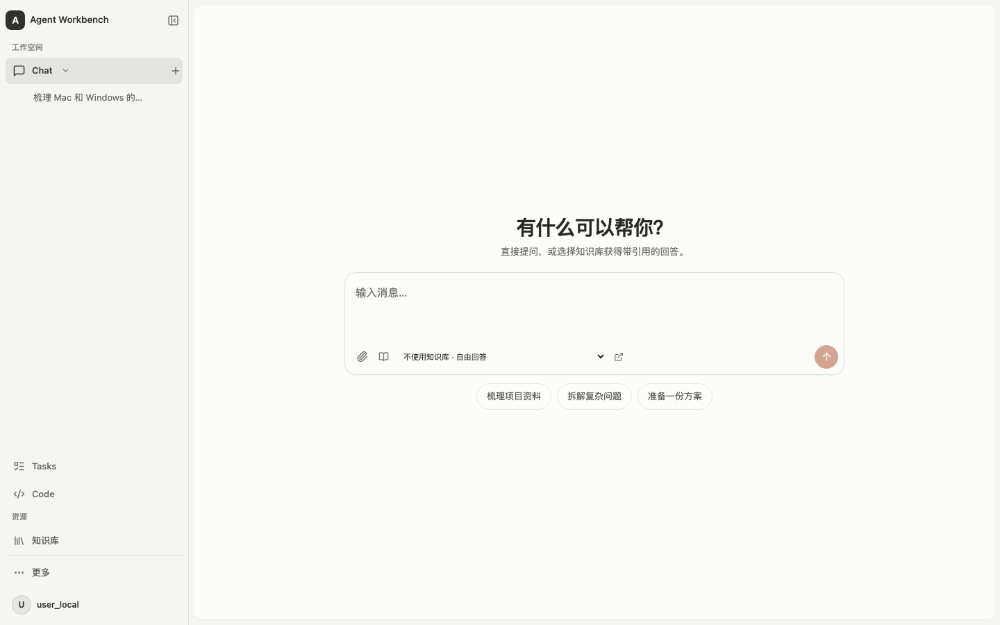
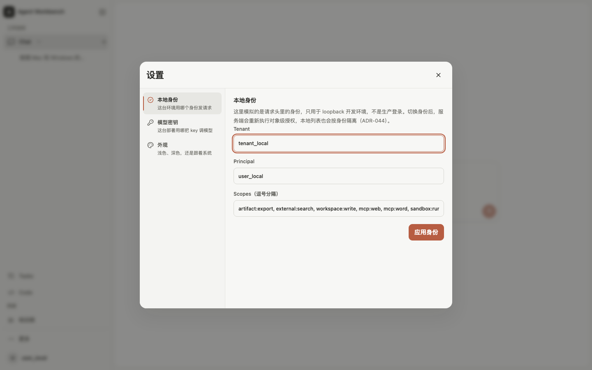
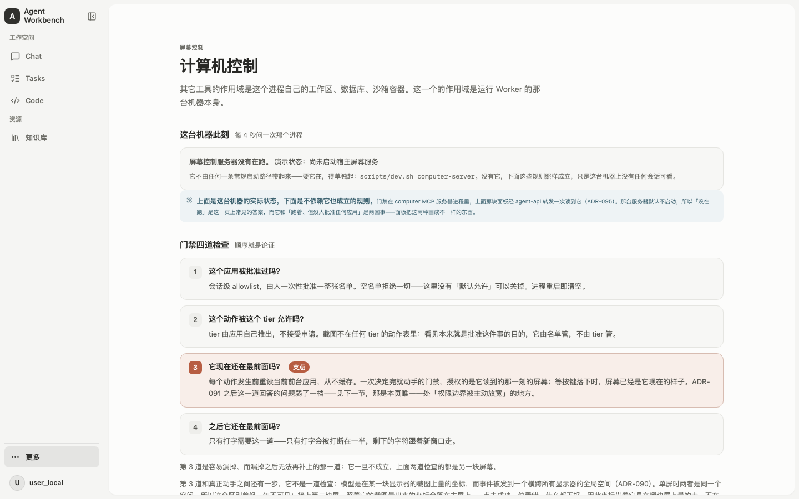
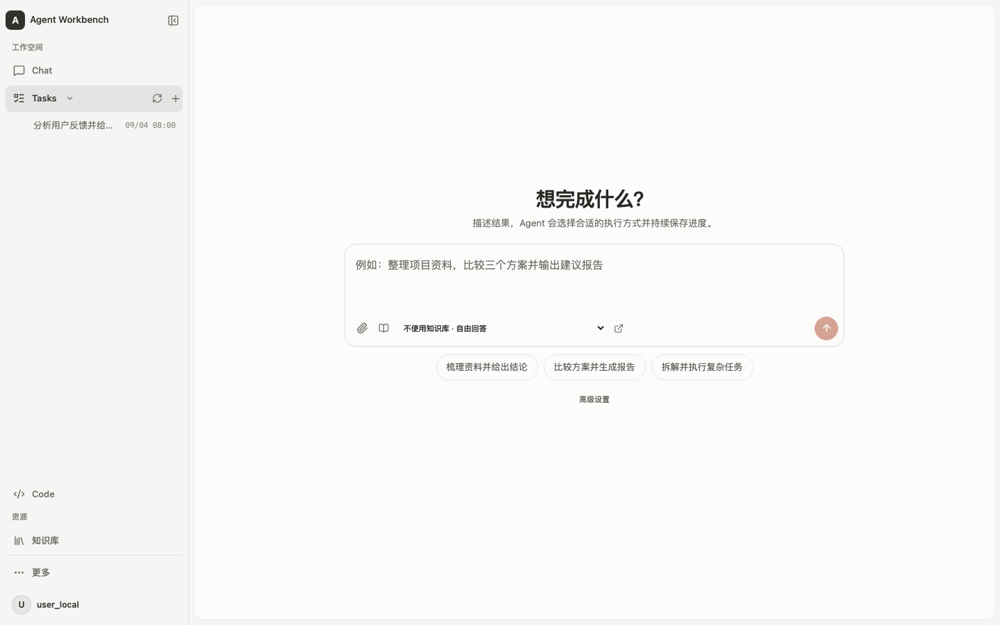
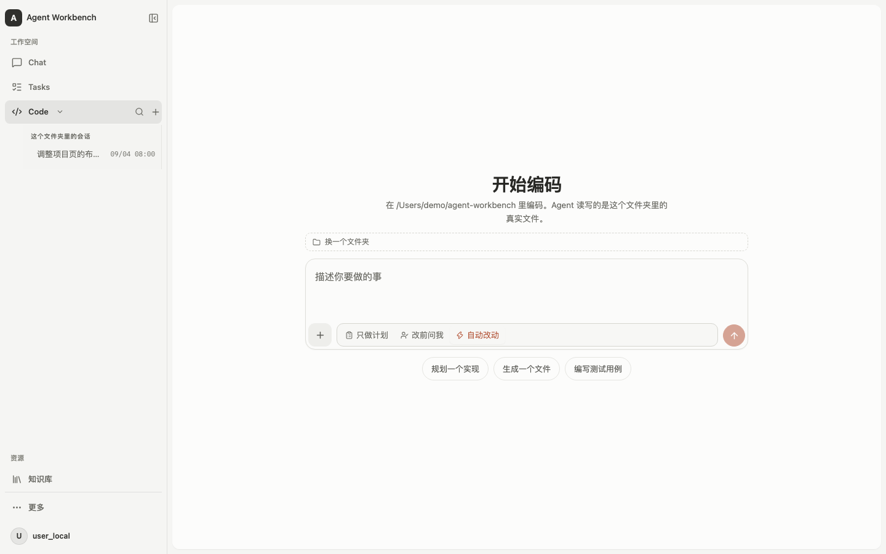
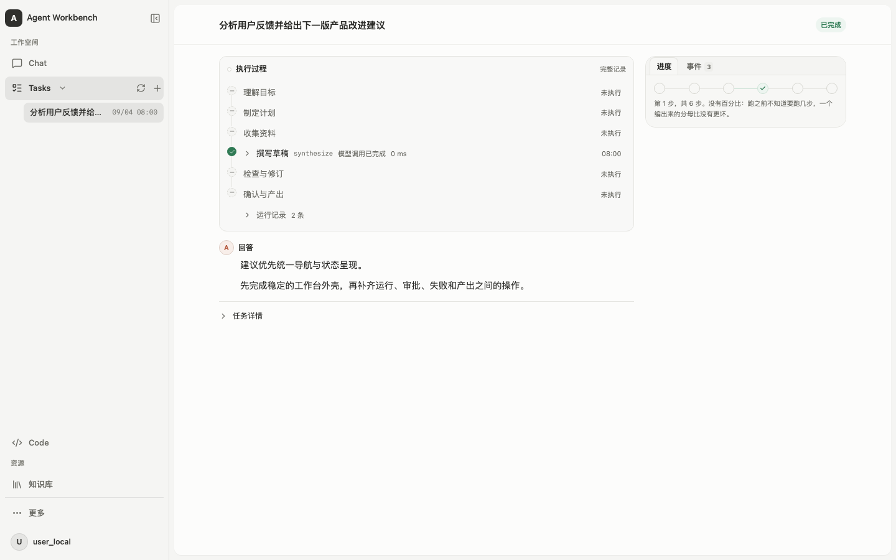

# Agent Workbench：作品集收尾评审

评审日期：2026-09-04 开始，2026-09-05 完成（America/New_York）。代码基线：`f83fb24ec58b05b73553c8a6f23a78246b9f7c25`。定位：**作品集展示，优先完成度、演示效果和工程亮点**。

来源：外部评审（OpenAI Codex，多子代理分工）。本仓库把它当作收尾那一轮的设计稿，逐项落实情况记在 [status.md](../status.md) 第七十六批。

本次审查覆盖主要架构、八个前端页面、共同组件与样式、启动配置、Mac/Windows 适配、能力缺口和测试。未修改产品源码。本报告是这一提交的评审快照，不是持续更新的能力台账。

## 结论与范围

项目已经具备足够的功能广度。最后一轮最有价值的工作，是让现有能力形成清楚、稳定、可以反复展示的产品体验。建议冻结新增大功能，把收尾集中为四个交付包：**稳定外壳、统一任务体验、补齐核心演示闭环、完成双端证据与展示材料**。

目前的主要问题是：导航随当前内容移动；用户操作和工程解释混在同一层；三种模式长得接近但操作规则不同；过程容易压过结果；部分核心能力在刷新、重新打开、跨端安装时缺少完整体验。继续逐个调整按钮或补一段解释，难以解决这些共同原因。

对作品集而言，推荐主叙事为：**一个能依据资料回答、执行长任务、在关键动作前等待批准，并留下可核验结果的 Agent 工作台。** Code 和受限计算机控制作为能力延伸。不要让八个页面都承担相同的介绍权重。

## 已有能力应当保留

| 能力 | 当前证据与价值 | 收尾原则 |
|---|---|---|
| 自研 Runtime 与 Port/Adapter 边界 | 核心工具循环只有一个实现，边界有架构测试 | 保留，作为技术讲解重点 |
| Task 恢复与审批 | checkpoint、租约接管、权威审批账本、取消和失败重提均有实现 | 主要完善呈现与可发现性 |
| RAG 引用与授权 | 检索过滤、发布复核、点击引用重新授权；已有评测报告 | 把“刷新后仍能核验”补完整 |
| 多 Agent | 真实委派、运行树、成本与状态面板已经存在 | 展示角色目标和模型策略即可，不重造编排器 |
| 文件预览 | 文本、图片、HTML、Word 版面与文字降级、下载已有 | 统一阅读外壳，保留真实能力边界 |
| Code 权限 | 计划、改前询问、自动改动；命令审批展示具体参数 | 保留，不用一个宽泛开关代替 |
| 基础交互 | 深浅主题、快捷跳转、窄屏导航、焦点管理、中文输入法保护已有 | 做跨页面一致性验收 |

## UI / UX：集中修正的七个问题

### 1. 主导航位置和侧栏宽度会变化——最高优先级

**实际观察：**1440×900 下，Chat 激活时，其会话列表占满侧栏剩余高度，Tasks 和 Code 被推到底部；切换 Tasks 后，Code 仍在底部；进入辅助页，侧栏由 272px 变成 188px，品牌标题换行。用户无法形成稳定的位置记忆。

**源码：**[当前模式占满高度](../../web/src/styles/minimal-theme.css:1843)、[辅助页改变宽度](../../web/src/styles/minimal-theme.css:980)、[激活项变成折叠按钮](../../web/src/app/AppShell.tsx:481)。同一行未选中时是导航，选中后变成展开/收起，也增加了学习成本。

**统一决定：**主导航始终固定顺序、位置和点击含义；其下另设“当前模式的最近记录”滚动区。折叠交给明确的箭头，新增入口保留可理解的标签。所有桌面页面共用一个侧栏宽度，只随窗口断点或用户主动折叠改变。这样仍能复用现有模式与数据，无须恢复新的项目实体层。

### 2. 产品操作与工程原理处于同一阅读层——最高优先级

**实际观察：**Computer 页面大部分空间用于讲门禁规则、tier、ADR 和 Worker 作用域；System 页解释 API 能证明什么；设置默认打开 Tenant、Principal、Scopes。内容有工程价值，但首次使用者首先需要知道能做什么、当前缺什么、下一步点哪里。

**源码：**[Computer 规则内容](../../web/src/features/computer/ComputerPage.tsx:67)、[System 首屏](../../web/src/features/system/SystemPage.tsx:118)、[设置默认身份](../../web/src/app/SettingsDialog.tsx:83)。

**统一决定：**每页第一层只回答“当前状态、当前对象、下一步”；第二层放证据和操作详情；第三层用“工程说明”折叠放 ADR、协议字段和设计理由。保留真实未知状态，但把诊断说明压成一句，并给相应操作。设置默认落在模型配置或常规设置；身份模拟独立标为“开发与权限演示”。导航使用一致的中文动作名，英文术语保留作次级标识。

示例：Computer 首屏呈现“未启动 → 对应系统的启动方式 → 重新检查”；启动后呈现“批准的应用、当前前台、最近动作”。四道门禁留在下方可展开，方便面试时主动讲解。

### 3. 三个起始页形式相近，用途和成果不够具体

Chat、Tasks 都是一个居中输入框与相似的示例问题；Code 多一个目录门槛。用户面对“分析资料并交付报告”仍要先判断模式。

**源码：**[模式定义](../../web/src/app/navigation.ts:35)、[共同起始组件](../../web/src/components/ModeStart.tsx:31)、[Task 分流](../../web/src/features/work/WorkPage.tsx:844)。现有 triage 解决 Task 内部选图，不是全局三模式路由。

**收尾方案：**保留三种模式，但把一句话介绍和示例改成明确成果：对话“得到带来源的答案”；任务“获得文件和执行记录”；编码“修改指定目录，并检查变更”。示例卡展示输入材料与预期产物，点击填入可演示的请求。需要串接时先提供“用这段结论创建任务”，预填内容并让用户提交，保留来源链接。暂不增加自动切换三模式的全局路由器，也不重造跨域项目空间。

### 4. Task 应围绕状态组织行动，完成后突出结果

**现状：**Task 页面先显示过程、再显示结果、再显示审批；取消在“任务详情”折叠中且必须填写原因。Code 审批则固定靠近输入器。同样是被 Agent 打断，两处需要到不同的位置找动作。

**源码：**[Task 页面顺序](../../web/src/features/work/WorkPage.tsx:1368)、[取消入口](../../web/src/features/work/WorkPage.tsx:1556)、[Code 审批固定区](../../web/src/features/code/CodePage.tsx:1746)。

| 状态 | 第一眼看见什么 | 主动作 |
|---|---|---|
| 排队 | 等待执行、等待原因或状态未知 | 取消、查看诊断 |
| 运行中 | 当前在做什么、已用时、最新可用结果 | 停止/取消 |
| 等待批准 | 要批准的具体对象与影响 | 查看内容、批准或拒绝 |
| 失败 | 哪一步失败、已保留什么 | 按原输入重新提交、复制诊断 |
| 完成 | 结论、文件、验证结果 | 打开/下载、继续使用结果 |

设置稳定的顶部行动区；完成后结果上移，执行过程折为摘要，按需查看。停止不应要求用户先找到隐藏表单；如果后端需要审计理由，UI 可提供明确默认理由并允许补充。失败重试已存在且会创建新 Task，应补来源链接，避免看起来像原地续跑。跨页面等待批准的任务，需要一个始终可见的“待处理”入口。

### 5. 输入器需要准确表达文件去向和授权范围

当前纸夹实际把文件持久上传到知识库，不是只给本轮使用；移除 chip 也不会删除文档。这一点源码已明确承认，现有文案有所改善，但图标和摆放仍容易诱导出普通附件的预期。

**源码：**[附件语义](../../web/src/components/AttachmentTray.tsx:21)、[Task 输入器](../../web/src/features/work/WorkPage.tsx:1008)。

**本轮必须做：**统一“导入知识库”的名称、目标库确认和上传/索引/失败状态；没有临时附件能力时就准确呈现现有能力。Chat、Tasks、Code 共用输入器的键盘、发送、禁用、错误和草稿规则，模式专属权限控件保持真实差异。Code 目录显示在稳定的上下文栏里，避免长路径同时占标题说明、切换条和输入区。

**可选能力：**Task 独立附件需要新增任务级 artifact 引用与快照，不是前端加拖拽就完成。它有价值，但本次作品集收尾可延期。

### 6. 统一阅读节奏、视觉语义和预览外壳

现有暖灰、陶土橙、圆角与深色主题可以继续用。主要问题是同一内容在 Chat、Code、Task 中呈现得不够一致：标题、正文、元数据密度不同；不同页面的圆钮、图标、文本按钮对主动作的强调不同；Code 空文件面板仍占据较大面积。

建议冻结一份小型规范：正文 15–16px、辅助说明约 13px、小于 12px 只用于非关键元数据；采用一套间距、控件高度、圆角和状态词。上述尺寸是设计起点，需在 Windows 缩放及实际字体下复核，不是现有页面测量值。动作色只负责主动作，状态使用文字和图形共同表达。

将文件、引用、命令输出统一装入同一右侧检查面板：标题、来源、预览、下载、关闭的顺序一致。没有打开对象时收起，空间不够时使用抽屉。已有查看器和安全限制继续复用，不改成永远常驻的三栏。

维护上同步整理样式职责：`app.css` 与 `minimal-theme.css` 对外壳存在多轮覆盖，已经让调整需要追踪多个位置。按 token、外壳、组件、页面划清唯一归属，避免再次靠文件尾追加覆盖修视觉问题；不需要为此迁移 UI 框架。

### 7. “快速跳转”和常用管理操作按真实范围命名

现有 Cmd/Ctrl+K 是目的页面筛选，不是跨会话全文搜索。会话改名、删除、Code 项目管理、主题与键盘支持已有，不应再列成缺失功能。

**源码：**[快速跳转仅筛选 destinations](../../web/src/app/QuickSwitcher.tsx:25)。

作品集阶段保留快速跳转，必要时增加会话标题搜索即可。完整全文检索、标签体系、无限层级分组与收藏中心都可以延后。首先解决返回工作台后能找到刚才任务、识别失败和待审批项的问题。

## 功能补充：按演示收益取舍

### A. 历史引用恢复——建议纳入收尾

Chat 当前实时回合有引用、turn_id 和 grounded；历史接口投影只有 role/text/usage，前端重建历史时 citations 为空。刷新后的证据体验不连续，正好削弱项目最值得展示的 RAG 特点。

**源码：**[历史消息协议](../../web/src/api/types.ts:206)、[历史 reducer](../../web/src/features/chat/model.ts:1168)。

补齐回合标识、引用定位信息及当时的证据状态。再次打开原文仍走现有实时授权与 revision 检查，不把旧原文缓存当成当前授权。验收：完成问答、刷新、点开引用；资料变更或权限撤回后，原文读取仍正确受限。

### B. Code 只读变更审查——如果要重点展示编码，优先补

已有真实项目读写、写入文件记录、当前文件预览；尚未形成产品级 Git status/diff、分支或 worktree 管理。

**源码：**[未提供 GitHub/分支/worktree 概念](../../web/src/features/code/ComposerMenu.tsx:20)、[回合写入记录](../../web/src/features/code/turnBlocks.ts:684)。

第一版只做“变更文件列表、diff、运行过的检查及结果、导出 patch/复制交付说明”。必须区分“当前工作区相对基线的改动”和“这次 Agent 产生的改动”；仓库原先已有未提交内容时，不能把全部 git diff 归给 Agent。需要会话前后基线或同等可靠记录。非 Git 目录明确降级。自动提交、自动回滚、PR 和 worktree 不进入本轮。

### C. 全局待处理入口——建议纳入收尾

Task 与 Code 页内审批均已有；全局发现和回到上下文的路径不足。Task 有审批列表后端接口，Code 使用另一种会话级审批对象，不能只接 Task API 就声称覆盖全部。

先用一个简洁的“待处理”列表显示对象、等待原因、来源和时间，点击回到原页面。任务运行状态来自服务端；Code 如果只能确认当前页面的运行，就明确标注其范围。浏览器通知可以选做，持久的站内入口更重要。

### D. 演示前自检——建议纳入收尾

已有 provider key 设置、本次/下次启动区分、能力清单和启动探针；API 与数据库健康也已有。真正缺口是对 Worker 等进程的可见性和完整的“可以开始演示”判断。

**源码：**[Worker 状态未知](../../web/src/features/system/SystemPage.tsx:110)、[密钥状态协议](../../web/src/api/types.ts:957)。

增加小型自检摘要：真实模型/合成演示模式、Task Worker 与 ingestion Worker、检索、MCP、沙箱、宿主屏幕服务，以及待重启配置。不能把 API 能响应等同于任务可执行；不能用旧心跳永远显示健康。若增加 Worker 注册，应带新鲜度/TTL、部署标识和能力快照，超时显示离线或未知。可先限定为现有本地部署，避免扩成监控平台。

### E. 多 Agent 角色模型策略——选做，适合工程亮点展示

子代理定义和委派已有 model_profile 接缝，界面也已有运行树与成本；内置角色尚未形成明确的模型分工策略。建议配置“主协调/综合”和“有限范围检索/检查”的档位，显示角色目标、实际模型、结果和成本。按任务能力与验证表现选择档位，不简单认定所有审核都应交给最小模型。不要先做任意拖拽 Agent 编排画布。

**源码：**[内置角色](../../src/agent_workbench/application/sub_agents.py:42)、[委派传入模型档](../../src/agent_workbench/application/delegation.py:431)。

### F. 可重复演示的资料整理——选做

知识库能创建、上传、索引并显示失败；文档列表缺删除与原文管理闭环。建议先提供明确标记的示例数据准备和重置方式，再决定是否补通用文档删除/重新索引。删除不能只移除列表行，需要处理 revision、授权、索引和字节留存的既有约束。作品集阶段不扩成完整企业知识库管理。

**源码：**[当前文档列表](../../web/src/features/knowledge/KnowledgePage.tsx:493)、[上传后不能删除的边界](../../web/src/components/AttachmentTray.tsx:30)。

## Mac 与 Windows：同 UI，分别验收部署和宿主能力

两个端共用 React 前端及 `/ui` 路由，主要区别在启动链、目录映射和宿主能力。Mac 原生路径和 Windows Compose 不能被描述成完全同等的运行环境。

| 维度 | macOS | Windows | 收尾要求 |
|---|---|---|---|
| 主界面 | 共用 Web UI | 共用 Web UI | 相同导航、状态、结果和预览规则 |
| 启动 | `scripts/dev.sh` 等原生路径 | `scripts/stack.cmd` 的 Compose 路径 | 分别提供可复制、可诊断的命令 |
| Code 目录 | 原生路径可访问授权项目目录 | 容器只访问映射目录，例如 `/projects` | 清楚显示正在操作的执行端和路径 |
| 宿主命令 | 取决于本机 profile 和能力装配 | 当前 Compose 路径不等同于 Windows 宿主 shell | 依据能力 API 展示，不用浏览器系统推断 |
| 计算机控制 | macOS adapter、系统权限 | Win32 adapter、宿主进程与 tunnel | 分别做真机授权、截图、前台切换测试 |

发现一处直接影响 Windows 上手的具体问题：Computer 页未启动提示硬编码 `scripts/dev.sh computer-server`，没有给 Windows 的 `scripts\computer.cmd`。应依据实际部署/宿主信息显示对应命令，浏览器所在系统不一定是执行端。[提示源码](../../web/src/features/computer/ScreenSessionPanel.tsx:48)

Windows 文档明确说明现有许多测试是 POSIX 上的规则断言，Win32 桌面链路缺真机运行证据。因此本轮结论只能是“实现已存在，真机能力需补证”，不能写“两端均已完整验证”。[Windows 说明](../../docs/windows-quickstart.md:16)

共同验收窗口至少包含 1440×900、1280×720、Windows 125%/150% 缩放；键盘检查 Cmd/Ctrl+K、Tab、Escape、中文输入法回车；目录检查中文、空格与长路径；主题检查浅色、深色和跟随系统。Computer 单独检查授权拒绝、撤销、应用退出、前台切换和服务未运行。无需为作品集阶段新增完整桌面壳、自动更新器和多机同步。

跨平台交互原则参考 [Microsoft 导航设计](https://learn.microsoft.com/en-us/windows/apps/design/basics/navigation-basics) 的一致性、简洁与清晰，以及 [Apple 侧栏指南](https://developer.apple.com/design/human-interface-guidelines/sidebars?changes=_8) 对层级与内容组织的建议。本文具体布局取舍来自当前项目观察，不是照搬某一系统外观。

## 四个交付包，一次冻结设计，一次整体验收

| 交付包 | 必须包含 | 完成判据 |
|---|---|---|
| 1. 稳定外壳 | 固定导航、独立记录列表、统一宽度/标题/正文/动作规则、设置分层 | 切换八个页面，主导航不跳位，主要动作位置可预测 |
| 2. 统一任务体验 | 状态行动区、结果优先、过程折叠、按需检查面板、准确文件去向、待处理入口 | 运行→等待批准→完成/失败，用户始终知道下一步 |
| 3. 核心演示闭环 | Chat 历史引用恢复；若 Code 是主打则加入只读变更审查；演示前自检 | 刷新后能核验证据；改动能解释并交付；缺服务能定位 |
| 4. 展示与跨端证据 | 三条固定演示、可复位示例数据、截图/短视频、Windows 实测表、文档首页压缩 | 另一个人按材料能复现，不依赖作者现场补命令 |

各包可以按依赖分提交，但设计和验收作为同一个版本处理。实施前冻结导航草图、组件规范、各状态页面和下面三条演示脚本；完成后只修验收发现的问题，新增想法统一进入后续清单。这样能避免“每次补一点文案，再引出下一批布局问题”。

## 作品集应该展示的三条故事

1. **资料问答：**打开预置资料 → 提问 → 查看答案引用 → 刷新后再次核验 → 展示资料不支持答案时的处理。技术讲解接到检索、权限和发布复核。
2. **可恢复任务：**提交报告目标 → 展开必要的 Agent 分工 → 检查待审内容 → 批准 → 预览并下载文件。另录一段受控 Worker 重启后接续的证据，说明恢复不是重新生成一次。
3. **编码交付：**选择示例仓库 → 提出一个小改动 → 审批必要命令 → 查看文件变更与检查结果 → 得到可交付说明。如果本轮不补 diff，就把演示口径限定为文件修改与预览。

主演示建议控制为数分钟，耗时较长的检索下载、环境安装与故障恢复留有单独证据片段。真实运行、合成演示、录制回放分别标明。复用已有架构面板、HIGHLIGHTS、评测页与真实事件证据，不另造一个互相重复的宣传页。

README 第一屏建议改为一句产品定位、一张实际界面图、三条能力、演示入口和启动方式；后面继续保留架构深读。现有文档已经有很丰富的技术材料，重点是把入口顺序调整成“先看成果，再看实现”。

## 暂不纳入本轮

自动跨模式路由、恢复通用项目组织层、完整临时附件系统、任务 SSE 改造、插件市场、Agent 可视化编排、团队账号与计费、完整 Git/PR/worktree 系统、跨机同步、通用定时任务。

这些方向未必不值得做，但它们都不能优先于稳定导航、结果展示、引用回看和一次可复现演示。Task 现有轮询是架构选择；没有量到明显交互延迟前，不能仅因为 Chat 有 SSE 就把它升级列为收尾必做。

## 本次验证与证据边界

- 前端 lint、typecheck、build 通过；Vitest **58 个文件、902 个测试通过**。测试运行环境 Node 24.19.0，仓库 engines 与 CI 固定 24.14.0，存在版本提示。
- 选定后端检查 **88 passed**：Windows Computer 规则、同意流程、架构面板及 Compose 部署测试。不是全部后端测试，也不是真 Windows 运行。
- 仓库现有 Playwright shell 用例在本机跑出 **6 passed**，包含桌面 Chromium 和移动视口 Chromium；本次复用 5173 开发服务，通过临时配置执行，未重复使用 CI 的构建预览启动链。
- CI 原本就安装 Chromium 并运行 E2E，不应把“增加 E2E”列作缺失；后续应扩充关键工作状态、截图与真实流程覆盖。[CI](../../.github/workflows/ci.yml:39)
- 本次打开八个页面及起始/历史/设置等状态，完成 15 张截图观察。样本宽度 1440 和 1280 下未发现页面根节点横向溢出，未出现 pageerror；这不等于全部弹层与极端内容已验证。
- 截图使用本次审查构造的示例 API 数据，不调用真实模型、不改业务数据；历史页事件流未提供 fixture，因此截图中的连接状态不能用作生产故障证据。Task 示例事件也不代表一次完整真实执行。附图用于布局与信息层级分析。
- 未运行 PostgreSQL/Qdrant 服务型测试、真实模型任务、Mac 屏幕授权流程或 Windows 真机链路；没有宣称全链路验收通过。

**推荐的收尾完成线：第一次打开看得懂，三条演示走得通，刷新和重开保留关键证据，两端能力说明与实测一致。达到这条线即可冻结版本，把时间用于展示和技术讲解。**
